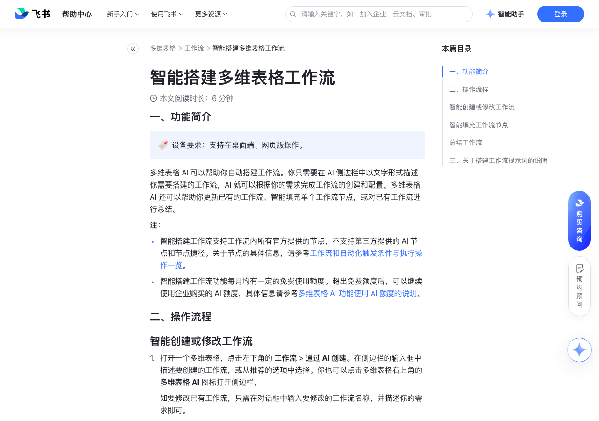

# 智能搭建多维表格工作流

> 来源：[飞书帮助中心](https://www.feishu.cn/hc/zh-CN/articles/317606642838)  
> 分类：多维表格 / 工作流  
> 抓取时间：2026-09-22T01:24:06.852Z

## 界面截图

### 文档内配图

1. 配图：https://p1-hera.feishucdn.com/tos-cn-i-jbbdkfciu3/2de4b67c0e084b6f8b0c4568dc4ffff7~tplv-jbbdkfciu3-image:0:0.image
2. 配图：https://p1-hera.feishucdn.com/tos-cn-i-jbbdkfciu3/abfd933694ef4f98917c111dee5d1ea4~tplv-jbbdkfciu3-image:0:0.image
3. 配图：https://p1-hera.feishucdn.com/tos-cn-i-jbbdkfciu3/32554e5dd3ef4eb18d2ab976630da779~tplv-jbbdkfciu3-image:0:0.image
4. 配图：https://p1-hera.feishucdn.com/tos-cn-i-jbbdkfciu3/0b10a7c3755645a98c899676e6ca1c46~tplv-jbbdkfciu3-image:0:0.image
5. 配图：https://p1-hera.feishucdn.com/tos-cn-i-jbbdkfciu3/d3c84d9efc7c4c3ca1ce067fbd5b5f4d~tplv-jbbdkfciu3-image:0:0.image

## 功能定位

本页对应飞书帮助中心「多维表格 / 工作流」下的「智能搭建多维表格工作流」。以下需求描述依据官方说明文档提炼，用于指导 DuoWei 对标实现。

## 功能目标

一、功能简介

## 文档结构（官方章节）

- 一、功能简介​
- 二、操作流程​
- 智能创建或修改工作流​
- 智能填充工作流节点​
- 总结工作流​
- 三、关于搭建工作流提示词的说明​

## 详细功能说明

一、功能简介

智能搭建工作流支持工作流内所有官方提供的节点，不支持第三方提供的 AI 节点和节点捷径。关于节点的具体信息，请参考工作流和自动化触发条件与执行操作一览。

智能搭建工作流功能每月均有一定的免费使用额度。超出免费额度后，可以继续使用企业购买的 AI 额度，具体信息请参考多维表格 AI 功能使用 AI 额度的说明。

二、操作流程

智能创建或修改工作流

打开一个多维表格，点击左下角的 工作流 > 通过 AI 创建。在侧边栏的输入框中描述要创建的工作流，或从推荐的选项中选择。你也可以点击多维表格右上角的 多维表格 AI 图标打开侧边栏。

如要修改已有工作流，只需在对话框中输入要修改的工作流名称，并描述你的需求即可。

有关创建工作流指令的更多信息，请参考下文的“三、关于搭建工作流提示词的说明”。

将信息发送给多维表格 AI 后，你可以在侧边栏中查看 AI 的推理过程和进度，也可以在左侧导航栏中对应的工作流选项旁查看进度。在 AI 思考和生成过程中，在 AI 思考和生成过程中，点击画布上方的 停止 或 对话框右下角的 停止生成，可停止当前任务。

完成后，你可以打开新创建或修改的工作流，在画布上查看工作流的配置详情。

在侧边栏或工作流画布下方选择 采纳 或 放弃 本次生成的工作流。如果对生成结果不满意，可以继续和 AI 对话，对工作流进行修改。

你还可以复制答案，让 AI 重新生成答案，或者给生成结果点赞、点踩。

智能填充工作流节点

从多维表格左侧的导航栏中打开一个工作流。

点击一个节点，打开配置界面。你也可以点击工作流中的 + 图标，新建节点并选择节点类型。

在节点配置界面上，点击右上角的 智能填充，开始配置节点。配置过程中将显示推理过程和配置进度。

配置结束后，你可以查看配置详情，并在画布下方或对话框中选择是否采纳 AI 生成的配置。如果对生成的配置不满意，还可以继续和 AI 对话，修改已生成的配置。

总结工作流

在多维表格左侧的导航栏中打开一个工作流。

点击多维表格左上角的 多维表格 AI 图标打开侧边栏，输入并发送指令，例如“总结一下这个工作流，介绍每一步在做什么”。等待 AI 返回内容即可。

三、关于搭建工作流提示词的说明

工作流的触发条件，即满足什么条件时，工作流会被触发。

需要工作流完成的任务，以及涉及到的关键信息。

触发条件

要完成的任务

当销售数据表中增加了一条新的客户记录时

给负责人发送一条消息，消息内容为“有新客户需要跟进”。

每天早晨 9 点

在日报数据表里新增一条记录，将所有组员的任务进行汇总。

当内容计划表中内容的发布状态变为“已发布”时

把该记录的实际发布日期更新为今天。

课程库数据表中创建新课程后，如果课程名称、类型、课程简介都不为空

根据课程名称、类型生成 100 字的简介，并更新课程简介字段。

触发条件 | 要完成的任务

当销售数据表中增加了一条新的客户记录时 | 给负责人发送一条消息，消息内容为“有新客户需要跟进”。

每天早晨 9 点 | 在日报数据表里新增一条记录，将所有组员的任务进行汇总。

当内容计划表中内容的发布状态变为“已发布”时 | 把该记录的实际发布日期更新为今天。

课程库数据表中创建新课程后，如果课程名称、类型、课程简介都不为空 | 根据课程名称、类型生成 100 字的简介，并更新课程简介字段。

## 实现要点（对标 DuoWei）

1. **入口与信息架构**：在产品中明确该能力所属模块（工作流），并保证用户可从对应导航触达。
2. **核心交互**：按上文「详细功能说明」还原主要操作路径；截图中出现的按钮、字段、面板命名尽量与飞书语义一致或可映射。
3. **数据与权限**：若文档涉及可见范围、可编辑范围、分享或高级权限，实现时需落到角色/成员模型，并保证 API/MCP 与 UI 权限一致。
4. **边界与上限**：若文档提到数量上限、格式限制、导入导出约束，需在实现与错误提示中体现。
5. **验收**：以本页截图场景为用例，完成「能打开 / 能配置 / 能保存 / 能被 Agent 读写（如适用）」四项检查。

## 原始摘录摘要

> 一、功能简介 智能搭建工作流支持工作流内所有官方提供的节点，不支持第三方提供的 AI 节点和节点捷径。关于节点的具体信息，请参考工作流和自动化触发条件与执行操作一览。 智能搭建工作流功能每月均有一定的免费使用额度。超出免费额度后，可以继续使用企业购买的 AI 额度，具体信息请参考多维表格 AI 功能使用 AI 额度的说明。 二、操作流程 智能创建或修改工作流 打开一个多维表格，点击左下角的 工作流 > 通过 AI 创建。在侧边栏的输入框中描述要创建的工作流，或从推荐的选项中选择。你也可以点击多维表格右上角的 多维表格 AI 图标打开侧边栏。 如要修改已有工作流，只需在对话框中输入要修改的工作流名称，并描述你的需求即可。 有关创建工作流指令的更多信息，请参考下文的“三、关于搭建工作流提示词的说明”。 将信息发送给多维表格 AI 后，你可以在侧边栏中查看 AI 的推理过程和进度，也可以在左侧导航栏中对应的工作流选项旁查看进度。在 AI 思考和生成过程中，在 AI 思考和生成过程中，点击画布上方的 停止 或 对话框右下角的 停止生成，可停止当前任务。 完成后，你可以打开新创建或修改的工作流，在画布上查看工作流的配置详情。 在侧边栏或工作流画布下方选择 采纳 或 放弃 本次生成的工作流。如果对生成结果不满意，可以继续和 AI 对话，对工作流进行修改。 你还可以复制答案，让 AI 重新生成答案，或者给生成结果点赞、点踩。 智能填充工作流节点 从多维表格左侧的导航栏中打开一个工作流。 点击一个节点，打开配置界面。你也可以点击工作流中的 + 图标，新建节点并选择节点类型。 在节点配置界面上，点击右上角的 智能填充，开始配置节点。配置过程中将显示推理过程和配置进度。 配置结束后，你可以查看配置详情，并在画布下方或对话框中选择是否采纳 AI 生成的配置。如果对生成的配置不满意，还可以继续和 …

## 元数据

- article_id: `7550579431989395475`
- category_id: `7415964452380049412`
- path: `/hc/zh-CN/articles/317606642838`
- extracted_text_length: 1397
