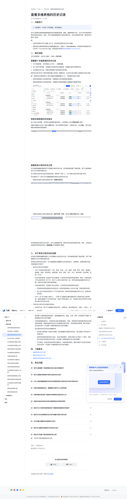

# 查看多维表格的历史记录

> 来源：[飞书帮助中心](https://www.feishu.cn/hc/zh-CN/articles/263286036719)  
> 分类：多维表格 / 快速入门 / 基础设置  
> 抓取时间：2026-09-22T00:55:49.557Z

## 界面截图

### 文档内配图

1. 配图：https://p1-hera.feishucdn.com/tos-cn-i-jbbdkfciu3/5ff72f1dde5e43d7af3559dd29ea7e51~tplv-jbbdkfciu3-image:0:0.image
2. 配图：https://p1-hera.feishucdn.com/tos-cn-i-jbbdkfciu3/01dd4b730cd344e3850f5d2832938626~tplv-jbbdkfciu3-image:0:0.image
3. 配图：https://p1-hera.feishucdn.com/tos-cn-i-jbbdkfciu3/51e15611be394244bbecc5b918b5bb7b~tplv-jbbdkfciu3-image:0:0.image
4. 配图：https://p1-hera.feishucdn.com/tos-cn-i-jbbdkfciu3/4c85c78012614733b769028e404dbe34~tplv-jbbdkfciu3-image:0:0.image
5. 配图：https://p1-hera.feishucdn.com/tos-cn-i-jbbdkfciu3/260d7a8815b142119d0f34e9ca56a1ef~tplv-jbbdkfciu3-image:0:0.image
6. 配图：https://p1-hera.feishucdn.com/tos-cn-i-jbbdkfciu3/2436670afbb148e088190a41c4920651~tplv-jbbdkfciu3-image:0:0.image

## 功能定位

本页对应飞书帮助中心「多维表格 / 快速入门 / 基础设置」下的「查看多维表格的历史记录」。以下需求描述依据官方说明文档提炼，用于指导 DuoWei 对标实现。

## 功能目标

一、功能简介

## 文档结构（官方章节）

- 一、功能简介​
- 二、操作流程​
- 查看整个多维表格的历史记录​
- 恢复多维表格的历史版本​
- 查看单条记录的历史记录​
- 三、关于单条记录历史的说明​
- 四、了解更多​
- 五、常见问题​

## 详细功能说明

一、功能简介

记录的变更历史可以保留 180 天，其余各类变更历史均永久保留。

如果你的多维表格界面没有 历史记录 选项，但显示了 Time Machine，则说明该多维表格文件已升级了 Time Machine 功能，具体信息可参考使用多维表格 Time Machine。

二、操作流程

查看整个多维表格的历史记录

打开多维表格，点击界面右上方的 ··· > 历史记录。

进入历史记录界面，左侧展示历史版本的多维表格，右侧展示操作详情和时间。

点击每条历史记录，界面左侧将展示该时刻的内容详情。

如果多维表格已开启高级权限，你需要成为该多维表格的管理员。

如果多维表格未开启高级权限，你需要对多维表格拥有可编辑或可管理的权限。

恢复多维表格的历史版本

查看单条记录的历史记录

右键点击某条记录的任意单元格 > 查看记录历史。

右键点击某条记录的任意单元格 > 展开详情 > 历史，或点击 展开详情 按钮 > 历史。

三、关于单条记录历史的说明

显示在记录历史中的操作：

对以下字段的内容的修改：文本、单选、多选、人员、群组、日期、附件、数字、复选框、超链接、按钮、电话号码、地理位置、条码、进度、货币、评分、单向关联、双向关联、流程、Email。

记录内容的新增：包括用户的主动新增，以及修改字段类型导致的新增。例如，字段类型由不可记录的字段（见下方）改为了上述可记录的字段（如，将字段类型由创建时间改为日期，则会记录该单元格内容的新增）。

记录内容的清空：包括用户的主动清空，以及修改字段类型导致的清空。

字段类型的更改使原本的内容失效（如将字段类型由人员改为日期，则清空原有内容）。

将上述可记录的字段改为了不可记录的字段（如将字段类型由数字改为公式，则清空原有内容）。

针对“人员”和“创建人/修改人”、“日期”和“创建时间/最后更新时间”这两类字段之间的转换，虽然后者属于不可记录的字段，但由于字段的格式一致，内容发生变化时仍然可以在单条记录历史中显示出来。

不显示在记录历史中的操作或变动：

由系统生成、用户不可编辑的字段的变动：创建时间、最后更新时间、创建人、修改人、自动编号。

并非主动修改、而是由其他字段内容变化间接造成变化的字段的变动：公式、查找引用。

修改整个多维表格结构的操作：新增或删除字段，筛选，分组，排序（此类操作可在整个多维表格的历史记录中查看）。

仅修改数据呈现形式、未修改单元格内容值的操作。例如，修改数字字段的展示格式但未更改数字数值，或是将进度字段/评分字段转换为数字字段、但未更改数字数值，都不会显示在记录历史中（可在整个多维表格的历史记录中查看）。

单元格内容未发生变化的编辑动作：

若在单元格内输入内容后又删除、退出编辑后内容前后无变化，那么曾输入的内容也不会被记录。

若将字段类型由单选改为多选、未进行其他操作，则单元格仍为已有的一个选项，该变更不会显示在单条历史记录中（可在整个多维表格的历史记录中查看）。

仅对单选、多选字段的选项进行重命名、未选择其他选项，重命名操作不会显示在单条历史记录中（可在整个多维表格的历史记录中查看）。

四、了解更多

查看表格的历史记录

查看文档的历史记录

查看和还原思维笔记历史记录

五、常见问题

一、功能简介🔖设备要求：支持在飞书桌面端、网页版操作。你可以查看多维表格数据表配置及表内数据的新增、删除、编辑等操作记录，也可以将多维表格还原至任意历史版本。同时，你可以直接查看单条记录的变更历史，包含内容修改详情、操作时间与操作人信息。注：记录的变更历史可以保留 180 天，其余各类变更历史均永久保留。如果你的多维表格界面没有 历史记录 选项，但显示了 Time Machine，则说明该多维表格文件已升级了 Time Machine 功能，具体信息可参考使用多维表格 Time Machine。二、操作流程打开多维表格，点击右上角的 ··· 图标 > 历史记录。查看整个多维表格的历史记录打开多维表格，点击界面右上方的 ··· > 历史记录。 进入历史记录界面，左侧展示历史版本的多维表格，右侧展示操作详情和时间。 点击每条历史记录，界面左侧将展示该时刻的内容详情。 短时间内进行的多个操作将被折叠汇总到同一编辑时间，点击该记录左侧的三角图标可显示详情。注：如果你在多维表格右上角无法看到 历史记录 的入口，可能是因为缺少权限：如果多维表格已开启高级权限，你需要成为该多维表格的管理员。如果多维表格未开启高级权限，你需要对多维表格拥有可编辑或可管理的权限。250px|700px|reset恢复多维表格的历史版本进入历史记录界面，在列表中选择要恢复的版本，点击界面上方的 还原此版本 按钮。 在确认弹窗中点击右下角的 还原 按钮，即可还原到对应版本。还原成功后，点击 确认，即可自动刷新多维表格并继续使用。 250px|700px|reset查看单条记录的历史记录对记录拥有编辑权限的用户可查看记录的历史记录。若多维表格设置了高级权限，用户只能查看对自己可见字段的变更记录。关于单条记录历史中显示的变更内容，请参考下文的“三、关于单条记录历史的说明”章节。你可使用以下 2 种方式可查看数据表中某条记录的历史记录：右键点击某条记录的任意单元格 > 查看记录历史。250px|700px|reset右键点击某条记录的任意单元格 > 展开详情 > 历史，或点击 展开详情 按钮 > 历史。250px|700px|reset250px|700px|reset在单条数据记录的历史记录中，你可以查看操作者、操作时间及具体的更改内容。同时，右键点击变更前和变更后的内容 > 复制数据 可对数据进行复制。250px|700px|reset三、关于单条记录历史的说明对该条记录拥有编辑权限的人均可查看此记录的历史记录。若多维表格设置了高级权限，用户只能查看自己可见字段的变更记录。在单条记录的历史记录中，你只能查看到可编辑的记录内容的变化，包括修改、新增和清空内容。详细说明及示例如下：显示在记录历史中的操作：对以下字段的内容的修改：文本、单选、多选、人员、群组、日期、附件、数字、复选框、超链接、按钮、电话号码、地理位置、条码、进度、货币、评分、单向关联、双向关联、流程、Email。记录内容的新增：包括用户的主动新增，以及修改字段类型导致的新增。例如，字段类型由不可记录的字段（见下方）改为了上述可记录的字段（如，将字段类型由创建时间改为日期，则会记录该单元格内容的新增）。记录内容的清空：包括用户的主动清空，以及修改字段类型导致的清空。字段类型的更改使原本的内容失效（如将字段类型由人员改为日期，则清空原有内容）。将上述可记录的字段改为了不可记录的字段（如将字段类型由数字改为公式，则清空原有内容）。针对“人员”和“创建人/修改人”、“日期”和“创建时间/最后更新时间”这两类字段之间的转换，虽然后者属于不可记录的字段，但由于字段的格式一致，内容发生变化时仍然可以在单条记录历史中显示出来。不显示在记录历史中的操作或变动：由系统生成、用户不可编辑的字段的变动：创建时间、最后更新时间、创建人、修改人、自动编号。并非主动修改、而是由其他字段内容变化间接造成变化的字段的变动：公式、查找引用。修改整个多维表格结构的操作：新增或删除字段，筛选，分组，排序（此类操作可在整个多维表格的历史记录中查看）。仅修改数据呈现形式、未修改单元格内容值的操作。例如，修改数字字段的展示格式但未更改数字数值，或是将进度字段/评分字段转换为数字字段、但未更改数字数值，都不会显示在记录历史中（可在整个多维表格的历史记录中查看）。单元格内容未发生变化的编辑动作：若在单元格内输入内容后又删除、退出编辑后内容前后无变化，那么曾输入的内容也不会被记录。若将字段类型由单选改为多选、未进行其他操作，则单元格仍为已有的一个选项，该变更不会显示在单条历史记录中（可在整个多维表格的历史记录中查看）。仅对单选、多选字段的选项进行重命名、未选择其他选项，重命名操作不会显示在单条历史记录中（可在整个多维表格的历史记录中查看）。四、了解更多查看表格的历史记录查看文档的历史记录查看和还原思维笔记历史记录五、常见问题

## 实现要点（对标 DuoWei）

1. **入口与信息架构**：在产品中明确该能力所属模块（快速入门 / 基础设置），并保证用户可从对应导航触达。
2. **核心交互**：按上文「详细功能说明」还原主要操作路径；截图中出现的按钮、字段、面板命名尽量与飞书语义一致或可映射。
3. **数据与权限**：若文档涉及可见范围、可编辑范围、分享或高级权限，实现时需落到角色/成员模型，并保证 API/MCP 与 UI 权限一致。
4. **边界与上限**：若文档提到数量上限、格式限制、导入导出约束，需在实现与错误提示中体现。
5. **验收**：以本页截图场景为用例，完成「能打开 / 能配置 / 能保存 / 能被 Agent 读写（如适用）」四项检查。

## 原始摘录摘要

> 一、功能简介 记录的变更历史可以保留 180 天，其余各类变更历史均永久保留。 如果你的多维表格界面没有 历史记录 选项，但显示了 Time Machine，则说明该多维表格文件已升级了 Time Machine 功能，具体信息可参考使用多维表格 Time Machine。 二、操作流程 查看整个多维表格的历史记录 打开多维表格，点击界面右上方的 ··· > 历史记录。 进入历史记录界面，左侧展示历史版本的多维表格，右侧展示操作详情和时间。 点击每条历史记录，界面左侧将展示该时刻的内容详情。 如果多维表格已开启高级权限，你需要成为该多维表格的管理员。 如果多维表格未开启高级权限，你需要对多维表格拥有可编辑或可管理的权限。 恢复多维表格的历史版本 查看单条记录的历史记录 右键点击某条记录的任意单元格 > 查看记录历史。 右键点击某条记录的任意单元格 > 展开详情 > 历史，或点击 展开详情 按钮 > 历史。 三、关于单条记录历史的说明 显示在记录历史中的操作： 对以下字段的内容的修改：文本、单选、多选、人员、群组、日期、附件、数字、复选框、超链接、按钮、电话号码、地理位置、条码、进度、货币、评分、单向关联、双向关联、流程、Email。 记录内容的新增：包括用户的主动新增，以及修改字段类型导致的新增。例如，字段类型由不可记录的字段（见下方）改为了上述可记录的字段（如，将字段类型由创建时间改为日期，则会记录该单元格内容的新增）。 记录内容的清空：包括用户的主动清空，以及修改字段类型导致的清空。 字段类型的更改使原本的内容失效（如将字段类型由人员改为日期，则清空原有内容）。 将上述可记录的字段改为了不可记录的字段（如将字段类型由数字改为公式，则清空原有内容）。 针对“人员”和“创建人/修改人”、“日期”和“创建时间/最后更新时间”这两类字段之间的转换，虽然后者属于不可记录的字段，但…

## 元数据

- article_id: `6982026277209358338`
- category_id: `7225072576895254530`
- path: `/hc/zh-CN/articles/263286036719`
- extracted_text_length: 2036
