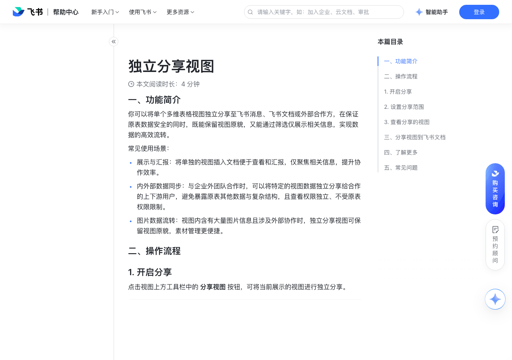

# 独立分享视图

> 来源：[飞书帮助中心](https://www.feishu.cn/hc/zh-CN/articles/396528986790)  
> 分类：多维表格 / 视图  
> 抓取时间：2026-09-22T01:21:43.288Z

## 界面截图

### 文档内配图

1. 配图：https://p1-hera.feishucdn.com/tos-cn-i-jbbdkfciu3/8151054bb2484a3c87a14ef611e85e8a~tplv-jbbdkfciu3-image:0:0.image
2. 配图：https://p1-hera.feishucdn.com/tos-cn-i-jbbdkfciu3/412f6e26b06d404298ed7cc64cf254c0~tplv-jbbdkfciu3-image:0:0.image
3. 配图：https://p1-hera.feishucdn.com/tos-cn-i-jbbdkfciu3/b6d5c546f8f845f3a37b697c719713a0~tplv-jbbdkfciu3-image:0:0.image
4. 配图：https://p1-hera.feishucdn.com/tos-cn-i-jbbdkfciu3/d568910cb64740a480e7fdd69cf9d035~tplv-jbbdkfciu3-image:0:0.image
5. 分享视图-0606.gif：https://p1-hera.feishucdn.com/tos-cn-i-jbbdkfciu3/c9ca12d5706c49cbaca6b2f07edf4fd5~tplv-jbbdkfciu3-image:0:0.image

## 功能定位

本页对应飞书帮助中心「多维表格 / 视图」下的「独立分享视图」。以下需求描述依据官方说明文档提炼，用于指导 DuoWei 对标实现。

## 功能目标

一、功能简介

## 文档结构（官方章节）

- 一、功能简介​
- 二、操作流程​
- 开启分享​
- 设置分享范围​
- 查看分享的视图​
- 三、分享视图到飞书文档​
- 四、了解更多​
- 五、常见问题​

## 详细功能说明

一、功能简介

常见使用场景：

展示与汇报：将单独的视图插入文档便于查看和汇报，仅聚焦相关信息，提升协作效率。

内外部数据同步：与企业外团队合作时，可以将特定的视图数据独立分享给合作的上下游用户，避免暴露原表其他数据与复杂结构，且查看权限独立、不受原表权限限制。

图片数据流转：视图内含有大量图片信息且涉及外部协作时，独立分享视图可保留视图原貌，素材管理更便捷。

二、操作流程

开启分享

若未开启高级权限：拥有可编辑权限或可管理权限的角色。

若开启了高级权限：此数据表的可管理角色及该多维表格的所有者。

该多维表格的可管理角色及所有者可以设置是否允许在分享页复制数据。

设置分享范围

查看分享的视图

展示在分享后视图中的内容：原分组条件及结果；原排序条件及结果；行高。

不展示在分享后视图中的内容：因字段配置而隐藏的字段；因筛选而隐藏的数据；原筛选条件。

三、分享视图到飞书文档

打开多维表格内想要分享的视图，点击上方的 分享视图。

开启分享并复制视图链接，按需调整分享范围及其他分享设置。

打开飞书文档，粘贴刚才复制的链接并选择 显示为预览视图。

四、了解更多

分享仪表盘

在飞书文档使用表单

五、常见问题

问：哪些人可以分享视图？

答：若多维表格未开启高级权限，则拥有可编辑权限及可管理权限的角色可分享视图；若多维表格开启了高级权限，则此数据表的可管理角色及该多维表格的所有者可分享视图。

问：分享的视图能被编辑吗？

答：不能。分享的视图只能被阅读，无法编辑内容。但阅读者可对分享视图进行字段配置、筛选、排序、分组、设置行高、搜索等操作，这些操作不会被同步至原表。

问：在分享视图时，为什么我无法开启“互联网上获得链接的人可阅读”？

答：这是由于分享者不具有对外分享视图的权限。对外分享视图的权限受到当前文档密级、文档权限设置、文档所在的空间及租户管控等限制，比如在文档权限设置中未开启“允许内容被分享到组织外”，或是文档密级限制对外分享等等。当确认已具备对外分享权限后，刷新界面即可。

问：原视图的筛选、分组、排序条件是否会展示在分享的视图中？

答：原视图的筛选条件不会展示在分享视图中；分组和排序条件会展示在分享视图中。

问：分享的视图的数据会实时自动更新吗？

答：暂不支持。每次访问视图的分享链接时可查看最新数据，在查看过程中则需刷新界面以查看最新数据。

问：分享视图下，是否支持按钮字段？

答：在分享的视图中，按钮字段会被展示，但不能被点击。

问：在独立分享的视图中，附件字段内的 PDF 文件是否支持预览？

答：在分享的视图中，仅支持预览 PDF 文件的第一页。

## 实现要点（对标 DuoWei）

1. **入口与信息架构**：在产品中明确该能力所属模块（视图），并保证用户可从对应导航触达。
2. **核心交互**：按上文「详细功能说明」还原主要操作路径；截图中出现的按钮、字段、面板命名尽量与飞书语义一致或可映射。
3. **数据与权限**：若文档涉及可见范围、可编辑范围、分享或高级权限，实现时需落到角色/成员模型，并保证 API/MCP 与 UI 权限一致。
4. **边界与上限**：若文档提到数量上限、格式限制、导入导出约束，需在实现与错误提示中体现。
5. **验收**：以本页截图场景为用例，完成「能打开 / 能配置 / 能保存 / 能被 Agent 读写（如适用）」四项检查。

## 原始摘录摘要

> 一、功能简介 常见使用场景： 展示与汇报：将单独的视图插入文档便于查看和汇报，仅聚焦相关信息，提升协作效率。 内外部数据同步：与企业外团队合作时，可以将特定的视图数据独立分享给合作的上下游用户，避免暴露原表其他数据与复杂结构，且查看权限独立、不受原表权限限制。 图片数据流转：视图内含有大量图片信息且涉及外部协作时，独立分享视图可保留视图原貌，素材管理更便捷。 二、操作流程 开启分享 若未开启高级权限：拥有可编辑权限或可管理权限的角色。 若开启了高级权限：此数据表的可管理角色及该多维表格的所有者。 该多维表格的可管理角色及所有者可以设置是否允许在分享页复制数据。 设置分享范围 查看分享的视图 展示在分享后视图中的内容：原分组条件及结果；原排序条件及结果；行高。 不展示在分享后视图中的内容：因字段配置而隐藏的字段；因筛选而隐藏的数据；原筛选条件。 三、分享视图到飞书文档 打开多维表格内想要分享的视图，点击上方的 分享视图。 开启分享并复制视图链接，按需调整分享范围及其他分享设置。 打开飞书文档，粘贴刚才复制的链接并选择 显示为预览视图。 四、了解更多 分享仪表盘 在飞书文档使用表单 五、常见问题 问：哪些人可以分享视图？ 答：若多维表格未开启高级权限，则拥有可编辑权限及可管理权限的角色可分享视图；若多维表格开启了高级权限，则此数据表的可管理角色及该多维表格的所有者可分享视图。 问：分享的视图能被编辑吗？ 答：不能。分享的视图只能被阅读，无法编辑内容。但阅读者可对分享视图进行字段配置、筛选、排序、分组、设置行高、搜索等操作，这些操作不会被同步至原表。 问：在分享视图时，为什么我无法开启“互联网上获得链接的人可阅读”？ 答：这是由于分享者不具有对外分享视图的权限。对外分享视图的权限受到当前文档密级、文档权限设置、文档所在的空间及租户管控等限制，比如在文档权限设置中未开启“允许内容被…

## 元数据

- article_id: `7226639214670790657`
- category_id: `7006240778276110337`
- path: `/hc/zh-CN/articles/396528986790`
- extracted_text_length: 1087
