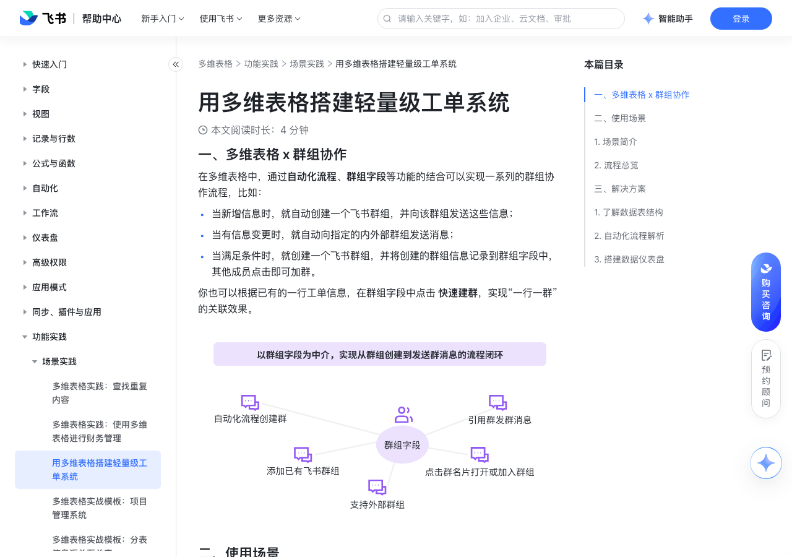

# 用多维表格搭建轻量级工单系统

> 来源：[飞书帮助中心](https://www.feishu.cn/hc/zh-CN/articles/036424884256)  
> 分类：多维表格 / 功能实践 / 场景实践  
> 抓取时间：2026-09-22T01:26:49.211Z

## 界面截图

### 文档内配图

1. whiteboard_exported_image.png：https://p1-hera.feishucdn.com/tos-cn-i-jbbdkfciu3/9c703da378da4889adce06fdbd46eaf5~tplv-jbbdkfciu3-png:0:0.png
2. whiteboard_exported_image copy.png：https://p1-hera.feishucdn.com/tos-cn-i-jbbdkfciu3/8cb7bb8779634d379febf5600691b1c7~tplv-jbbdkfciu3-png:0:0.png
3. 配图：https://p1-hera.feishucdn.com/tos-cn-i-jbbdkfciu3/3b46726bb7b449dea3745d7205983d84~tplv-jbbdkfciu3-image:0:0.image
4. 配图：https://p1-hera.feishucdn.com/tos-cn-i-jbbdkfciu3/af2ac6c6770b45b68848c635999b61bb~tplv-jbbdkfciu3-image:0:0.image
5. 配图：https://p1-hera.feishucdn.com/tos-cn-i-jbbdkfciu3/fb51dd7c80a446cb801de26b9ee9c6db~tplv-jbbdkfciu3-image:0:0.image
6. 配图：https://p1-hera.feishucdn.com/tos-cn-i-jbbdkfciu3/83ba23f87a4841e8a5738081d423e255~tplv-jbbdkfciu3-image:0:0.image
7. 配图：https://p1-hera.feishucdn.com/tos-cn-i-jbbdkfciu3/dbd4c601d8084228997c950f6edbf0de~tplv-jbbdkfciu3-image:0:0.image
8. 配图：https://p1-hera.feishucdn.com/tos-cn-i-jbbdkfciu3/4a8ce6ffb9844bf599f89632d5229b00~tplv-jbbdkfciu3-image:0:0.image
9. 配图：https://p1-hera.feishucdn.com/tos-cn-i-jbbdkfciu3/28fd9edf26194d7c8014aa7b1fd4a486~tplv-jbbdkfciu3-image:0:0.image
10. 配图：https://p1-hera.feishucdn.com/tos-cn-i-jbbdkfciu3/14c0feb9b905492199bb5521422bae8a~tplv-jbbdkfciu3-image:0:0.image
11. 配图：https://p1-hera.feishucdn.com/tos-cn-i-jbbdkfciu3/361545e6e09d4cb4bc6f4bef411b6a4d~tplv-jbbdkfciu3-image:0:0.image

## 功能定位

本页对应飞书帮助中心「多维表格 / 功能实践 / 场景实践」下的「用多维表格搭建轻量级工单系统」。以下需求描述依据官方说明文档提炼，用于指导 DuoWei 对标实现。

## 功能目标

一、多维表格 x 群组协作

## 文档结构（官方章节）

- 一、多维表格 x 群组协作​
- 二、使用场景​
- 场景简介​
- 流程总览​
- 三、解决方案​
- 了解数据表结构​
- 自动化流程解析​
- 搭建数据仪表盘​

## 详细功能说明

一、多维表格 x 群组协作

当新增信息时，就自动创建一个飞书群组，并向该群组发送这些信息；

当有信息变更时，就自动向指定的内外部群组发送消息；

当满足条件时，就创建一个飞书群组，并将创建的群组信息记录到群组字段中，其他成员点击即可加群。

二、使用场景

场景简介

接到客诉的成员发起工单申请，提交后系统将自动提醒总负责人来分配工单；

负责人可以从实际情况判断是否需要新建工单群，系统将自动创建群组并添加工单发起人、负责人等相关成员进群，同时自动发送工单详细信息到群组里；

如果工单状态、信息等有更新，也能自动同步到工单群中，不用担心产生信息差；

创建的工单群信息可以被记录到群组字段中，相关成员可以直接通过群组字段加入相应工单群，及时追溯上下文。

流程总览

三、解决方案

了解数据表结构

数据表名

关键字段

工单管理总表记录所有的工单信息和数据

关键字段工单负责人：由总负责人分配谁来负责工单任务；是否建群：工单系统总负责人根据工单信息判断是否需要新建群组，选择 建群 时将自动创建一个群组；工单状态：根据工单的状态触发不同的操作，比如取消后发送消息到群组等；工单开始时间：当工单状态变成 进行中 时，自动写入开始时间；工单结束时间：当工单状态变成 已完成 时，自动写入结束时间；耗费工时：公式字段，自动计算每个工单从开始到结束耗费的时间；工单群：群组字段，可以在这里绑定已有的群组，也可以将通过 是否建群 中新创建的群组记录到这里。

工单负责人：由总负责人分配谁来负责工单任务；

是否建群：工单系统总负责人根据工单信息判断是否需要新建群组，选择 建群 时将自动创建一个群组；

工单状态：根据工单的状态触发不同的操作，比如取消后发送消息到群组等；

工单开始时间：当工单状态变成 进行中 时，自动写入开始时间；

工单结束时间：当工单状态变成 已完成 时，自动写入结束时间；

耗费工时：公式字段，自动计算每个工单从开始到结束耗费的时间；

工单群：群组字段，可以在这里绑定已有的群组，也可以将通过 是否建群 中新创建的群组记录到这里。

250px|700px|reset250px|700px|reset

关键视图工单总表：用来记录所有的工单详细信息；工单申请表单：由工单发起人填写。还可以根据具体业务需求，通过不同的筛选、分组等方式添加其他视图，让信息更聚焦。

工单总表：用来记录所有的工单详细信息；

工单申请表单：由工单发起人填写。

自动化流程解析

流程名称

流程设置

效果图示

成功创建通知发送消息

触发条件：用户通过表单 工单申请表单 提交工单信息后触发。实现效果：工单申请人将收到已成功创建工单的信息。

触发条件：用户通过表单 工单申请表单 提交工单信息后触发。

实现效果：工单申请人将收到已成功创建工单的信息。

250px|700px|reset

新增工单通知发送消息

触发条件：用户通过表单 工单申请表单 提交工单信息后触发。实现效果：目标用户或群组（如工单信息群）可以收到新增工单的提示，并查看工单相关的信息。

实现效果：目标用户或群组（如工单信息群）可以收到新增工单的提示，并查看工单相关的信息。

建群发通知创建群组、修改记录、发送消息

触发条件：当 是否建群 变更为 建群 时触发。实现效果：自动创建一个飞书群并添加工单创建人、负责人和总负责人为群成员；将创建的群组记录到群组字段，工单状态修改为 进行中，并自动记录工单开始时间；发送工单信息到创建的工单群组。

触发条件：当 是否建群 变更为 建群 时触发。

实现效果：

自动创建一个飞书群并添加工单创建人、负责人和总负责人为群成员；

将创建的群组记录到群组字段，工单状态修改为 进行中，并自动记录工单开始时间；

发送工单信息到创建的工单群组。

负责人变更通知发送消息、修改记录

触发条件：当 新负责人不为空 时触发。实现效果：向新负责人发送更换负责人通知，新负责人可从多维表格中通过群组字段加群；向群组同步变更后的信息；将 工单负责人 修改为 新负责人。

触发条件：当 新负责人不为空 时触发。

向新负责人发送更换负责人通知，新负责人可从多维表格中通过群组字段加群；

向群组同步变更后的信息；

将 工单负责人 修改为 新负责人。

记录完成时间修改记录

触发条件：工单状态 变更为 已完成 或 已取消 时触发。实现效果：自动记录工单的结束时间，并通过公式自动计算耗费工时，方便后续效率统计。

触发条件：工单状态 变更为 已完成 或 已取消 时触发。

实现效果：自动记录工单的结束时间，并通过公式自动计算耗费工时，方便后续效率统计。

满意度调查发送消息

触发条件：工单状态 变更为 已完成 时触发。实现效果：向工单群发送工单已完成的信息并邀请填写满意度评价。

触发条件：工单状态 变更为 已完成 时触发。

实现效果：向工单群发送工单已完成的信息并邀请填写满意度评价。

工单数据同步发送仪表盘

触发条件：每个工作日定时触发。实现效果：向目标群组或用户发送每天的工单数据情况，方便随时跟进工单进度。

触发条件：每个工作日定时触发。

实现效果：向目标群组或用户发送每天的工单数据情况，方便随时跟进工单进度。

💡 此外，还可按需决定是否需要在工单发生变化时及时同步相关成员，比如：工单信息发生变更时或是工单状态有更新时，都可以及时向群组同步。

搭建数据仪表盘

数据表名 | 关键字段 | 图示

工单管理总表记录所有的工单信息和数据 | 关键字段工单负责人：由总负责人分配谁来负责工单任务；是否建群：工单系统总负责人根据工单信息判断是否需要新建群组，选择 建群 时将自动创建一个群组；工单状态：根据工单的状态触发不同的操作，比如取消后发送消息到群组等；工单开始时间：当工单状态变成 进行中 时，自动写入开始时间；工单结束时间：当工单状态变成 已完成 时，自动写入结束时间；耗费工时：公式字段，自动计算每个工单从开始到结束耗费的时间；工单群：群组字段，可以在这里绑定已有的群组，也可以将通过 是否建群 中新创建的群组记录到这里。 | 250px|700px|reset250px|700px|reset

流程名称 | 流程设置 | 效果图示

成功创建通知发送消息 | 触发条件：用户通过表单 工单申请表单 提交工单信息后触发。实现效果：工单申请人将收到已成功创建工单的信息。 | 250px|700px|reset

新增工单通知发送消息 | 触发条件：用户通过表单 工单申请表单 提交工单信息后触发。实现效果：目标用户或群组（如工单信息群）可以收到新增工单的提示，并查看工单相关的信息。 |

建群发通知创建群组、修改记录、发送消息 | 触发条件：当 是否建群 变更为 建群 时触发。实现效果：自动创建一个飞书群并添加工单创建人、负责人和总负责人为群成员；将创建的群组记录到群组字段，工单状态修改为 进行中，并自动记录工单开始时间；发送工单信息到创建的工单群组。 | 250px|700px|reset

负责人变更通知发送消息、修改记录 | 触发条件：当 新负责人不为空 时触发。实现效果：向新负责人发送更换负责人通知，新负责人可从多维表格中通过群组字段加群；向群组同步变更后的信息；将 工单负责人 修改为 新负责人。 | 250px|700px|reset

记录完成时间修改记录 | 触发条件：工单状态 变更为 已完成 或 已取消 时触发。实现效果：自动记录工单的结束时间，并通过公式自动计算耗费工时，方便后续效率统计。 | 250px|700px|reset

满意度调查发送消息 | 触发条件：工单状态 变更为 已完成 时触发。实现效果：向工单群发送工单已完成的信息并邀请填写满意度评价。 | 250px|700px|reset

工单数据同步发送仪表盘 | 触发条件：每个工作日定时触发。实现效果：向目标群组或用户发送每天的工单数据情况，方便随时跟进工单进度。 | 250px|700px|reset

## 实现要点（对标 DuoWei）

1. **入口与信息架构**：在产品中明确该能力所属模块（功能实践 / 场景实践），并保证用户可从对应导航触达。
2. **核心交互**：按上文「详细功能说明」还原主要操作路径；截图中出现的按钮、字段、面板命名尽量与飞书语义一致或可映射。
3. **数据与权限**：若文档涉及可见范围、可编辑范围、分享或高级权限，实现时需落到角色/成员模型，并保证 API/MCP 与 UI 权限一致。
4. **边界与上限**：若文档提到数量上限、格式限制、导入导出约束，需在实现与错误提示中体现。
5. **验收**：以本页截图场景为用例，完成「能打开 / 能配置 / 能保存 / 能被 Agent 读写（如适用）」四项检查。

## 原始摘录摘要

> 一、多维表格 x 群组协作 当新增信息时，就自动创建一个飞书群组，并向该群组发送这些信息； 当有信息变更时，就自动向指定的内外部群组发送消息； 当满足条件时，就创建一个飞书群组，并将创建的群组信息记录到群组字段中，其他成员点击即可加群。 二、使用场景 场景简介 接到客诉的成员发起工单申请，提交后系统将自动提醒总负责人来分配工单； 负责人可以从实际情况判断是否需要新建工单群，系统将自动创建群组并添加工单发起人、负责人等相关成员进群，同时自动发送工单详细信息到群组里； 如果工单状态、信息等有更新，也能自动同步到工单群中，不用担心产生信息差； 创建的工单群信息可以被记录到群组字段中，相关成员可以直接通过群组字段加入相应工单群，及时追溯上下文。 流程总览 三、解决方案 了解数据表结构 数据表名 关键字段 工单管理总表记录所有的工单信息和数据 关键字段工单负责人：由总负责人分配谁来负责工单任务；是否建群：工单系统总负责人根据工单信息判断是否需要新建群组，选择 建群 时将自动创建一个群组；工单状态：根据工单的状态触发不同的操作，比如取消后发送消息到群组等；工单开始时间：当工单状态变成 进行中 时，自动写入开始时间；工单结束时间：当工单状态变成 已完成 时，自动写入结束时间；耗费工时：公式字段，自动计算每个工单从开始到结束耗费的时间；工单群：群组字段，可以在这里绑定已有的群组，也可以将通过 是否建群 中新创建的群组记录到这里。 工单负责人：由总负责人分配谁来负责工单任务； 是否建群：工单系统总负责人根据工单信息判断是否需要新建群组，选择 建群 时将自动创建一个群组； 工单状态：根据工单的状态触发不同的操作，比如取消后发送消息到群组等； 工单开始时间：当工单状态变成 进行中 时，自动写入开始时间； 工单结束时间：当工单状态变成 已完成 时，自动写入结束时间； 耗费工时：公式字段，自动计算每…

## 元数据

- article_id: `7213316794600374274`
- category_id: `7225155238691471361`
- path: `/hc/zh-CN/articles/036424884256`
- extracted_text_length: 3276
