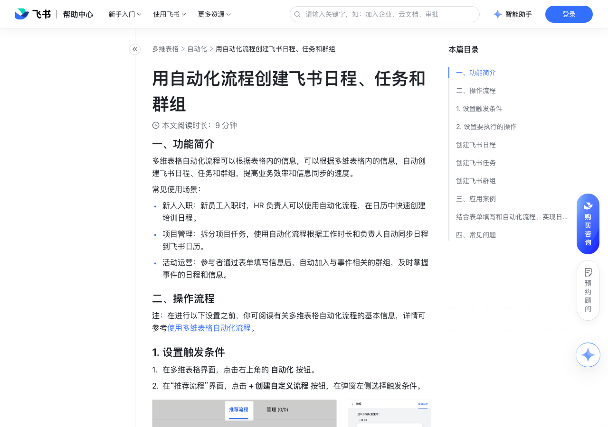

# 用自动化流程创建飞书日程、任务和群组

> 来源：[飞书帮助中心](https://www.feishu.cn/hc/zh-CN/articles/447311016689)  
> 分类：多维表格 / 自动化  
> 抓取时间：2026-09-22T01:24:01.384Z

## 界面截图

### 文档内配图

1. 配图：https://p1-hera.feishucdn.com/tos-cn-i-jbbdkfciu3/d2a02f917ecf47ac835519c5085effe2~tplv-jbbdkfciu3-image:0:0.image
2. 配图：https://p1-hera.feishucdn.com/tos-cn-i-jbbdkfciu3/f7950c4b59b747f8b9155919fb9c08a2~tplv-jbbdkfciu3-image:0:0.image
3. 配图：https://p1-hera.feishucdn.com/tos-cn-i-jbbdkfciu3/59eb087b92c940a0a2036213017c7f9f~tplv-jbbdkfciu3-image:0:0.image
4. 配图：https://p1-hera.feishucdn.com/tos-cn-i-jbbdkfciu3/84f0ced9ead441d0a7a341ff6bf7a601~tplv-jbbdkfciu3-image:0:0.image
5. 配图：https://p1-hera.feishucdn.com/tos-cn-i-jbbdkfciu3/1f9a17d630dd4fcaa35bc5a4ed090214~tplv-jbbdkfciu3-image:0:0.image
6. 配图：https://p1-hera.feishucdn.com/tos-cn-i-jbbdkfciu3/44a2e619840f4a23ab89991d0b93a41a~tplv-jbbdkfciu3-image:0:0.image
7. 配图：https://p1-hera.feishucdn.com/tos-cn-i-jbbdkfciu3/541a259745254ea5963a934d4979d119~tplv-jbbdkfciu3-image:0:0.image
8. 配图：https://p1-hera.feishucdn.com/tos-cn-i-jbbdkfciu3/ed56f7124ded449db2d5c666b25bf351~tplv-jbbdkfciu3-image:0:0.image
9. 配图：https://p1-hera.feishucdn.com/tos-cn-i-jbbdkfciu3/5dcb3f18c7a8434bb49793e5edfbf14a~tplv-jbbdkfciu3-image:0:0.image
10. 配图：https://p1-hera.feishucdn.com/tos-cn-i-jbbdkfciu3/2bf4f82a3a694a2e944789d28f20188a~tplv-jbbdkfciu3-image:0:0.image
11. 配图：https://p1-hera.feishucdn.com/tos-cn-i-jbbdkfciu3/6ece29077f40403d9eca9281a373b6e4~tplv-jbbdkfciu3-image:0:0.image
12. 配图：https://p1-hera.feishucdn.com/tos-cn-i-jbbdkfciu3/9d6a5d638624464480f09e3c10ab3c04~tplv-jbbdkfciu3-image:0:0.image
13. 配图：https://p1-hera.feishucdn.com/tos-cn-i-jbbdkfciu3/b5ca9a04c57f4240ad6f279d809f755a~tplv-jbbdkfciu3-image:0:0.image
14. 配图：https://p1-hera.feishucdn.com/tos-cn-i-jbbdkfciu3/2b43c9a8c858403b99efb4dbb176cf5c~tplv-jbbdkfciu3-image:0:0.image

## 功能定位

本页对应飞书帮助中心「多维表格 / 自动化」下的「用自动化流程创建飞书日程、任务和群组」。以下需求描述依据官方说明文档提炼，用于指导 DuoWei 对标实现。

## 功能目标

一、功能简介

## 文档结构（官方章节）

- 一、功能简介​
- 二、操作流程​
- 设置触发条件​
- 设置要执行的操作​
- 创建飞书日程​
- 创建飞书任务​
- 创建飞书群组​
- 三、应用案例​
- 结合表单填写和自动化流程，实现日程的自动创建​
- 四、常见问题​

## 详细功能说明

一、功能简介

新人入职：新员工入职时，HR 负责人可以使用自动化流程，在日历中快速创建培训日程。

项目管理：拆分项目任务，使用自动化流程根据工作时长和负责人自动同步日程到飞书日历。

活动运营：参与者通过表单填写信息后，自动加入与事件相关的群组，及时掌握事件的日程和信息。

二、操作流程

设置触发条件

在多维表格界面，点击右上角的 自动化 按钮。

在“推荐流程”界面，点击 + 创建自定义流程 按钮，在弹窗左侧选择触发条件。

设置要执行的操作

创建飞书日程

在执行操作中，选择 创建飞书日程。

填写日程的主题、开始时间、结束时间。你可以手动填写，也可以点击输入框右侧的 ⊕ 图标引用多维表格中的数据。

在“参与者”输入框内，选择参与日程的联系人或群组。外部的联系人或群组也可以被选择。如果日程参与者为空、未选择任何人员，则会默认将该自动化流程的编辑者设置为日程参与人。

选择日程所属的日历。

如果后续你需要使用生成的日程链接，你可以：

在数据表中新建一个文本字段用于存放日程的会议链接。

在自动化创建日程的步骤后，添加一个 修改记录 的自动化步骤，通过引用 第 2 步创建飞书日程的返回值，来自动记录日程的视频会议链接。

此处支持引用的变量内容包括：日历 ID、日程 ID、视频会议链接、日程创建者。

创建飞书任务

在执行操作中，选择 创建飞书任务。

填写任务标题。你可以手动填写，也可以点击输入框右侧的 ⊕ 图标引用多维表格中的数据。

添加任务的负责人。你可以搜索选择自己的联系人；外部联系人也可以被选择。

注：如果选择了多位负责人，则后续只要有一位负责人勾选完成任务，任务即被完成。如果需要设置所有负责人均勾选后才能完成任务，需要在任务界面设置。

设置任务的截止时间。

如果任务创建人将自己设置为任务的负责人或关注人，那么“任务助手”不会向创建人发送通知。因此，当你在通过自动化流程创建任务时，如果任务的负责人或关注人是自己，即使任务创建成功也不会收到通知。你可以在飞书任务里查看创建好的任务。

通过多维表格自动化流程创建的任务，不会直接出现在负责人的任何任务清单中。如有需要，请在任务被创建后手动添加至某个任务清单。

创建飞书群组

在执行操作中，选择 创建飞书群组。

填写群名称。你可以手动填写，也可以点击输入框右侧的 ⊕ 图标引用多维表格中的数据。

添加群成员，最多可以添加 50 人。你可以搜索选择自己的联系人，外部联系人也可以被选择。此处还可以选择之前步骤产生的数据（如有），直接引用多维表格中的人员字段。

选择群主，只能选择 1 人。外部用户无法被选为群主。可以选择之前步骤产生的数据（如有），引用多维表格中的人员字段。如果引用的人员字段中人员多于一人，“多维表格助手”会成为该群的群主。

输入群描述（非必填）。

除“创建群组”的操作之外，自动化还支持 添加群成员 和 移除群成员 的执行操作。添加和移除时最多可选择 50 人。

三、应用案例

结合表单填写和自动化流程，实现日程的自动创建

在表格视图中，添加“议题”（文本字段）、“开始时间”（日期字段）、“结束时间”（日期字段）和“是否预约会议？”（复选框字段）几个字段。日期格式需要设置为带有分钟的格式。

创建一个自动化流程，设置触发条件和执行操作。

触发条件：选择 添加新记录时，在“且已选字段不为空时”处，勾选“是否预约会议？”字段。

执行操作：选择 创建飞书日程。设置日程主题、开始和结束时间等。你可以引用多维表格中的字段数据，例如，在“日程主题”一栏引用记录创建人的姓名和“议题”字段内容，将表格内的日期字段引用为开始时间和结束时间等，如下图所示。

最后，点击 保存并启用。

创建一个表单视图，将所有问题设置为必填。点击屏幕右上角的 分享表单，复制表单分享链接并分享给其他人。

四、常见问题

问：多维表格自动化流程可以创建包含外部用户的日程或任务吗？

答：可以。

问：多维表格自动化流程创建群组时可以添加外部用户吗？

答：可以，但不能将外部用户设置为群主。

问：什么是任务 ID？

答：任务 ID 是用于识别任务的唯一身份。

问：什么是任务链接？

答：任务链接是任务的 AppLink。你可以直接从这个 AppLink 打开任务的详细页面。

问：在多维表格自动化流程中创建日程时，如何提前设置好日程的名称？

答：在“日程主题”输入框内，你可以手动输入日程的名称，或者点击输入框右侧的 ⊕ 引用多维表格中的数据。

问：在多维表格内删除一条记录时，能删除对应的由自动化流程创建的日程吗？

答：不能。

问：如何通过多维表格自动化创建“全天”的日程？

答：你可以将日程的开始时间和结束时间分别设置为同一天的 0:00 和 23:59。但是，在以这种方式创建的日程的详细页面中，“全天”选项不会被选中（见右图）。250px|700px|reset250px|700px|reset

问：多维表格是否可以实现“将所有员工的请假状态通过日历展示出来”的效果？

答：可以，前提是需要新建一个专门用于展示员工请假情况的公共日历，且员工请假是通过飞书审批进行申请和记录的。借助同步审批数据到多维表格的功能，将员工请假的各种数据同步到多维表格中，包括发起人姓名、请假起止时间等。再利用自动化创建日程的功能，即可实现类似效果。比如，如果你想达成“当请假审批已通过时，将请假情况展示在日历中”的效果，就可以采取这样的做法：将触发条件设置为“新增/修改的记录满足条件时”，满足的条件为“审批节点”字段等于“已通过”。将执行操作设置为“创建飞书日程”，自定义日程名称，并将日程的开始和结束时间设置为员工请假的起止时间。需注意，选择日历时请选择专用的员工请假公共日历，方便展示给企业内所有人查看。以上步骤仅供参考，如有其他管理需求或场景请进行自定义。250px|700px|reset

## 实现要点（对标 DuoWei）

1. **入口与信息架构**：在产品中明确该能力所属模块（自动化），并保证用户可从对应导航触达。
2. **核心交互**：按上文「详细功能说明」还原主要操作路径；截图中出现的按钮、字段、面板命名尽量与飞书语义一致或可映射。
3. **数据与权限**：若文档涉及可见范围、可编辑范围、分享或高级权限，实现时需落到角色/成员模型，并保证 API/MCP 与 UI 权限一致。
4. **边界与上限**：若文档提到数量上限、格式限制、导入导出约束，需在实现与错误提示中体现。
5. **验收**：以本页截图场景为用例，完成「能打开 / 能配置 / 能保存 / 能被 Agent 读写（如适用）」四项检查。

## 原始摘录摘要

> 一、功能简介 新人入职：新员工入职时，HR 负责人可以使用自动化流程，在日历中快速创建培训日程。 项目管理：拆分项目任务，使用自动化流程根据工作时长和负责人自动同步日程到飞书日历。 活动运营：参与者通过表单填写信息后，自动加入与事件相关的群组，及时掌握事件的日程和信息。 二、操作流程 设置触发条件 在多维表格界面，点击右上角的 自动化 按钮。 在“推荐流程”界面，点击 + 创建自定义流程 按钮，在弹窗左侧选择触发条件。 设置要执行的操作 创建飞书日程 在执行操作中，选择 创建飞书日程。 填写日程的主题、开始时间、结束时间。你可以手动填写，也可以点击输入框右侧的 ⊕ 图标引用多维表格中的数据。 在“参与者”输入框内，选择参与日程的联系人或群组。外部的联系人或群组也可以被选择。如果日程参与者为空、未选择任何人员，则会默认将该自动化流程的编辑者设置为日程参与人。 选择日程所属的日历。 如果后续你需要使用生成的日程链接，你可以： 在数据表中新建一个文本字段用于存放日程的会议链接。 在自动化创建日程的步骤后，添加一个 修改记录 的自动化步骤，通过引用 第 2 步创建飞书日程的返回值，来自动记录日程的视频会议链接。 此处支持引用的变量内容包括：日历 ID、日程 ID、视频会议链接、日程创建者。 创建飞书任务 在执行操作中，选择 创建飞书任务。 填写任务标题。你可以手动填写，也可以点击输入框右侧的 ⊕ 图标引用多维表格中的数据。 添加任务的负责人。你可以搜索选择自己的联系人；外部联系人也可以被选择。 注：如果选择了多位负责人，则后续只要有一位负责人勾选完成任务，任务即被完成。如果需要设置所有负责人均勾选后才能完成任务，需要在任务界面设置。 设置任务的截止时间。 如果任务创建人将自己设置为任务的负责人或关注人，那么“任务助手”不会向创建人发送通知。因此，当你在通过自动化流程创建任务时，如果…

## 元数据

- article_id: `7179506996646952961`
- category_id: `7165751270974767105`
- path: `/hc/zh-CN/articles/447311016689`
- extracted_text_length: 2413
