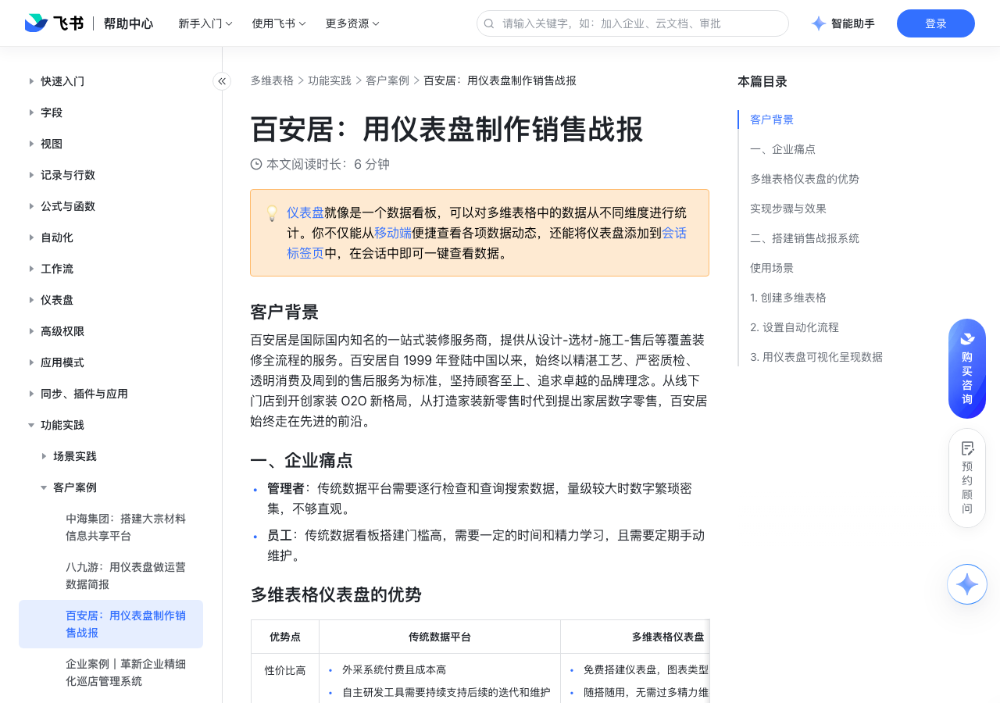

# 百安居：用仪表盘制作销售战报

> 来源：[飞书帮助中心](https://www.feishu.cn/hc/zh-CN/articles/333358441607)  
> 分类：多维表格 / 功能实践 / 客户案例  
> 抓取时间：2026-09-22T01:26:51.313Z

## 界面截图

### 文档内配图

1. image.png：https://p1-hera.feishucdn.com/tos-cn-i-jbbdkfciu3/4eb88877693340fba2f2409ad73e74fe~tplv-jbbdkfciu3-image:0:0.image
2. 配图：https://p1-hera.feishucdn.com/tos-cn-i-jbbdkfciu3/65cf6d59d45246989be2edb43c902813~tplv-jbbdkfciu3-image:0:0.image
3. 配图：https://p1-hera.feishucdn.com/tos-cn-i-jbbdkfciu3/e6227782730a4f8eb56ff90385d5a68c~tplv-jbbdkfciu3-image:0:0.image
4. Group 1912055499 (1).png：https://p1-hera.feishucdn.com/tos-cn-i-jbbdkfciu3/7a25d195c89e455dbcc50c06b18f0820~tplv-jbbdkfciu3-png:0:0.png
5. 配图：https://p1-hera.feishucdn.com/tos-cn-i-jbbdkfciu3/3d21a73808bd44379552cf854d573e0f~tplv-jbbdkfciu3-image:0:0.image

## 功能定位

本页对应飞书帮助中心「多维表格 / 功能实践 / 客户案例」下的「百安居：用仪表盘制作销售战报」。以下需求描述依据官方说明文档提炼，用于指导 DuoWei 对标实现。

## 功能目标

客户背景

## 文档结构（官方章节）

- 客户背景​
- 一、企业痛点​
- 多维表格仪表盘的优势​
- 实现步骤与效果​
- 二、搭建销售战报系统​
- 使用场景​
- 创建多维表格​
- 设置自动化流程​
- 用仪表盘可视化呈现数据​

## 详细功能说明

客户背景

一、企业痛点

管理者：传统数据平台需要逐行检查和查询搜索数据，量级较大时数字繁琐密集，不够直观。

员工：传统数据看板搭建门槛高，需要一定的时间和精力学习，且需要定期手动维护。

多维表格仪表盘的优势

传统数据平台

多维表格仪表盘

性价比高

外采系统付费且成本高自主研发工具需要持续支持后续的迭代和维护

外采系统付费且成本高

自主研发工具需要持续支持后续的迭代和维护

免费搭建仪表盘，图表类型丰富随搭随用，无需过多精力维护

免费搭建仪表盘，图表类型丰富

随搭随用，无需过多精力维护

操作门槛低

专业数据工具需要有数据分析背景的专人维护需要系统学习数据平台搭建的知识或课程

专业数据工具需要有数据分析背景的专人维护

需要系统学习数据平台搭建的知识或课程

所有人都可以基于表格中的数据按照不同维度搭建数据看板没有任何数据基础也能快速上手

所有人都可以基于表格中的数据按照不同维度搭建数据看板

没有任何数据基础也能快速上手

稳定性高协作性强

与海外协作时，常常有网络不稳定的问题数据工具与消息等工具割裂，协作不够顺畅

与海外协作时，常常有网络不稳定的问题

数据工具与消息等工具割裂，协作不够顺畅

与飞书套件打通，感受一站式协作工具的流畅无需反复切换工具，协作更加顺畅

与飞书套件打通，感受一站式协作工具的流畅

无需反复切换工具，协作更加顺畅

实现步骤与效果

创建多维表格，管理数据

找到目标飞书会话群，比如：销售大群等

在目标群组内配置群组机器人，用来推送签单消息

配置多维表格自动化流程，使用发送 HTTP 请求来执行向群组推送消息的操作

业务人员通过表单填写签单信息，提交后即可触发自动化流程，向群内推送消息

基于多维表格中的数据，用多种图表从不同维度搭建数据看板。

通过多维表格自动化流程向团队成员同步销售赢单信息，一键点击即可查看相关数据。

二、搭建销售战报系统

使用场景

618 一口价整装签单王

全国 38 个门店，大中小群各一，总量 200 人参与，包括区总、门店经理、一线销售人员

创建多维表格

签约动态表：用来记录签约信息，其中业务人员通过表单来提交相关数据。

门店信息对照表：总数据表，用来记录所有门店信息。

设置自动化流程

设置触发条件为：新增记录时，此时只要业务人员提交了签单信息，就能执行下一步操作。

设置执行操作为：发送 HTTP 请求，通过在群组中配置自定义机器人的方式，即可向目标群组推送相关的签单信息。

用仪表盘可视化呈现数据

优势点 | 传统数据平台 | 多维表格仪表盘

性价比高 | 外采系统付费且成本高自主研发工具需要持续支持后续的迭代和维护 | 免费搭建仪表盘，图表类型丰富随搭随用，无需过多精力维护

操作门槛低 | 专业数据工具需要有数据分析背景的专人维护需要系统学习数据平台搭建的知识或课程 | 所有人都可以基于表格中的数据按照不同维度搭建数据看板没有任何数据基础也能快速上手

稳定性高协作性强 | 与海外协作时，常常有网络不稳定的问题数据工具与消息等工具割裂，协作不够顺畅 | 与飞书套件打通，感受一站式协作工具的流畅无需反复切换工具，协作更加顺畅

## 实现要点（对标 DuoWei）

1. **入口与信息架构**：在产品中明确该能力所属模块（功能实践 / 客户案例），并保证用户可从对应导航触达。
2. **核心交互**：按上文「详细功能说明」还原主要操作路径；截图中出现的按钮、字段、面板命名尽量与飞书语义一致或可映射。
3. **数据与权限**：若文档涉及可见范围、可编辑范围、分享或高级权限，实现时需落到角色/成员模型，并保证 API/MCP 与 UI 权限一致。
4. **边界与上限**：若文档提到数量上限、格式限制、导入导出约束，需在实现与错误提示中体现。
5. **验收**：以本页截图场景为用例，完成「能打开 / 能配置 / 能保存 / 能被 Agent 读写（如适用）」四项检查。

## 原始摘录摘要

> 客户背景 一、企业痛点 管理者：传统数据平台需要逐行检查和查询搜索数据，量级较大时数字繁琐密集，不够直观。 员工：传统数据看板搭建门槛高，需要一定的时间和精力学习，且需要定期手动维护。 多维表格仪表盘的优势 传统数据平台 多维表格仪表盘 性价比高 外采系统付费且成本高自主研发工具需要持续支持后续的迭代和维护 外采系统付费且成本高 自主研发工具需要持续支持后续的迭代和维护 免费搭建仪表盘，图表类型丰富随搭随用，无需过多精力维护 免费搭建仪表盘，图表类型丰富 随搭随用，无需过多精力维护 操作门槛低 专业数据工具需要有数据分析背景的专人维护需要系统学习数据平台搭建的知识或课程 专业数据工具需要有数据分析背景的专人维护 需要系统学习数据平台搭建的知识或课程 所有人都可以基于表格中的数据按照不同维度搭建数据看板没有任何数据基础也能快速上手 所有人都可以基于表格中的数据按照不同维度搭建数据看板 没有任何数据基础也能快速上手 稳定性高协作性强 与海外协作时，常常有网络不稳定的问题数据工具与消息等工具割裂，协作不够顺畅 与海外协作时，常常有网络不稳定的问题 数据工具与消息等工具割裂，协作不够顺畅 与飞书套件打通，感受一站式协作工具的流畅无需反复切换工具，协作更加顺畅 与飞书套件打通，感受一站式协作工具的流畅 无需反复切换工具，协作更加顺畅 实现步骤与效果 创建多维表格，管理数据 找到目标飞书会话群，比如：销售大群等 在目标群组内配置群组机器人，用来推送签单消息 配置多维表格自动化流程，使用发送 HTTP 请求来执行向群组推送消息的操作 业务人员通过表单填写签单信息，提交后即可触发自动化流程，向群内推送消息 基于多维表格中的数据，用多种图表从不同维度搭建数据看板。 通过多维表格自动化流程向团队成员同步销售赢单信息，一键点击即可查看相关数据。 二、搭建销售战报系统 使用场景 618 一口价整装…

## 元数据

- article_id: `7116516479100534785`
- category_id: `7225155397370363906`
- path: `/hc/zh-CN/articles/333358441607`
- extracted_text_length: 1298
