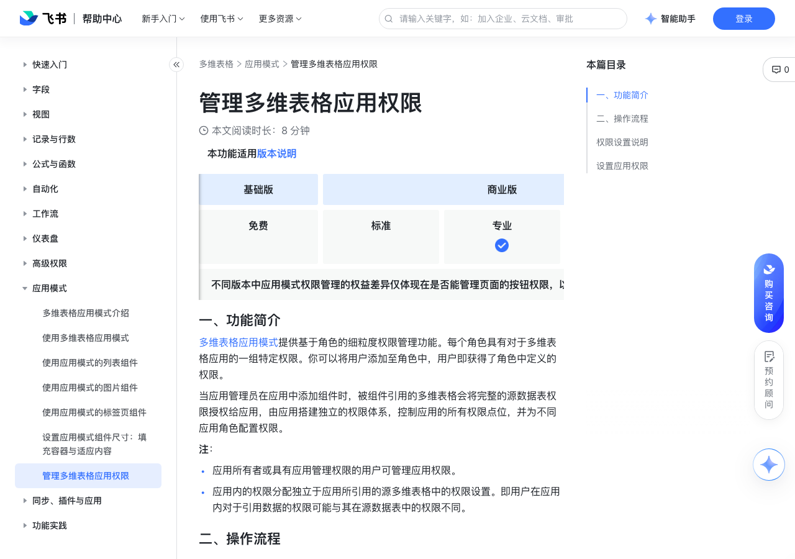

# 管理多维表格应用权限

> 来源：[飞书帮助中心](https://www.feishu.cn/hc/zh-CN/articles/798412479190)  
> 分类：多维表格 / 应用模式  
> 抓取时间：2026-09-22T01:26:33.633Z

## 界面截图

### 文档内配图

1. 配图：https://p1-hera.feishucdn.com/tos-cn-i-jbbdkfciu3/d5762b7e74714491842cce36addbcfdd~tplv-jbbdkfciu3-image:0:0.image
2. 配图：https://p1-hera.feishucdn.com/tos-cn-i-jbbdkfciu3/fd92d1d609d844aebf007f5815fcd20d~tplv-jbbdkfciu3-image:0:0.image
3. 配图：https://p1-hera.feishucdn.com/tos-cn-i-jbbdkfciu3/44da10bd24c14cf088d84fedf01cfd77~tplv-jbbdkfciu3-image:0:0.image
4. 配图：https://p1-hera.feishucdn.com/tos-cn-i-jbbdkfciu3/1a423e0703b646d58509a94a75f3a9b7~tplv-jbbdkfciu3-image:0:0.image
5. 配图：https://p1-hera.feishucdn.com/tos-cn-i-jbbdkfciu3/eda66ee8b1cb4099a3fd113f7899c95e~tplv-jbbdkfciu3-image:0:0.image

## 功能定位

本页对应飞书帮助中心「多维表格 / 应用模式」下的「管理多维表格应用权限」。以下需求描述依据官方说明文档提炼，用于指导 DuoWei 对标实现。

## 功能目标

一、功能简介

## 文档结构（官方章节）

- 一、功能简介​
- 二、操作流程​
- 权限设置说明​
- 设置应用权限​

## 详细功能说明

一、功能简介

应用所有者或具有应用管理权限的用户可管理应用权限。

应用内的权限分配独立于应用所引用的源多维表格中的权限设置。即用户在应用内对于引用数据的权限可能与其在源数据表中的权限不同。

二、操作流程

权限设置说明

页面权限：是否可浏览应用页面，以及对页面上列表组件中的按钮是否可操作。

数据权限：是否可以通过应用中的组件，对引用的数据表进行增、删、改、查等操作，以及可操作的数据范围。

注：应用中设定的数据权限仅在应用中生效。当用户使用对应的多维表格时，其所拥有的权限将由多维表格中的权限设置决定。

其他功能权限：是否可复制应用内容。

页面权限

数据权限

其他功能权限

角色权限是否可被修改

可管理所有页面，包括新增页面。可操作页面上的全部按钮。

可管理所有页面，包括新增页面。

可操作页面上的全部按钮。

可编辑所有引用的多维表格数据表，包括新增的引用数据表。

可复制应用内容

默认：可阅读所有页面，包括新增的页面。可见全部按钮；是否可操作需结合对应数据表的行权限判断。可调整权限。

可阅读所有页面，包括新增的页面。

可见全部按钮；是否可操作需结合对应数据表的行权限判断。

可调整权限。

默认：可编辑所有引用的多维表格数据表。可调整数据表、行、列的编辑、阅读权限。

默认：可编辑所有引用的多维表格数据表。

可调整数据表、行、列的编辑、阅读权限。

默认：可复制应用内容可更改为不可复制

默认：可复制应用内容

可更改为不可复制

默认：可阅读所有引用的多维表格数据表。可调整数据表、行、列的阅读权限。

默认：可阅读所有引用的多维表格数据表。

可调整数据表、行、列的阅读权限。

设置应用权限

在应用右上角点击 应用权限，打开权限管理面板。

注：如果你看不到 应用权限 图标，需要点击应用名称旁的 编辑应用，进入编辑模式。

你可以设置是否允许用户通过分享的方式授权其他用户访问和使用应用。默认设置为 允许通过分享授权，可更改为 仅自定义角色可访问 。

允许通过分享授权：有权限的用户可通过在分享面板中添加协作者和链接分享的方式分享应用，并分配可管理、可编辑或可阅读的权限。推荐对公共数据应用此选项。

仅自定义角色可访问：仅自定义角色内的成员和拥有多维表格应用可管理权限的用户可访问应用。通过应用链接进入的用户，或在分享面板中添加的可编辑和可阅读的协作者，均无法访问应用。推荐对敏感数据应用此选项。

注：选择 仅自定义角色可访问 后，系统角色中的 编辑者 角色和 阅读者 角色没有访问应用的权限。系统角色中的 所有者 和 管理员 不受影响，可正常访问。

（可选）创建自定义角色：点击权限配置面板左侧的 + 添加角色，即可创建一个自定义角色。在角色配置面板的左上角输入角色名称。

注：点击自定义角色旁的 ··· 图标，你可以重命名、复制或删除角色。

设置角色权限：你可以按需设置系统角色中的编辑者、阅读者的权限，还可以设置自定义角色。下文以自定义角色为例，描述权限设置方式：

设置角色对页面的权限：

250px|700px|reset

点击 页面权限。

在 新增页面默认权限 下拉栏中选择对于新增页面和页面操作的默认权限。

在左侧页面导航栏选择要设置权限的页面，你可以使用上方的搜索框搜索页面。在面板右侧设置以下权限：

页面权限：选择可阅读页面或对页面无阅读权限。

页面操作权限：选择对页面上的哪些按钮可操作，可设置所有按钮可见、不可见，或部分按钮可见。

设置角色对数据的权限：

点击 数据权限。

在 新增数据表默认权限 下拉栏中选择对于新增数据表的默认权限。

设置数据表权限和详细权限。你可以对应用中引用的每个数据表设置整体权限，还可为数据表中的记录、字段、设置更详细的权限。详细权限不可超过数据表的权限：例如，当数据表权限为 仅可阅读 时，记录、字段和视图的最大权限为可阅读，无法被设置为可编辑。

关于设置数据权限的具体信息，请参考“使用多维表格高级权限”教程中的设置数据权限章节。

设置其他功能权限：选择该角色是否可以复制应用中的内容。

将用户添加至角色中：点击角色右上角的 + 添加成员 图标，使用 该角色包含的成员 页面右上角的搜索框添加成员。可向角色中添加用户、群组、部门或用户组。所有被添加的用户将获得该角色的权限设置。

预览权限设置：点击右下角的保存并预览，可进入预览模式。在左上角切换用户，即可预览不同用户授权角色下看到的应用页面和数据操作范围。预览结束后，点击左上角的 退出预览 退出预览模式。

完成权限设置后，点击 保存。

角色 | 页面权限 | 数据权限 | 其他功能权限 | 角色权限是否可被修改

所有者 | 可管理所有页面，包括新增页面。可操作页面上的全部按钮。 | 可编辑所有引用的多维表格数据表，包括新增的引用数据表。 | 可复制应用内容 | 不支持

管理员 | 可管理所有页面，包括新增页面。可操作页面上的全部按钮。 | 可编辑所有引用的多维表格数据表，包括新增的引用数据表。 | 可复制应用内容 | 不支持

编辑者 | 默认：可阅读所有页面，包括新增的页面。可见全部按钮；是否可操作需结合对应数据表的行权限判断。可调整权限。 | 默认：可编辑所有引用的多维表格数据表。可调整数据表、行、列的编辑、阅读权限。 | 默认：可复制应用内容可更改为不可复制 | 支持

阅读者 | 默认：可阅读所有页面，包括新增的页面。可见全部按钮；是否可操作需结合对应数据表的行权限判断。可调整权限。 | 默认：可阅读所有引用的多维表格数据表。可调整数据表、行、列的阅读权限。 | 默认：可复制应用内容可更改为不可复制 | 支持

## 实现要点（对标 DuoWei）

1. **入口与信息架构**：在产品中明确该能力所属模块（应用模式），并保证用户可从对应导航触达。
2. **核心交互**：按上文「详细功能说明」还原主要操作路径；截图中出现的按钮、字段、面板命名尽量与飞书语义一致或可映射。
3. **数据与权限**：若文档涉及可见范围、可编辑范围、分享或高级权限，实现时需落到角色/成员模型，并保证 API/MCP 与 UI 权限一致。
4. **边界与上限**：若文档提到数量上限、格式限制、导入导出约束，需在实现与错误提示中体现。
5. **验收**：以本页截图场景为用例，完成「能打开 / 能配置 / 能保存 / 能被 Agent 读写（如适用）」四项检查。

## 原始摘录摘要

> 一、功能简介 应用所有者或具有应用管理权限的用户可管理应用权限。 应用内的权限分配独立于应用所引用的源多维表格中的权限设置。即用户在应用内对于引用数据的权限可能与其在源数据表中的权限不同。 二、操作流程 权限设置说明 页面权限：是否可浏览应用页面，以及对页面上列表组件中的按钮是否可操作。 数据权限：是否可以通过应用中的组件，对引用的数据表进行增、删、改、查等操作，以及可操作的数据范围。 注：应用中设定的数据权限仅在应用中生效。当用户使用对应的多维表格时，其所拥有的权限将由多维表格中的权限设置决定。 其他功能权限：是否可复制应用内容。 页面权限 数据权限 其他功能权限 角色权限是否可被修改 可管理所有页面，包括新增页面。可操作页面上的全部按钮。 可管理所有页面，包括新增页面。 可操作页面上的全部按钮。 可编辑所有引用的多维表格数据表，包括新增的引用数据表。 可复制应用内容 默认：可阅读所有页面，包括新增的页面。可见全部按钮；是否可操作需结合对应数据表的行权限判断。可调整权限。 可阅读所有页面，包括新增的页面。 可见全部按钮；是否可操作需结合对应数据表的行权限判断。 可调整权限。 默认：可编辑所有引用的多维表格数据表。可调整数据表、行、列的编辑、阅读权限。 默认：可编辑所有引用的多维表格数据表。 可调整数据表、行、列的编辑、阅读权限。 默认：可复制应用内容可更改为不可复制 默认：可复制应用内容 可更改为不可复制 默认：可阅读所有引用的多维表格数据表。可调整数据表、行、列的阅读权限。 默认：可阅读所有引用的多维表格数据表。 可调整数据表、行、列的阅读权限。 设置应用权限 在应用右上角点击 应用权限，打开权限管理面板。 注：如果你看不到 应用权限 图标，需要点击应用名称旁的 编辑应用，进入编辑模式。 你可以设置是否允许用户通过分享的方式授权其他用户访问和使用应用。默认设置为 允许通…

## 元数据

- article_id: `7548790836738588700`
- category_id: `7550306356478574620`
- path: `/hc/zh-CN/articles/798412479190`
- extracted_text_length: 2315
