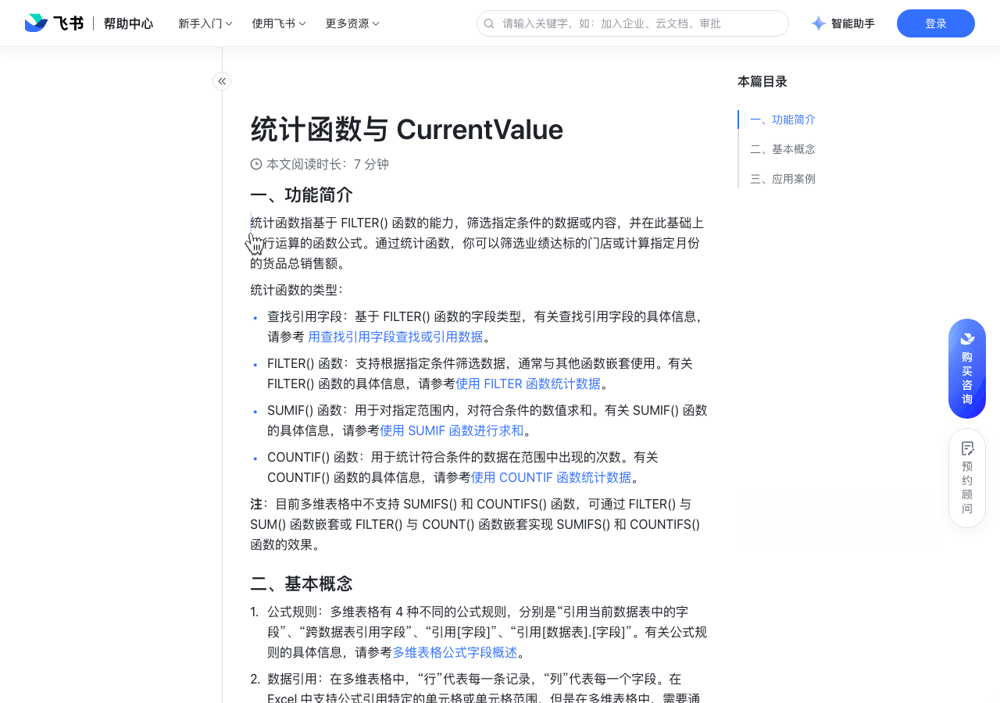

# 统计函数与 CurrentValue

> 来源：[飞书帮助中心](https://www.feishu.cn/hc/zh-CN/articles/129846167324)  
> 分类：多维表格 / 公式与函数 / 基础介绍  
> 抓取时间：2026-09-22T01:23:49.554Z

## 界面截图

### 文档内配图

1. 配图：https://p1-hera.feishucdn.com/tos-cn-i-jbbdkfciu3/5daa78c9833c4180be0cd33f61e3f428~tplv-jbbdkfciu3-image:0:0.image
2. 配图：https://p1-hera.feishucdn.com/tos-cn-i-jbbdkfciu3/0a26ee1dd47440f88123d69f2c058947~tplv-jbbdkfciu3-image:0:0.image
3. 配图：https://p1-hera.feishucdn.com/tos-cn-i-jbbdkfciu3/8a214169570743cf9b1a5c05f6f75150~tplv-jbbdkfciu3-image:0:0.image

## 功能定位

本页对应飞书帮助中心「多维表格 / 公式与函数 / 基础介绍」下的「统计函数与 CurrentValue」。以下需求描述依据官方说明文档提炼，用于指导 DuoWei 对标实现。

## 功能目标

一、功能简介

## 文档结构（官方章节）

- 一、功能简介​
- 二、基本概念​
- 三、应用案例​
- 在数据表中使用 CurrentValue​
- 在字段中使用 CurrentValue ​
- 计算符合条件的销售总和​

## 详细功能说明

一、功能简介

统计函数的类型：

查找引用字段：基于 FILTER() 函数的字段类型，有关查找引用字段的具体信息，请参考 用查找引用字段查找或引用数据。

FILTER() 函数：支持根据指定条件筛选数据，通常与其他函数嵌套使用。有关 FILTER() 函数的具体信息，请参考使用 FILTER 函数统计数据。

SUMIF() 函数：用于对指定范围内，对符合条件的数值求和。有关 SUMIF() 函数的具体信息，请参考使用 SUMIF 函数进行求和。

COUNTIF() 函数：用于统计符合条件的数据在范围中出现的次数。有关 COUNTIF() 函数的具体信息，请参考使用 COUNTIF 函数统计数据。

注：目前多维表格中不支持 SUMIFS() 和 COUNTIFS() 函数，可通过 FILTER() 与 SUM() 函数嵌套或 FILTER() 与 COUNT() 函数嵌套实现 SUMIFS() 和 COUNTIFS() 函数的效果。

二、基本概念

公式规则：多维表格有 4 种不同的公式规则，分别是“引用当前数据表中的字段”、“跨数据表引用字段”、“引用[字段]”、“引用[数据表].[字段]”。有关公式规则的具体信息，请参考多维表格公式字段概述。

数据引用：在多维表格中，“行”代表每一条记录，“列”代表每一个字段。在 Excel 中支持公式引用特定的单元格或单元格范围，但是在多维表格中，需要通过引用字段的方式引用单个数据或数据集合。有关数据引用的具体信息，请参考在公式中引用数据。

CurrentValue：是多维表格针对筛选统计函数特殊开发的一个参数，在使用 FILTER(）、SUMIF()、COUNTIF() 这 3 个函数值时，以 CurrentValue 为参数可以引用数据表中的每一个值。

三、应用案例

在数据表中使用 CurrentValue

在字段中使用 CurrentValue

计算符合条件的销售总和

## 实现要点（对标 DuoWei）

1. **入口与信息架构**：在产品中明确该能力所属模块（公式与函数 / 基础介绍），并保证用户可从对应导航触达。
2. **核心交互**：按上文「详细功能说明」还原主要操作路径；截图中出现的按钮、字段、面板命名尽量与飞书语义一致或可映射。
3. **数据与权限**：若文档涉及可见范围、可编辑范围、分享或高级权限，实现时需落到角色/成员模型，并保证 API/MCP 与 UI 权限一致。
4. **边界与上限**：若文档提到数量上限、格式限制、导入导出约束，需在实现与错误提示中体现。
5. **验收**：以本页截图场景为用例，完成「能打开 / 能配置 / 能保存 / 能被 Agent 读写（如适用）」四项检查。

## 原始摘录摘要

> 一、功能简介 统计函数的类型： 查找引用字段：基于 FILTER() 函数的字段类型，有关查找引用字段的具体信息，请参考 用查找引用字段查找或引用数据。 FILTER() 函数：支持根据指定条件筛选数据，通常与其他函数嵌套使用。有关 FILTER() 函数的具体信息，请参考使用 FILTER 函数统计数据。 SUMIF() 函数：用于对指定范围内，对符合条件的数值求和。有关 SUMIF() 函数的具体信息，请参考使用 SUMIF 函数进行求和。 COUNTIF() 函数：用于统计符合条件的数据在范围中出现的次数。有关 COUNTIF() 函数的具体信息，请参考使用 COUNTIF 函数统计数据。 注：目前多维表格中不支持 SUMIFS() 和 COUNTIFS() 函数，可通过 FILTER() 与 SUM() 函数嵌套或 FILTER() 与 COUNT() 函数嵌套实现 SUMIFS() 和 COUNTIFS() 函数的效果。 二、基本概念 公式规则：多维表格有 4 种不同的公式规则，分别是“引用当前数据表中的字段”、“跨数据表引用字段”、“引用[字段]”、“引用[数据表].[字段]”。有关公式规则的具体信息，请参考多维表格公式字段概述。 数据引用：在多维表格中，“行”代表每一条记录，“列”代表每一个字段。在 Excel 中支持公式引用特定的单元格或单元格范围，但是在多维表格中，需要通过引用字段的方式引用单个数据或数据集合。有关数据引用的具体信息，请参考在公式中引用数据。 CurrentValue：是多维表格针对筛选统计函数特殊开发的一个参数，在使用 FILTER(）、SUMIF()、COUNTIF() 这 3 个函数值时，以 CurrentValue 为参数可以引用数据表中的每一个值。 三、应用案例 在数据表中使用 CurrentValue 在字段中使用 Curren…

## 元数据

- article_id: `7049930870723117058`
- category_id: `7082596125407985665`
- path: `/hc/zh-CN/articles/129846167324`
- extracted_text_length: 818
