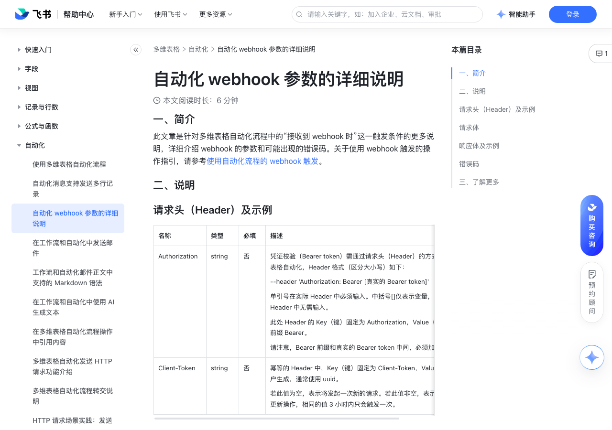

# 自动化 webhook 参数的详细说明

> 来源：[飞书帮助中心](https://www.feishu.cn/hc/zh-CN/articles/383585269199)  
> 分类：多维表格 / 自动化  
> 抓取时间：2026-09-22T01:24:00.345Z

## 界面截图

## 功能定位

本页对应飞书帮助中心「多维表格 / 自动化」下的「自动化 webhook 参数的详细说明」。以下需求描述依据官方说明文档提炼，用于指导 DuoWei 对标实现。

## 功能目标

一、简介

## 文档结构（官方章节）

- 一、简介​
- 二、说明​
- 请求头（Header）及示例​
- 请求体​
- 响应体及示例​
- 错误码​
- 三、了解更多​

## 详细功能说明

一、简介

二、说明

请求头（Header）及示例

Authorization

string

凭证校验（Bearer token）需通过请求头（Header）的方式传给多维表格自动化，Header 格式（区分大小写）如下：--header 'Authorization: Bearer [真实的 Bearer token]'单引号在实际 Header 中必须输入。中括号[]仅表示变量，在实际 Header 中无需输入。此处 Header 的 Key（键）固定为 Authorization，Value（值）有固定前缀 Bearer。请注意，Bearer 前缀和真实的 Bearer token 中间，必须加一个空格。

Client-Token

幂等的 Header 中，Key（键）固定为 Client-Token，Value（值）由用户生成，通常使用 uuid。若此值为空，表示将发起一次新的请求。若此值非空，表示幂等的进行更新操作，相同的值 3 小时内只会触发一次。

响应体及示例

报错文案

报错原因

解决方法

800005649

未通过凭证校验

开启了凭证校验，但HTTP 请求中携带的凭证与自动化流程中所需的凭证不符，导致流程无法运行。

重新检查和输入凭证。

800005650

IP 地址不在白名单中，请检查

开启了 IP 白名单，且发送请求的 IP 不在白名单内。

将对应 IP 加入白名单，或更换 IP 地址重新发送。

800005647

请求内容大小超出上限，请减少内容

webhook 接收 HTTP 请求的大小超出了 4 MB。

请减少内容。

800005646

存在调用自身的 HTTP 节点，造成死循环，请修改 HTTP 节点请求地址

自动化流程的触发条件为“webhook 触发时”，执行操作为“发送 HTTP 请求”，且 HTTP 的请求 URL 和当前流程的 webhook 地址一致，导致流程进入了循环触发。

修改“发送 HTTP 请求”中的 URL，不可与 webhook 地址一致。

800005652

请求过于频繁，请稍后再试

webhook 接收 HTTP 请求的频率超出了限制，被限流。整个多维表格的 webhook 触发频率上限为 50 次/秒。单个自动化流程的 webhook 触发频率上限为 5 次/秒。针对不开启凭证校验（Bearer token）的自动化流程，每个流程的频率上限为 1 次/秒。

整个多维表格的 webhook 触发频率上限为 50 次/秒。

单个自动化流程的 webhook 触发频率上限为 5 次/秒。

针对不开启凭证校验（Bearer token）的自动化流程，每个流程的频率上限为 1 次/秒。

稍后再试。

800006003

请求体不符合 JSON 格式规范，请修改后重新请求

通常发生在使用“通过发送请求设置”的方法设置输出的时候，指接收到的请求体的 JSON 格式有误。

请重新检查请求体的 JSON，修改后重试。

三、了解更多

名称 | 类型 | 必填 | 描述

Authorization | string | 否 | 凭证校验（Bearer token）需通过请求头（Header）的方式传给多维表格自动化，Header 格式（区分大小写）如下：--header 'Authorization: Bearer [真实的 Bearer token]'单引号在实际 Header 中必须输入。中括号[]仅表示变量，在实际 Header 中无需输入。此处 Header 的 Key（键）固定为 Authorization，Value（值）有固定前缀 Bearer。请注意，Bearer 前缀和真实的 Bearer token 中间，必须加一个空格。

Client-Token | string | 否 | 幂等的 Header 中，Key（键）固定为 Client-Token，Value（值）由用户生成，通常使用 uuid。若此值为空，表示将发起一次新的请求。若此值非空，表示幂等的进行更新操作，相同的值 3 小时内只会触发一次。

错误码 | 报错文案 | 报错原因 | 解决方法

800005649 | 未通过凭证校验 | 开启了凭证校验，但HTTP 请求中携带的凭证与自动化流程中所需的凭证不符，导致流程无法运行。 | 重新检查和输入凭证。

800005650 | IP 地址不在白名单中，请检查 | 开启了 IP 白名单，且发送请求的 IP 不在白名单内。 | 将对应 IP 加入白名单，或更换 IP 地址重新发送。

800005647 | 请求内容大小超出上限，请减少内容 | webhook 接收 HTTP 请求的大小超出了 4 MB。 | 请减少内容。

800005646 | 存在调用自身的 HTTP 节点，造成死循环，请修改 HTTP 节点请求地址 | 自动化流程的触发条件为“webhook 触发时”，执行操作为“发送 HTTP 请求”，且 HTTP 的请求 URL 和当前流程的 webhook 地址一致，导致流程进入了循环触发。 | 修改“发送 HTTP 请求”中的 URL，不可与 webhook 地址一致。

800005652 | 请求过于频繁，请稍后再试 | webhook 接收 HTTP 请求的频率超出了限制，被限流。整个多维表格的 webhook 触发频率上限为 50 次/秒。单个自动化流程的 webhook 触发频率上限为 5 次/秒。针对不开启凭证校验（Bearer token）的自动化流程，每个流程的频率上限为 1 次/秒。 | 稍后再试。

800006003 | 请求体不符合 JSON 格式规范，请修改后重新请求 | 通常发生在使用“通过发送请求设置”的方法设置输出的时候，指接收到的请求体的 JSON 格式有误。 | 请重新检查请求体的 JSON，修改后重试。

## 实现要点（对标 DuoWei）

1. **入口与信息架构**：在产品中明确该能力所属模块（自动化），并保证用户可从对应导航触达。
2. **核心交互**：按上文「详细功能说明」还原主要操作路径；截图中出现的按钮、字段、面板命名尽量与飞书语义一致或可映射。
3. **数据与权限**：若文档涉及可见范围、可编辑范围、分享或高级权限，实现时需落到角色/成员模型，并保证 API/MCP 与 UI 权限一致。
4. **边界与上限**：若文档提到数量上限、格式限制、导入导出约束，需在实现与错误提示中体现。
5. **验收**：以本页截图场景为用例，完成「能打开 / 能配置 / 能保存 / 能被 Agent 读写（如适用）」四项检查。

## 原始摘录摘要

> 一、简介 二、说明 请求头（Header）及示例 Authorization string 凭证校验（Bearer token）需通过请求头（Header）的方式传给多维表格自动化，Header 格式（区分大小写）如下：--header 'Authorization: Bearer [真实的 Bearer token]'单引号在实际 Header 中必须输入。中括号[]仅表示变量，在实际 Header 中无需输入。此处 Header 的 Key（键）固定为 Authorization，Value（值）有固定前缀 Bearer。请注意，Bearer 前缀和真实的 Bearer token 中间，必须加一个空格。 Client-Token 幂等的 Header 中，Key（键）固定为 Client-Token，Value（值）由用户生成，通常使用 uuid。若此值为空，表示将发起一次新的请求。若此值非空，表示幂等的进行更新操作，相同的值 3 小时内只会触发一次。 响应体及示例 报错文案 报错原因 解决方法 800005649 未通过凭证校验 开启了凭证校验，但HTTP 请求中携带的凭证与自动化流程中所需的凭证不符，导致流程无法运行。 重新检查和输入凭证。 800005650 IP 地址不在白名单中，请检查 开启了 IP 白名单，且发送请求的 IP 不在白名单内。 将对应 IP 加入白名单，或更换 IP 地址重新发送。 800005647 请求内容大小超出上限，请减少内容 webhook 接收 HTTP 请求的大小超出了 4 MB。 请减少内容。 800005646 存在调用自身的 HTTP 节点，造成死循环，请修改 HTTP 节点请求地址 自动化流程的触发条件为“webhook 触发时”，执行操作为“发送 HTTP 请求”，且 HTTP 的请求 URL 和当前流程的 webho…

## 元数据

- article_id: `7386927940087054364`
- category_id: `7165751270974767105`
- path: `/hc/zh-CN/articles/383585269199`
- extracted_text_length: 2447
