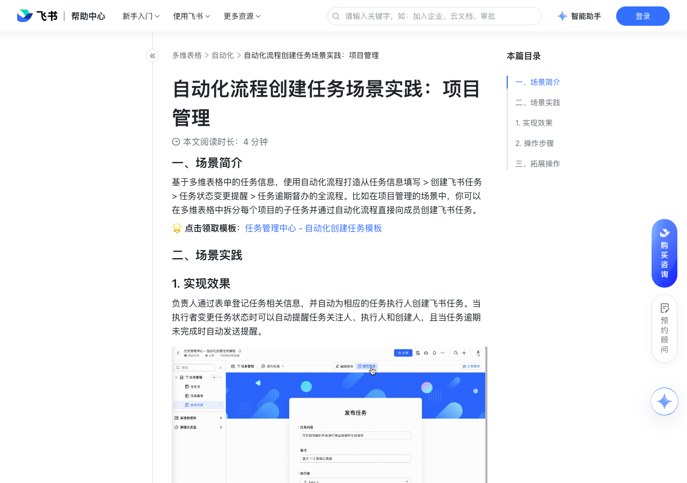

# 自动化流程创建任务场景实践：项目管理

> 来源：[飞书帮助中心](https://www.feishu.cn/hc/zh-CN/articles/071051888352)  
> 分类：多维表格 / 自动化  
> 抓取时间：2026-09-22T01:24:02.343Z

## 界面截图

### 文档内配图

1. 配图：https://p1-hera.feishucdn.com/tos-cn-i-jbbdkfciu3/a2d33e961deb4b0893537dc31469d3a6~tplv-jbbdkfciu3-image:0:0.image
2. 配图：https://p1-hera.feishucdn.com/tos-cn-i-jbbdkfciu3/8d70a8f76b6e46feb1737255d8752741~tplv-jbbdkfciu3-image:0:0.image
3. 配图：https://p1-hera.feishucdn.com/tos-cn-i-jbbdkfciu3/5d27658a68da4e02b06bd9fc7ec98f95~tplv-jbbdkfciu3-image:0:0.image
4. 配图：https://p1-hera.feishucdn.com/tos-cn-i-jbbdkfciu3/d42b8f9a3e5d4f7084ef6dcc2355e8dc~tplv-jbbdkfciu3-image:0:0.image
5. 配图：https://p1-hera.feishucdn.com/tos-cn-i-jbbdkfciu3/2f172960a85d405988e4245c59b3bfd3~tplv-jbbdkfciu3-image:0:0.image
6. 配图：https://p1-hera.feishucdn.com/tos-cn-i-jbbdkfciu3/9914a110dbd94ab5aebb70b064c39090~tplv-jbbdkfciu3-image:0:0.image

## 功能定位

本页对应飞书帮助中心「多维表格 / 自动化」下的「自动化流程创建任务场景实践：项目管理」。以下需求描述依据官方说明文档提炼，用于指导 DuoWei 对标实现。

## 功能目标

一、场景简介

## 文档结构（官方章节）

- 一、场景简介​
- 二、场景实践​
- 实现效果​
- 操作步骤​
- 三、拓展操作​

## 详细功能说明

一、场景简介

二、场景实践

实现效果

操作步骤

设置数据表：1 个表单 + 1 个表格视图

表格视图：负责人可在表格中按需设置任务相关的字段，如：任务内容、执行者、关注者、创建者、截止时间等信息

表单：基于表格视图生成表单，任务创建人可以在表单中填写相应的任务信息来发布任务并自动汇总到表格中

发布任务后自动创建飞书任务：

设置触发条件为添加新记录时，并设置条件执行者不为空

设置执行操作为创建飞书任务，填写相应的任务标题、负责人、截止时间、关注人等信息

任务状态变更时自动通知执行人、关注人、创建人：

设置触发条件为记录内容变更时，选择关注的字段为任务状态

设置执行操作为发送飞书消息，设置接收人、消息内容和跳转链接

任务逾期时向执行人发送催办通知：

设置触发条件为记录内容变更时，设置条件为任务催办等于✅

三、拓展操作

添加一个执行操作

在设置记录内容处，选择字段 > 点击+引用值 > 选择创建飞书任务的返回值 > 选择需要引用的信息

## 实现要点（对标 DuoWei）

1. **入口与信息架构**：在产品中明确该能力所属模块（自动化），并保证用户可从对应导航触达。
2. **核心交互**：按上文「详细功能说明」还原主要操作路径；截图中出现的按钮、字段、面板命名尽量与飞书语义一致或可映射。
3. **数据与权限**：若文档涉及可见范围、可编辑范围、分享或高级权限，实现时需落到角色/成员模型，并保证 API/MCP 与 UI 权限一致。
4. **边界与上限**：若文档提到数量上限、格式限制、导入导出约束，需在实现与错误提示中体现。
5. **验收**：以本页截图场景为用例，完成「能打开 / 能配置 / 能保存 / 能被 Agent 读写（如适用）」四项检查。

## 原始摘录摘要

> 一、场景简介 二、场景实践 实现效果 操作步骤 设置数据表：1 个表单 + 1 个表格视图 表格视图：负责人可在表格中按需设置任务相关的字段，如：任务内容、执行者、关注者、创建者、截止时间等信息 表单：基于表格视图生成表单，任务创建人可以在表单中填写相应的任务信息来发布任务并自动汇总到表格中 发布任务后自动创建飞书任务： 设置触发条件为添加新记录时，并设置条件执行者不为空 设置执行操作为创建飞书任务，填写相应的任务标题、负责人、截止时间、关注人等信息 任务状态变更时自动通知执行人、关注人、创建人： 设置触发条件为记录内容变更时，选择关注的字段为任务状态 设置执行操作为发送飞书消息，设置接收人、消息内容和跳转链接 任务逾期时向执行人发送催办通知： 设置触发条件为记录内容变更时，设置条件为任务催办等于✅ 三、拓展操作 添加一个执行操作 在设置记录内容处，选择字段 > 点击+引用值 > 选择创建飞书任务的返回值 > 选择需要引用的信息

## 元数据

- article_id: `7184720291187245084`
- category_id: `7165751270974767105`
- path: `/hc/zh-CN/articles/071051888352`
- extracted_text_length: 420
