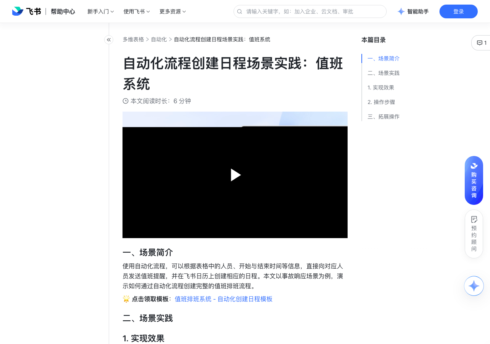

# 自动化流程创建日程场景实践：值班系统

> 来源：[飞书帮助中心](https://www.feishu.cn/hc/zh-CN/articles/843545289113)  
> 分类：多维表格 / 自动化  
> 抓取时间：2026-09-22T01:24:02.695Z

## 界面截图

### 文档内配图

1. 配图：https://p1-hera.feishucdn.com/tos-cn-i-jbbdkfciu3/64e6e30821454777a60e04e621696074~tplv-jbbdkfciu3-image:0:0.image
2. 配图：https://p1-hera.feishucdn.com/tos-cn-i-jbbdkfciu3/c6a25fa1b10245ba904951b2bb7dc98d~tplv-jbbdkfciu3-image:0:0.image
3. 配图：https://p1-hera.feishucdn.com/tos-cn-i-jbbdkfciu3/77b7fdf70c1c47c58943986c85e4b781~tplv-jbbdkfciu3-image:0:0.image
4. 配图：https://p1-hera.feishucdn.com/tos-cn-i-jbbdkfciu3/467fedec72c5482fa2f19a0107650e11~tplv-jbbdkfciu3-image:0:0.image
5. 配图：https://p1-hera.feishucdn.com/tos-cn-i-jbbdkfciu3/4551f5434a2948bc8fd566bcea63e3f6~tplv-jbbdkfciu3-image:0:0.image

## 功能定位

本页对应飞书帮助中心「多维表格 / 自动化」下的「自动化流程创建日程场景实践：值班系统」。以下需求描述依据官方说明文档提炼，用于指导 DuoWei 对标实现。

## 功能目标

播放 00:00 / 00:00 直播 00:00 进入全屏 1x 0.5x0.75x1x1.5x2x 点击按住可拖动视频

## 文档结构（官方章节）

- ​
    
    
    
    
      
       
       
      
    
      
  

    
    
  

  

    
    
    
      
      
    
    
  

  

     播放
    
    00:00
    /
    00:00
    直播
    
      
    
      
        
      
      
        
          
        
        
      
      00:00
      
      
    
    
    
      
      
    
    
  

  

     
    进入全屏
    
    
    
      
      
  
  

  
  

  
  

      
        
        
          
        
      
    
    
    
   
    
    1x
   0.5x0.75x1x1.5x2x
    
    
   
    
    
   
    
    
      
      
       
    点击按住可拖动视频
    
      
      
        
          
        
      
      
      
  

  

      ​​
- 一、场景简介​
- 二、场景实践​
- 实现效果​
- 操作步骤​
- 三、拓展操作​

## 详细功能说明

播放 00:00 / 00:00 直播 00:00 进入全屏 1x 0.5x0.75x1x1.5x2x 点击按住可拖动视频

0.5x

0.75x

1.5x

一、场景简介

二、场景实践

实现效果

操作步骤

负责人按需在表格内填写值班相关信息：开始时间、结束时间、值班人、产品模块等。

设置触发条件：进入自动化流程设置页面 > 选择触发条件为 到达记录中的时间时，设置日期字段（如：值班表中的开始时间）和触发时间。

设置执行操作：

日程开始时发送消息提醒：选择发送飞书消息 > 设置接收人、消息内容和跳转链接等信息。

创建飞书日程：添加第 3 步执行操作为创建飞书日程 > 设置日程的主题、开始与结束时间、参与者（即值班人）、日程描述等信息。

保存并运行自动化流程后，创建的日程将出现在参与者的飞书日历中，参与者也能接收到日历助手的提醒。

三、拓展操作

添加一个执行操作；

在设置记录内容处，选择字段 > 点击+引用值 > 选择创建飞书日程的返回值 > 选择需要引用的信息。

## 实现要点（对标 DuoWei）

1. **入口与信息架构**：在产品中明确该能力所属模块（自动化），并保证用户可从对应导航触达。
2. **核心交互**：按上文「详细功能说明」还原主要操作路径；截图中出现的按钮、字段、面板命名尽量与飞书语义一致或可映射。
3. **数据与权限**：若文档涉及可见范围、可编辑范围、分享或高级权限，实现时需落到角色/成员模型，并保证 API/MCP 与 UI 权限一致。
4. **边界与上限**：若文档提到数量上限、格式限制、导入导出约束，需在实现与错误提示中体现。
5. **验收**：以本页截图场景为用例，完成「能打开 / 能配置 / 能保存 / 能被 Agent 读写（如适用）」四项检查。

## 原始摘录摘要

> 播放 00:00 / 00:00 直播 00:00 进入全屏 1x 0.5x0.75x1x1.5x2x 点击按住可拖动视频 0.5x 0.75x 1.5x 一、场景简介 二、场景实践 实现效果 操作步骤 负责人按需在表格内填写值班相关信息：开始时间、结束时间、值班人、产品模块等。 设置触发条件：进入自动化流程设置页面 > 选择触发条件为 到达记录中的时间时，设置日期字段（如：值班表中的开始时间）和触发时间。 设置执行操作： 日程开始时发送消息提醒：选择发送飞书消息 > 设置接收人、消息内容和跳转链接等信息。 创建飞书日程：添加第 3 步执行操作为创建飞书日程 > 设置日程的主题、开始与结束时间、参与者（即值班人）、日程描述等信息。 保存并运行自动化流程后，创建的日程将出现在参与者的飞书日历中，参与者也能接收到日历助手的提醒。 三、拓展操作 添加一个执行操作； 在设置记录内容处，选择字段 > 点击+引用值 > 选择创建飞书日程的返回值 > 选择需要引用的信息。

## 元数据

- article_id: `7184719200051986460`
- category_id: `7165751270974767105`
- path: `/hc/zh-CN/articles/843545289113`
- extracted_text_length: 435
