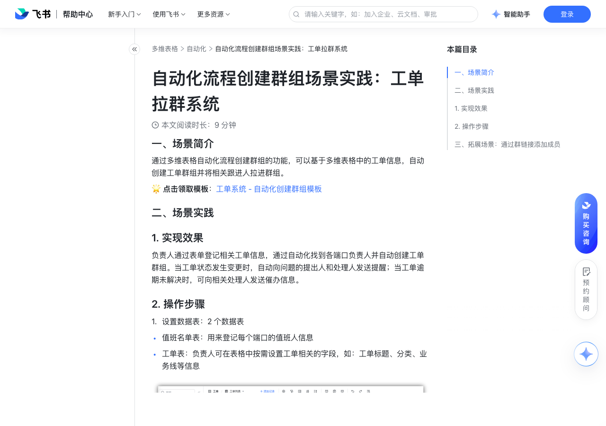

# 自动化流程创建群组场景实践：工单拉群系统

> 来源：[飞书帮助中心](https://www.feishu.cn/hc/zh-CN/articles/952306961867)  
> 分类：多维表格 / 自动化  
> 抓取时间：2026-09-22T01:24:03.428Z

## 界面截图

### 文档内配图

1. 配图：https://p1-hera.feishucdn.com/tos-cn-i-jbbdkfciu3/823dd5d039554223a66a58cc2bf57c4b~tplv-jbbdkfciu3-image:0:0.image
2. 配图：https://p1-hera.feishucdn.com/tos-cn-i-jbbdkfciu3/a65daad985b34826af99931ef45ada02~tplv-jbbdkfciu3-image:0:0.image
3. 配图：https://p1-hera.feishucdn.com/tos-cn-i-jbbdkfciu3/08fceb97856744c0aa593eb298108a8a~tplv-jbbdkfciu3-image:0:0.image

## 功能定位

本页对应飞书帮助中心「多维表格 / 自动化」下的「自动化流程创建群组场景实践：工单拉群系统」。以下需求描述依据官方说明文档提炼，用于指导 DuoWei 对标实现。

## 功能目标

一、场景简介

## 文档结构（官方章节）

- 一、场景简介​
- 二、场景实践​
- 实现效果​
- 操作步骤​
- 三、拓展场景：通过群链接添加成员​

## 详细功能说明

一、场景简介

二、场景实践

实现效果

操作步骤

设置数据表：2 个数据表

值班名单表：用来登记每个端口的值班人信息

工单表：负责人可在表格中按需设置工单相关的字段，如：工单标题、分类、业务线等信息

提交工单后自动拉群：

设置触发条件为添加新记录时；

设置执行操作为查找记录，从值班名单表中找到问题段对应的负责人；

添加执行操作为创建飞书群组，完善群名称、群成员、群主等信息；

添加执行操作为修改记录，在工单群字段中自动记录创建群组的分享链接，在处理人字段自动记录查找记录中找到的处理人姓名。

0.5x

0.75x

1.5x

工单状态变更通知：

设置触发条件为记录内容变更时，选择关注的字段为状态

设置执行操作为发送飞书消息，设置接收人、消息内容和跳转链接

工单逾期时向执行人发送催办通知：

设置触发条件为记录内容变更时，设置条件为工单催办等于✅

三、拓展场景：通过群链接添加成员

在创建群组的步骤之后添加一个执行操作 发送飞书消息

填写接收人、消息标题和内容等信息

添加一个底部按钮，在跳转链接处选择引用值 > 创建飞书群组的返回值 > 群分享链接

## 实现要点（对标 DuoWei）

1. **入口与信息架构**：在产品中明确该能力所属模块（自动化），并保证用户可从对应导航触达。
2. **核心交互**：按上文「详细功能说明」还原主要操作路径；截图中出现的按钮、字段、面板命名尽量与飞书语义一致或可映射。
3. **数据与权限**：若文档涉及可见范围、可编辑范围、分享或高级权限，实现时需落到角色/成员模型，并保证 API/MCP 与 UI 权限一致。
4. **边界与上限**：若文档提到数量上限、格式限制、导入导出约束，需在实现与错误提示中体现。
5. **验收**：以本页截图场景为用例，完成「能打开 / 能配置 / 能保存 / 能被 Agent 读写（如适用）」四项检查。

## 原始摘录摘要

> 一、场景简介 二、场景实践 实现效果 操作步骤 设置数据表：2 个数据表 值班名单表：用来登记每个端口的值班人信息 工单表：负责人可在表格中按需设置工单相关的字段，如：工单标题、分类、业务线等信息 提交工单后自动拉群： 设置触发条件为添加新记录时； 设置执行操作为查找记录，从值班名单表中找到问题段对应的负责人； 添加执行操作为创建飞书群组，完善群名称、群成员、群主等信息； 添加执行操作为修改记录，在工单群字段中自动记录创建群组的分享链接，在处理人字段自动记录查找记录中找到的处理人姓名。 0.5x 0.75x 1.5x 工单状态变更通知： 设置触发条件为记录内容变更时，选择关注的字段为状态 设置执行操作为发送飞书消息，设置接收人、消息内容和跳转链接 工单逾期时向执行人发送催办通知： 设置触发条件为记录内容变更时，设置条件为工单催办等于✅ 三、拓展场景：通过群链接添加成员 在创建群组的步骤之后添加一个执行操作 发送飞书消息 填写接收人、消息标题和内容等信息 添加一个底部按钮，在跳转链接处选择引用值 > 创建飞书群组的返回值 > 群分享链接

## 元数据

- article_id: `7184721074750717953`
- category_id: `7165751270974767105`
- path: `/hc/zh-CN/articles/952306961867`
- extracted_text_length: 474
