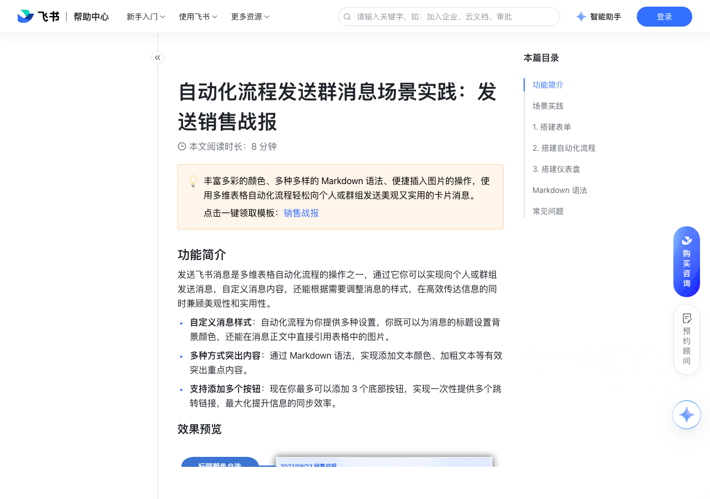

# 自动化流程发送群消息场景实践：发送销售战报

> 来源：[飞书帮助中心](https://www.feishu.cn/hc/zh-CN/articles/404571940828)  
> 分类：多维表格 / 自动化  
> 抓取时间：2026-09-22T01:24:03.713Z

## 界面截图

### 文档内配图

1. 配图：https://p1-hera.feishucdn.com/tos-cn-i-jbbdkfciu3/a487083db8804667be373e7687637e51~tplv-jbbdkfciu3-image:0:0.image
2. 配图：https://p1-hera.feishucdn.com/tos-cn-i-jbbdkfciu3/8011e97be353412f998069062fe35ad3~tplv-jbbdkfciu3-image:0:0.image
3. 9月26日 (1)(4).gif：https://p1-hera.feishucdn.com/tos-cn-i-jbbdkfciu3/138812926ae046b892c80bd3c3c6ffb2~tplv-jbbdkfciu3-image:0:0.image
4. 配图：https://p1-hera.feishucdn.com/tos-cn-i-jbbdkfciu3/b512604f6a564b55aa45a7f28da73b31~tplv-jbbdkfciu3-image:0:0.image
5. 配图：https://p1-hera.feishucdn.com/tos-cn-i-jbbdkfciu3/77f4e4dd4644479baeadbd59e1a4e5ed~tplv-jbbdkfciu3-image:0:0.image

## 功能定位

本页对应飞书帮助中心「多维表格 / 自动化」下的「自动化流程发送群消息场景实践：发送销售战报」。以下需求描述依据官方说明文档提炼，用于指导 DuoWei 对标实现。

## 功能目标

功能简介

## 文档结构（官方章节）

- 功能简介​
- 效果预览​
- 场景实践​
- 搭建表单​
- 搭建自动化流程​
- 设置触发条件​
- 设置执行操作​
- 搭建仪表盘​
- Markdown 语法​
- 常见问题​

## 详细功能说明

功能简介

自定义消息样式：自动化流程为你提供多种设置，你既可以为消息的标题设置背景颜色，还能在消息正文中直接引用表格中的图片。

多种方式突出内容：通过 Markdown 语法，实现添加文本颜色、加粗文本等有效突出重点内容。

支持添加多个按钮：现在你最多可以添加 3 个底部按钮，实现一次性提供多个跳转链接，最大化提升信息的同步效率。

效果预览

场景实践

一键领取模板：房产销售战报

实现效果：当成员成功签约时，通过表单填写签约信息到多维表格，提交表单后自动向群组发送签约信息。

搭建表单

基于表格视图签约总表的结构，新建一个表单视图，用来收集成员们的签约信息。

开启表格链接分享，复制表单的链接发送给团队成员。

搭建自动化流程

设置触发条件

设置执行操作

查找记录：选择新增的记录所在的数据表 > 选择记录为第 1 步新增的记录 > 设置查找内容为查找引用和公式字段（如下图中的大区和城市字段）

发送飞书消息：选择发送消息至群组 > 选择接收信息的群组 > 设置消息标题和背景颜色 > 输入消息内容，可以直接选择表格中的附件字段发送图片消息，也可以添加 Markdown 语法加粗或分割消息

添加底部按钮：按需添加按钮，方便成员从消息处直接跳转到对应的页面（如签约信息登记表单、数据仪表盘等）

0.5x

0.75x

1.5x

搭建仪表盘

Markdown 语法

**粗体**

250px|700px|reset

*文字*

~~文字~~

@所有人

<at id=all></at>

<a href=链接>文本</a>

如：效果为：https://www.feishu.cn/

文字链接

[文字](https://www.feishu.cn/)

文本颜色

 绿色文本   红色文本   灰色文本 

绿色红色灰色

常见问题

问：为什么一直提示邀请多维表格助手失败？

答：请确认目标群组是否开启了仅群主和群管理员可邀请群成员，此时请联系群主或群管理员邀请多维表格助手加入群组。

问：我没有权限邀请多维表格助手机器人入群，是否还能发送群消息？

答：如果多维表格助手已由其他群成员邀请进入目标群组，则本群内成员都可以通过多维表格自动化流程向该群发送消息，否则需由有权限的成员邀请机器人入群后才能发送。

问：是否支持向外部群组发送消息？

答：使用多维表格助手支持向外部群发送消息。当勾选“单独通知每个群成员时”，群人数不得超过 200 人。

名称 | 语法 | 效果 | 预览图

加粗 | **粗体** | 粗体 | 250px|700px|reset

斜体 | *文字* | 斜体 |

删除线 | ~~文字~~ | 文字 |

@所有人 | <at id=all></at> | @所有人 |

超链接 | <a href=链接>文本</a> | 如：效果为：https://www.feishu.cn/ |

文字链接 | [文字](https://www.feishu.cn/) | 文字 |

分割线 | 
 | |

图片 |  | / |

文本颜色 |  绿色文本   红色文本   灰色文本  | 绿色红色灰色 |

## 实现要点（对标 DuoWei）

1. **入口与信息架构**：在产品中明确该能力所属模块（自动化），并保证用户可从对应导航触达。
2. **核心交互**：按上文「详细功能说明」还原主要操作路径；截图中出现的按钮、字段、面板命名尽量与飞书语义一致或可映射。
3. **数据与权限**：若文档涉及可见范围、可编辑范围、分享或高级权限，实现时需落到角色/成员模型，并保证 API/MCP 与 UI 权限一致。
4. **边界与上限**：若文档提到数量上限、格式限制、导入导出约束，需在实现与错误提示中体现。
5. **验收**：以本页截图场景为用例，完成「能打开 / 能配置 / 能保存 / 能被 Agent 读写（如适用）」四项检查。

## 原始摘录摘要

> 功能简介 自定义消息样式：自动化流程为你提供多种设置，你既可以为消息的标题设置背景颜色，还能在消息正文中直接引用表格中的图片。 多种方式突出内容：通过 Markdown 语法，实现添加文本颜色、加粗文本等有效突出重点内容。 支持添加多个按钮：现在你最多可以添加 3 个底部按钮，实现一次性提供多个跳转链接，最大化提升信息的同步效率。 效果预览 场景实践 一键领取模板：房产销售战报 实现效果：当成员成功签约时，通过表单填写签约信息到多维表格，提交表单后自动向群组发送签约信息。 搭建表单 基于表格视图签约总表的结构，新建一个表单视图，用来收集成员们的签约信息。 开启表格链接分享，复制表单的链接发送给团队成员。 搭建自动化流程 设置触发条件 设置执行操作 查找记录：选择新增的记录所在的数据表 > 选择记录为第 1 步新增的记录 > 设置查找内容为查找引用和公式字段（如下图中的大区和城市字段） 发送飞书消息：选择发送消息至群组 > 选择接收信息的群组 > 设置消息标题和背景颜色 > 输入消息内容，可以直接选择表格中的附件字段发送图片消息，也可以添加 Markdown 语法加粗或分割消息 添加底部按钮：按需添加按钮，方便成员从消息处直接跳转到对应的页面（如签约信息登记表单、数据仪表盘等） 0.5x 0.75x 1.5x 搭建仪表盘 Markdown 语法 **粗体** 250px|700px|reset *文字* ~~文字~~ @所有人 <at id=all></at> <a href=链接>文本</a> 如：效果为：https://www.feishu.cn/ 文字链接 [文字](https://www.feishu.cn/) 
  文本颜色 <font color='gr…

## 元数据

- article_id: `7147568993090404353`
- category_id: `7165751270974767105`
- path: `/hc/zh-CN/articles/404571940828`
- extracted_text_length: 1573
