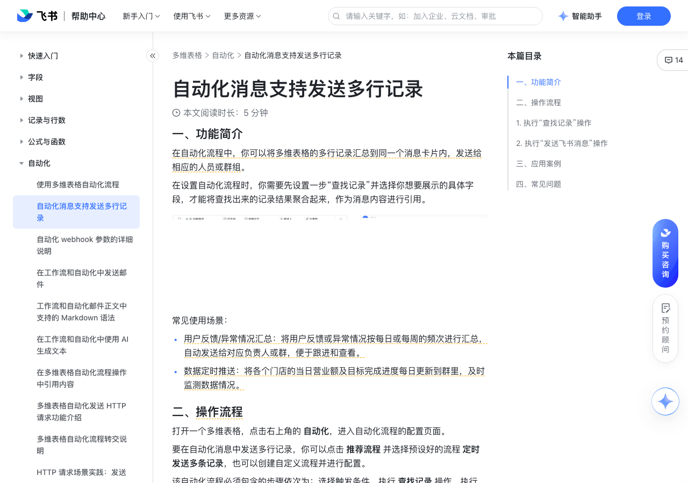

# 自动化消息支持发送多行记录

> 来源：[飞书帮助中心](https://www.feishu.cn/hc/zh-CN/articles/113700155280)  
> 分类：多维表格 / 自动化  
> 抓取时间：2026-09-22T01:24:00.363Z

## 界面截图

### 文档内配图

1. 配图：https://p1-hera.feishucdn.com/tos-cn-i-jbbdkfciu3/5c8f65555e6b4576b302b04e0eaf3553~tplv-jbbdkfciu3-image:0:0.image
2. 配图：https://p1-hera.feishucdn.com/tos-cn-i-jbbdkfciu3/7b52e3c46bf24099976919ed45844d0c~tplv-jbbdkfciu3-image:0:0.image
3. 配图：https://p1-hera.feishucdn.com/tos-cn-i-jbbdkfciu3/6ee1ee5388934590b5350cf5fd9ea8f4~tplv-jbbdkfciu3-image:0:0.image
4. 配图：https://p1-hera.feishucdn.com/tos-cn-i-jbbdkfciu3/2fd5c84123ae4d32b72e2fdec8c6295c~tplv-jbbdkfciu3-image:0:0.image
5. 配图：https://p1-hera.feishucdn.com/tos-cn-i-jbbdkfciu3/4631d09312cc49b2a792036da8b83e27~tplv-jbbdkfciu3-image:0:0.image
6. 配图：https://p1-hera.feishucdn.com/tos-cn-i-jbbdkfciu3/5be0e82318aa46c09ea8926459679f17~tplv-jbbdkfciu3-image:0:0.image
7. 配图：https://p1-hera.feishucdn.com/tos-cn-i-jbbdkfciu3/369fd98b128640f9a3d548b441e43ea5~tplv-jbbdkfciu3-image:0:0.image
8. 配图：https://p1-hera.feishucdn.com/tos-cn-i-jbbdkfciu3/19756eca5caf47c1a44d5d4241099d13~tplv-jbbdkfciu3-image:0:0.image
9. 配图：https://p1-hera.feishucdn.com/tos-cn-i-jbbdkfciu3/c538e7653ffd405b8cc871e63f3b68c7~tplv-jbbdkfciu3-image:0:0.image
10. 配图：https://p1-hera.feishucdn.com/tos-cn-i-jbbdkfciu3/5aefdc4c8d1049878c7c8978061baaa6~tplv-jbbdkfciu3-image:0:0.image

## 功能定位

本页对应飞书帮助中心「多维表格 / 自动化」下的「自动化消息支持发送多行记录」。以下需求描述依据官方说明文档提炼，用于指导 DuoWei 对标实现。

## 功能目标

一、功能简介

## 文档结构（官方章节）

- 一、功能简介​
- 二、操作流程​
- 执行“查找记录”操作​
- 执行“发送飞书消息”操作​
- 三、应用案例​
- 四、常见问题​

## 详细功能说明

一、功能简介

常见使用场景：

用户反馈/异常情况汇总：将用户反馈或异常情况按每日或每周的频次进行汇总，自动发送给对应负责人或群，便于跟进和查看。

数据定时推送：将各个门店的当日营业额及目标完成进度每日更新到群里，及时监测数据情况。

二、操作流程

执行“查找记录”操作

执行“发送飞书消息”操作

三、应用案例

将触发条件设定为 定时触发，按需设定时间及重复规则。

查找记录，筛选出 进展状态 不包含“已上线”和“验收通过，待上线”的记录；并设置需查找的字段内容。

发送飞书消息，选择接收消息的群组，设置消息卡片标题和内容。输入所需的 markdown 内容，点击 ⊕ 引用值 图标 > 第 2 步查找的记录 > 查找到的所有记录。最后配置消息卡片的底部按钮，点击按钮可跳转至原视图。

四、常见问题

问：发送多行记录时，自动化流程运行失败的原因有哪些？

答：出现以下任意一种情况，都会导致自动化流程运行失败：发送的多维表格记录超过了 50 行。单个消息卡片上，最多可发送 50 条多维表格记录。若在“查找记录”的前置节点中查找到的记录结果超过 50 行，则会导致消息发送失败。消息卡片的大小超过了 30 KB。由于消息卡片的限制，最多只能发送 30 KB 的数据，因此需控制发送的行数及各单元格内的内容。注：如果消息卡片中含图片，图片本身大小不计入卡片大小。可能是所选的字段内容超过了最大可展示内容。各字段类型在消息卡片中有个数或字符限制（多为 100 个字符），详情见下表：注：若文本字段或公式字段内包含换行，会被识别为\n，计算为 2 个字符。空格也会计算在字符限制内。消息卡片支持的字段类型在消息卡片上展示的格式消息卡片上的内容限制文本文本无限制人员@人名最多可添加 10 个人员附件图片单张图片不得超过 10 MB；每个消息卡片最多可展示 100 张图片。复选框true / false不涉及超链接超链接最多可展示 100 个字符进度数字最多可展示 100 个字符评分数字最多可展示 100 个字符货币数字最多可展示 100 个字符单选文本最多可展示 100 个字符多选文本最多可展示 100 个字符群组文本最多可展示 100 个字符地理位置文本最多可展示 100 个字符条码文本最多可展示 100 个字符单向关联文本最多可展示 100 个字符公式文本最多可展示 100 个字符查找引用文本最多可展示 100 个字符数字数字最多可展示 100 个字符自动编号数字/文本最多可展示 100 个字符电话号码数字最多可展示 100 个字符

## 实现要点（对标 DuoWei）

1. **入口与信息架构**：在产品中明确该能力所属模块（自动化），并保证用户可从对应导航触达。
2. **核心交互**：按上文「详细功能说明」还原主要操作路径；截图中出现的按钮、字段、面板命名尽量与飞书语义一致或可映射。
3. **数据与权限**：若文档涉及可见范围、可编辑范围、分享或高级权限，实现时需落到角色/成员模型，并保证 API/MCP 与 UI 权限一致。
4. **边界与上限**：若文档提到数量上限、格式限制、导入导出约束，需在实现与错误提示中体现。
5. **验收**：以本页截图场景为用例，完成「能打开 / 能配置 / 能保存 / 能被 Agent 读写（如适用）」四项检查。

## 原始摘录摘要

> 一、功能简介 常见使用场景： 用户反馈/异常情况汇总：将用户反馈或异常情况按每日或每周的频次进行汇总，自动发送给对应负责人或群，便于跟进和查看。 数据定时推送：将各个门店的当日营业额及目标完成进度每日更新到群里，及时监测数据情况。 二、操作流程 执行“查找记录”操作 执行“发送飞书消息”操作 三、应用案例 将触发条件设定为 定时触发，按需设定时间及重复规则。 查找记录，筛选出 进展状态 不包含“已上线”和“验收通过，待上线”的记录；并设置需查找的字段内容。 发送飞书消息，选择接收消息的群组，设置消息卡片标题和内容。输入所需的 markdown 内容，点击 ⊕ 引用值 图标 > 第 2 步查找的记录 > 查找到的所有记录。最后配置消息卡片的底部按钮，点击按钮可跳转至原视图。 四、常见问题 问：发送多行记录时，自动化流程运行失败的原因有哪些？ 答：出现以下任意一种情况，都会导致自动化流程运行失败：发送的多维表格记录超过了 50 行。单个消息卡片上，最多可发送 50 条多维表格记录。若在“查找记录”的前置节点中查找到的记录结果超过 50 行，则会导致消息发送失败。消息卡片的大小超过了 30 KB。由于消息卡片的限制，最多只能发送 30 KB 的数据，因此需控制发送的行数及各单元格内的内容。注：如果消息卡片中含图片，图片本身大小不计入卡片大小。可能是所选的字段内容超过了最大可展示内容。各字段类型在消息卡片中有个数或字符限制（多为 100 个字符），详情见下表：注：若文本字段或公式字段内包含换行，会被识别为\n，计算为 2 个字符。空格也会计算在字符限制内。消息卡片支持的字段类型在消息卡片上展示的格式消息卡片上的内容限制文本文本无限制人员@人名最多可添加 10 个人员附件图片单张图片不得超过 10 MB；每个消息卡片最多可展示 100 张图片。复选框true / false不涉及超链…

## 元数据

- article_id: `7280501131040620546`
- category_id: `7165751270974767105`
- path: `/hc/zh-CN/articles/113700155280`
- extracted_text_length: 1068
