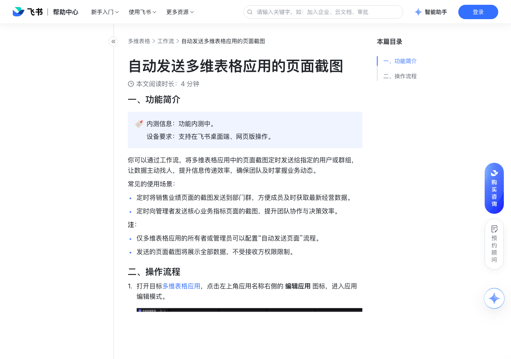

# 自动发送多维表格应用的页面截图

> 来源：[飞书帮助中心](https://www.feishu.cn/hc/zh-CN/articles/087984717819)  
> 分类：多维表格 / 工作流  
> 抓取时间：2026-09-22T01:25:12.456Z

## 界面截图

### 文档内配图

1. 配图：https://p1-hera.feishucdn.com/tos-cn-i-jbbdkfciu3/5feb2427ae8e40ca90e1cb47693c40dc~tplv-jbbdkfciu3-image:0:0.image
2. 配图：https://p1-hera.feishucdn.com/tos-cn-i-jbbdkfciu3/029b84f1a4f74e05b0955d4a6bf98d45~tplv-jbbdkfciu3-image:0:0.image
3. 配图：https://p1-hera.feishucdn.com/tos-cn-i-jbbdkfciu3/56536e9e390247bd81556ba153aacffc~tplv-jbbdkfciu3-image:0:0.image
4. 配图：https://p1-hera.feishucdn.com/tos-cn-i-jbbdkfciu3/e5b9d8732de34b3ca8bb3a59deaaed6a~tplv-jbbdkfciu3-image:0:0.image
5. 配图：https://p1-hera.feishucdn.com/tos-cn-i-jbbdkfciu3/d45b6ddadac042d8ba25d5aa3f49c35a~tplv-jbbdkfciu3-image:0:0.image

## 功能定位

本页对应飞书帮助中心「多维表格 / 工作流」下的「自动发送多维表格应用的页面截图」。以下需求描述依据官方说明文档提炼，用于指导 DuoWei 对标实现。

## 功能目标

一、功能简介

## 文档结构（官方章节）

- 一、功能简介​
- 二、操作流程​

## 详细功能说明

一、功能简介

定时将销售业绩页面的截图发送到部门群，方便成员及时获取最新经营数据。

定时向管理者发送核心业务指标页面的截图，提升团队协作与决策效率。

仅多维表格应用的所有者或管理员可以配置“自动发送页面”流程。

发送的页面截图将展示全部数据，不受接收方权限限制。

二、操作流程

打开目标多维表格应用，点击左上角应用名称右侧的 编辑应用 图标，进入应用编辑模式。

250px|700px|reset

在左侧目录中选中需要发送截图的页面，点击页面右侧的 ··· 图标 > 设置自动发送，打开流程配置面板。

在配置面板中，你可以配置以下信息：

流程名称：点击名称右侧的 编辑 图标，自定义流程的名称。

触发时间：设置定时发送的时间和重复频次。例如，你可以设置每个工作日早上 10 点触发流程。

接收方：设置接收定时消息的对象，可以选择用户或者群组，支持多选。

工作流数据源：用于存储定时发送工作流的多维表格。你可以选择当前多维表格空间内有管理权限的任意多维表格。

根据需要决定是否进行更多自定义设置：

如无需更多设置，点击 确定，系统将在你选择的工作流数据源表格中自动创建一个工作流。

如需更多设置，点击 更多配置 进入工作流配置页面，进行以下修改。完成修改后，点击工作流右上角 保存并启用 即可。

点击 截图 节点，调整截图的应用或截图页面。

注：如果不进行自定义设置，默认发送之前选中页面的截图。

按需添加节点。例如，点击 + 图标，添加 应用截图 节点。通过这种方式，你可以添加其他需发送的页面截图。

点击 发送飞书消息 节点，调整定时消息的发送人、接收方、消息标题、消息内容、消息按钮中的跳转链接等。例如，你可以在消息内容中引用上一步添加的应用截图。

工作流创建完成后，点击对应多维表格应用页面右侧的 ··· 图标，将鼠标悬停在 设置自动发送 上，可以查看与当前页面绑定的工作流列表。你还可以：

点击已创建的流程名称，直接进入工作流编辑页面。

点击 + 快速创建，新增一个定时发送流程。

## 实现要点（对标 DuoWei）

1. **入口与信息架构**：在产品中明确该能力所属模块（工作流），并保证用户可从对应导航触达。
2. **核心交互**：按上文「详细功能说明」还原主要操作路径；截图中出现的按钮、字段、面板命名尽量与飞书语义一致或可映射。
3. **数据与权限**：若文档涉及可见范围、可编辑范围、分享或高级权限，实现时需落到角色/成员模型，并保证 API/MCP 与 UI 权限一致。
4. **边界与上限**：若文档提到数量上限、格式限制、导入导出约束，需在实现与错误提示中体现。
5. **验收**：以本页截图场景为用例，完成「能打开 / 能配置 / 能保存 / 能被 Agent 读写（如适用）」四项检查。

## 原始摘录摘要

> 一、功能简介 定时将销售业绩页面的截图发送到部门群，方便成员及时获取最新经营数据。 定时向管理者发送核心业务指标页面的截图，提升团队协作与决策效率。 仅多维表格应用的所有者或管理员可以配置“自动发送页面”流程。 发送的页面截图将展示全部数据，不受接收方权限限制。 二、操作流程 打开目标多维表格应用，点击左上角应用名称右侧的 编辑应用 图标，进入应用编辑模式。 250px|700px|reset 在左侧目录中选中需要发送截图的页面，点击页面右侧的 ··· 图标 > 设置自动发送，打开流程配置面板。 在配置面板中，你可以配置以下信息： 流程名称：点击名称右侧的 编辑 图标，自定义流程的名称。 触发时间：设置定时发送的时间和重复频次。例如，你可以设置每个工作日早上 10 点触发流程。 接收方：设置接收定时消息的对象，可以选择用户或者群组，支持多选。 工作流数据源：用于存储定时发送工作流的多维表格。你可以选择当前多维表格空间内有管理权限的任意多维表格。 根据需要决定是否进行更多自定义设置： 如无需更多设置，点击 确定，系统将在你选择的工作流数据源表格中自动创建一个工作流。 如需更多设置，点击 更多配置 进入工作流配置页面，进行以下修改。完成修改后，点击工作流右上角 保存并启用 即可。 点击 截图 节点，调整截图的应用或截图页面。 注：如果不进行自定义设置，默认发送之前选中页面的截图。 按需添加节点。例如，点击 + 图标，添加 应用截图 节点。通过这种方式，你可以添加其他需发送的页面截图。 点击 发送飞书消息 节点，调整定时消息的发送人、接收方、消息标题、消息内容、消息按钮中的跳转链接等。例如，你可以在消息内容中引用上一步添加的应用截图。 工作流创建完成后，点击对应多维表格应用页面右侧的 ··· 图标，将鼠标悬停在 设置自动发送 上，可以查看与当前页面绑定的工作流列表。你还可以： 点…

## 元数据

- article_id: `7644860624566537425`
- category_id: `7415964452380049412`
- path: `/hc/zh-CN/articles/087984717819`
- extracted_text_length: 844
