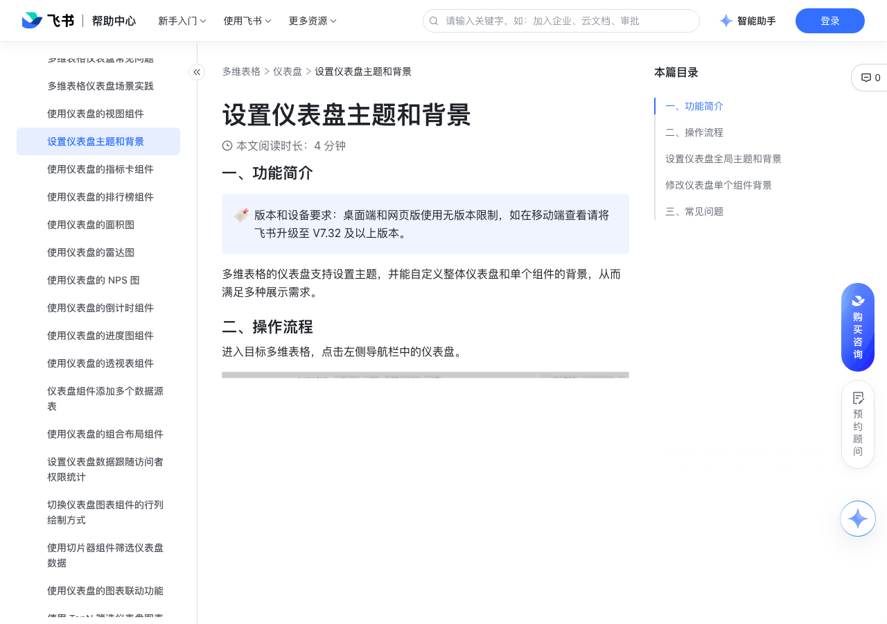

# 设置仪表盘主题和背景

> 来源：[飞书帮助中心](https://www.feishu.cn/hc/zh-CN/articles/508987086152)  
> 分类：多维表格 / 仪表盘  
> 抓取时间：2026-09-22T01:25:18.798Z

## 界面截图

### 文档内配图

1. 配图：https://p1-hera.feishucdn.com/tos-cn-i-jbbdkfciu3/08b3539767204310866e2767e5bd42c3~tplv-jbbdkfciu3-image:0:0.image
2. image.png：https://p1-hera.feishucdn.com/tos-cn-i-jbbdkfciu3/759e9494ab1348f5be22b5d54f985640~tplv-jbbdkfciu3-png:0:0.png
3. 配图：https://p1-hera.feishucdn.com/tos-cn-i-jbbdkfciu3/af4424a5875749c99b288dd79677bbc4~tplv-jbbdkfciu3-image:0:0.image
4. 配图：https://p1-hera.feishucdn.com/tos-cn-i-jbbdkfciu3/af761210373643b5b1746efa42a3f6db~tplv-jbbdkfciu3-image:0:0.image
5. 配图：https://p1-hera.feishucdn.com/tos-cn-i-jbbdkfciu3/11b1387b61bd43459e717df8d03b3abf~tplv-jbbdkfciu3-image:0:0.image
6. 配图：https://p1-hera.feishucdn.com/tos-cn-i-jbbdkfciu3/6ef6b61726c44779b2dc4c7798965a4d~tplv-jbbdkfciu3-image:0:0.image
7. 配图：https://p1-hera.feishucdn.com/tos-cn-i-jbbdkfciu3/856bab80495b4bd39354056564b6b740~tplv-jbbdkfciu3-image:0:0.image
8. 配图：https://p1-hera.feishucdn.com/tos-cn-i-jbbdkfciu3/b643f8992e3f48f4a466b097fe69d17a~tplv-jbbdkfciu3-image:0:0.image

## 功能定位

本页对应飞书帮助中心「多维表格 / 仪表盘」下的「设置仪表盘主题和背景」。以下需求描述依据官方说明文档提炼，用于指导 DuoWei 对标实现。

## 功能目标

一、功能简介

## 文档结构（官方章节）

- 一、功能简介​
- 二、操作流程​
- 设置仪表盘全局主题和背景​
- 修改仪表盘单个组件背景​
- 三、常见问题​

## 详细功能说明

一、功能简介

二、操作流程

设置仪表盘全局主题和背景

设置仪表盘全局主题：除默认主题外，你有 5 种不同的主题可以选择，包括清新、简约、活力、深邃、未来。成功切换主题后，图表背景、仪表盘背景、图表样式等元素会跟随主题配置而变化。

其中，若你已经在仪表盘组件中对某些元素进行了一些自定义设置，那么它们将不再跟随主题的切换而变化。这些元素包括：

图例文本字号、样式、颜色

数据标签文本字号、样式、颜色

图表选中色板

图表网格线的颜色和粗细

图表刻度线的颜色和粗细

轴线颜色

修改仪表盘全局背景：默认全局背景颜色为所选仪表盘全局主题所对应的背景色。你可以自定义修改仪表盘全局背景颜色，也可以选择本地图片作为仪表盘全局背景。

注：当选择图片作为仪表盘背景时，支持选择单个 jpg、jpeg、png、gif 格式的图片文件，所上传的图片文件大小需在 20 MB 以下，图片建议尺寸为 1280*720 px。

修改仪表盘单个组件背景

将鼠标悬停在你需要更改背景的组件上，点击组件右上角的 图标 > 配置。

在 自定义样式 标签页下，点击 背景 项下方的下拉框，则可以自定义该组件的背景颜色。

组件默认背景颜色为所选仪表盘全局主题所对应的背景色。

点击 恢复默认 则选中仪表盘全局主题下默认背景色。

完成背景颜色的修改后，点击 确定 即可。

三、常见问题

问：移动端可以修改仪表盘全局主题或者单个组件的背景颜色吗？

答：不可以。移动端仅可查看自定义后的仪表盘样式，不支持编辑。

## 实现要点（对标 DuoWei）

1. **入口与信息架构**：在产品中明确该能力所属模块（仪表盘），并保证用户可从对应导航触达。
2. **核心交互**：按上文「详细功能说明」还原主要操作路径；截图中出现的按钮、字段、面板命名尽量与飞书语义一致或可映射。
3. **数据与权限**：若文档涉及可见范围、可编辑范围、分享或高级权限，实现时需落到角色/成员模型，并保证 API/MCP 与 UI 权限一致。
4. **边界与上限**：若文档提到数量上限、格式限制、导入导出约束，需在实现与错误提示中体现。
5. **验收**：以本页截图场景为用例，完成「能打开 / 能配置 / 能保存 / 能被 Agent 读写（如适用）」四项检查。

## 原始摘录摘要

> 一、功能简介 二、操作流程 设置仪表盘全局主题和背景 设置仪表盘全局主题：除默认主题外，你有 5 种不同的主题可以选择，包括清新、简约、活力、深邃、未来。成功切换主题后，图表背景、仪表盘背景、图表样式等元素会跟随主题配置而变化。 其中，若你已经在仪表盘组件中对某些元素进行了一些自定义设置，那么它们将不再跟随主题的切换而变化。这些元素包括： 图例文本字号、样式、颜色 数据标签文本字号、样式、颜色 图表选中色板 图表网格线的颜色和粗细 图表刻度线的颜色和粗细 轴线颜色 修改仪表盘全局背景：默认全局背景颜色为所选仪表盘全局主题所对应的背景色。你可以自定义修改仪表盘全局背景颜色，也可以选择本地图片作为仪表盘全局背景。 注：当选择图片作为仪表盘背景时，支持选择单个 jpg、jpeg、png、gif 格式的图片文件，所上传的图片文件大小需在 20 MB 以下，图片建议尺寸为 1280*720 px。 修改仪表盘单个组件背景 将鼠标悬停在你需要更改背景的组件上，点击组件右上角的 图标 > 配置。 在 自定义样式 标签页下，点击 背景 项下方的下拉框，则可以自定义该组件的背景颜色。 组件默认背景颜色为所选仪表盘全局主题所对应的背景色。 点击 恢复默认 则选中仪表盘全局主题下默认背景色。 完成背景颜色的修改后，点击 确定 即可。 三、常见问题 问：移动端可以修改仪表盘全局主题或者单个组件的背景颜色吗？ 答：不可以。移动端仅可查看自定义后的仪表盘样式，不支持编辑。

## 元数据

- article_id: `7412546708745404419`
- category_id: `7165754521875005468`
- path: `/hc/zh-CN/articles/508987086152`
- extracted_text_length: 632
