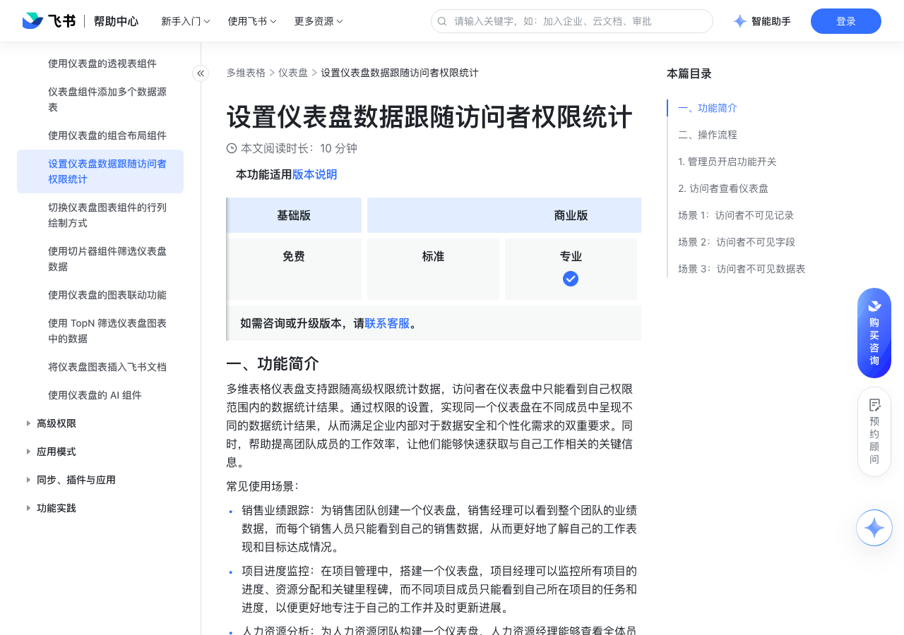

# 设置仪表盘数据跟随访问者权限统计

> 来源：[飞书帮助中心](https://www.feishu.cn/hc/zh-CN/articles/181520041196)  
> 分类：多维表格 / 仪表盘  
> 抓取时间：2026-09-22T01:25:21.462Z

## 界面截图

### 文档内配图

1. 配图：https://p1-hera.feishucdn.com/tos-cn-i-jbbdkfciu3/e41ceb5a2c9649f4b658de274a272b15~tplv-jbbdkfciu3-image:0:0.image
2. 配图：https://p1-hera.feishucdn.com/tos-cn-i-jbbdkfciu3/cb306a39400d46fb9989aaff3b23b6bd~tplv-jbbdkfciu3-image:0:0.image
3. 配图：https://p1-hera.feishucdn.com/tos-cn-i-jbbdkfciu3/18e72947666f43abbac1c81727f42b31~tplv-jbbdkfciu3-image:0:0.image
4. 配图：https://p1-hera.feishucdn.com/tos-cn-i-jbbdkfciu3/cb2d8becafc34e7ea0311c09b7c400da~tplv-jbbdkfciu3-image:0:0.image
5. 配图：https://p1-hera.feishucdn.com/tos-cn-i-jbbdkfciu3/5dc8873af6064fa08dac5b1201bfbf88~tplv-jbbdkfciu3-image:0:0.image
6. 配图：https://p1-hera.feishucdn.com/tos-cn-i-jbbdkfciu3/ca624c9d5ddc4921b3cbf4d4d6fb651e~tplv-jbbdkfciu3-image:0:0.image
7. 配图：https://p1-hera.feishucdn.com/tos-cn-i-jbbdkfciu3/41915f1ab63c45298da5393da294d5f4~tplv-jbbdkfciu3-image:0:0.image
8. 配图：https://p1-hera.feishucdn.com/tos-cn-i-jbbdkfciu3/7dc37117fedb498fad2f810dff7c47ae~tplv-jbbdkfciu3-image:0:0.image
9. 配图：https://p1-hera.feishucdn.com/tos-cn-i-jbbdkfciu3/03db3ee17107442e8aad10ec56ab6c98~tplv-jbbdkfciu3-image:0:0.image
10. 配图：https://p1-hera.feishucdn.com/tos-cn-i-jbbdkfciu3/fbb40a6ca8c14f4cafc0823b147ba524~tplv-jbbdkfciu3-image:0:0.image
11. 配图：https://p1-hera.feishucdn.com/tos-cn-i-jbbdkfciu3/91daa170f16f43dd9da147dd1b22006b~tplv-jbbdkfciu3-image:0:0.image
12. 配图：https://p1-hera.feishucdn.com/tos-cn-i-jbbdkfciu3/dd4e72b0eb514db892984c5b1bbd94ac~tplv-jbbdkfciu3-image:0:0.image
13. 配图：https://p1-hera.feishucdn.com/tos-cn-i-jbbdkfciu3/10f544a2c34441c68da3a601d500eb5e~tplv-jbbdkfciu3-image:0:0.image
14. 配图：https://p1-hera.feishucdn.com/tos-cn-i-jbbdkfciu3/104d0e5a0b544493893806c882ceb23c~tplv-jbbdkfciu3-image:0:0.image
15. 配图：https://p1-hera.feishucdn.com/tos-cn-i-jbbdkfciu3/27dcfaa77b9f4c829b7fc4434245703b~tplv-jbbdkfciu3-image:0:0.image
16. 配图：https://p1-hera.feishucdn.com/tos-cn-i-jbbdkfciu3/769bfea5e3a844d49b1cf089b016e2af~tplv-jbbdkfciu3-image:0:0.image
17. 配图：https://p1-hera.feishucdn.com/tos-cn-i-jbbdkfciu3/f3510fd513ce4c1791538763d6dd4203~tplv-jbbdkfciu3-image:0:0.image
18. 配图：https://p1-hera.feishucdn.com/tos-cn-i-jbbdkfciu3/8258a635d7364b28a7ebd55eb89269e6~tplv-jbbdkfciu3-image:0:0.image
19. 配图：https://p1-hera.feishucdn.com/tos-cn-i-jbbdkfciu3/848c7f1f39d141fbb3e95a4f6f50308d~tplv-jbbdkfciu3-image:0:0.image
20. 配图：https://p1-hera.feishucdn.com/tos-cn-i-jbbdkfciu3/2bec917e712f4a6aadfba0dba154f007~tplv-jbbdkfciu3-image:0:0.image
21. 配图：https://p1-hera.feishucdn.com/tos-cn-i-jbbdkfciu3/a3fd16164880410ea536ea42587d5937~tplv-jbbdkfciu3-image:0:0.image
22. 配图：https://p1-hera.feishucdn.com/tos-cn-i-jbbdkfciu3/8b68811958ba42c9b290c9f72f94d059~tplv-jbbdkfciu3-image:0:0.image
23. 配图：https://p1-hera.feishucdn.com/tos-cn-i-jbbdkfciu3/b0f2fd3e0cc340bd956a47ac0c3bf7ee~tplv-jbbdkfciu3-image:0:0.image
24. 配图：https://p1-hera.feishucdn.com/tos-cn-i-jbbdkfciu3/0e3f403a60034ba4a83990fa1f6ce20c~tplv-jbbdkfciu3-image:0:0.image
25. 配图：https://p1-hera.feishucdn.com/tos-cn-i-jbbdkfciu3/52cbe7d2a7344d5ab5c48ac6f93a197a~tplv-jbbdkfciu3-image:0:0.image
26. 配图：https://p1-hera.feishucdn.com/tos-cn-i-jbbdkfciu3/63e0de76ef4e47dbb06cc3330c890727~tplv-jbbdkfciu3-image:0:0.image
27. 配图：https://p1-hera.feishucdn.com/tos-cn-i-jbbdkfciu3/a18e4602a9144e3fbe92bbad63f051a8~tplv-jbbdkfciu3-image:0:0.image
28. 配图：https://p1-hera.feishucdn.com/tos-cn-i-jbbdkfciu3/e1ac48c8550344ea82335274e56f3b56~tplv-jbbdkfciu3-image:0:0.image
29. 配图：https://p1-hera.feishucdn.com/tos-cn-i-jbbdkfciu3/d017b606bde844439e949f89c7a4359c~tplv-jbbdkfciu3-image:0:0.image
30. 配图：https://p1-hera.feishucdn.com/tos-cn-i-jbbdkfciu3/373a7eef40e54b18bd99b465fca80724~tplv-jbbdkfciu3-image:0:0.image
31. 配图：https://p1-hera.feishucdn.com/tos-cn-i-jbbdkfciu3/1e520d3161b1402faf9bd17029fe1310~tplv-jbbdkfciu3-image:0:0.image
32. 配图：https://p1-hera.feishucdn.com/tos-cn-i-jbbdkfciu3/86f2b28b57074393a414942cb6ff3a67~tplv-jbbdkfciu3-image:0:0.image
33. 配图：https://p1-hera.feishucdn.com/tos-cn-i-jbbdkfciu3/30aebf2e8848409789bdf6f96be1f864~tplv-jbbdkfciu3-image:0:0.image
34. 配图：https://p1-hera.feishucdn.com/tos-cn-i-jbbdkfciu3/3208f55b28c44a918aacea6001941909~tplv-jbbdkfciu3-image:0:0.image
35. 配图：https://p1-hera.feishucdn.com/tos-cn-i-jbbdkfciu3/78142b5005e6474db84421cf5cac3781~tplv-jbbdkfciu3-image:0:0.image
36. 配图：https://p1-hera.feishucdn.com/tos-cn-i-jbbdkfciu3/55305600ca674803954d2fbb751239b2~tplv-jbbdkfciu3-image:0:0.image
37. 配图：https://p1-hera.feishucdn.com/tos-cn-i-jbbdkfciu3/ae8a4f7898c840f9a5ea1a15f2be4f11~tplv-jbbdkfciu3-image:0:0.image
38. 配图：https://p1-hera.feishucdn.com/tos-cn-i-jbbdkfciu3/b93c08488d544466bdf262b9269f9fd1~tplv-jbbdkfciu3-image:0:0.image
39. 配图：https://p1-hera.feishucdn.com/tos-cn-i-jbbdkfciu3/bdbd70d0efae456999e87a48dadea1d3~tplv-jbbdkfciu3-image:0:0.image
40. 配图：https://p1-hera.feishucdn.com/tos-cn-i-jbbdkfciu3/8ffe0581ea0d4f0982506998a85b834e~tplv-jbbdkfciu3-image:0:0.image

## 功能定位

本页对应飞书帮助中心「多维表格 / 仪表盘」下的「设置仪表盘数据跟随访问者权限统计」。以下需求描述依据官方说明文档提炼，用于指导 DuoWei 对标实现。

## 功能目标

一、功能简介

## 文档结构（官方章节）

- 一、功能简介​
- 二、操作流程​
- 管理员开启功能开关​
- 访问者查看仪表盘​
- 场景 1：访问者不可见记录​
- 场景 2：访问者不可见字段​
- 场景 3：访问者不可见数据表​

## 详细功能说明

一、功能简介

销售业绩跟踪：为销售团队创建一个仪表盘，销售经理可以看到整个团队的业绩数据，而每个销售人员只能看到自己的销售数据，从而更好地了解自己的工作表现和目标达成情况。

项目进度监控：在项目管理中，搭建一个仪表盘，项目经理可以监控所有项目的进度、资源分配和关键里程碑，而不同项目成员只能看到自己所在项目的任务和进度，以便更好地专注于自己的工作并及时更新进展。

人力资源分析：为人力资源团队构建一个仪表盘，人力资源经理能够查看全体员工的各类数据，如绩效评估、培训记录等，而每个部门的负责人只能看到本部门员工的相关信息，有助于针对性地进行人员管理和决策。

二、操作流程

管理员开启功能开关

访问者查看仪表盘

场景 1：访问者不可见记录

组件类型

管理员视角

访问者视角（仅可见“华东区”记录）

柱状图、折线图、条形图、面积图、散点图、组合图（以条形图为例）

250px|700px|reset

排行榜组件

NPS 图

视图类组件

文本组件、按钮组件

不受影响

场景 2：访问者不可见字段

访问者不可见字段配置情况（满足一个条件即可）

配置示图

访问者无权限查看对应组件

柱状图、折线图、条形图、面积图、散点图、组合图

横轴（类别）“纵轴（字段）”选择了 统计字段数值 后，将不可见字段配置为计算依据。分组聚合

横轴（类别）

“纵轴（字段）”选择了 统计字段数值 后，将不可见字段配置为计算依据。

分组聚合

类别轴“数值轴（系列）”选择了 统计字段数值 后，将不可见字段配置为计算依据。分组聚合

“数值轴（系列）”选择了 统计字段数值 后，将不可见字段配置为计算依据。

扇区分组“扇区数值”选择了 统计字段数值 后，将不可见字段配置为计算依据。

扇区分组

“扇区数值”选择了 统计字段数值 后，将不可见字段配置为计算依据。

漏斗层“数值”选择了 统计字段数值 后，将不可见字段配置为计算依据。

“数值”选择了 统计字段数值 后，将不可见字段配置为计算依据。

关键词字段

“统计方式”选择了 统计字段数值 后，将不可见字段配置为计算依据。

排行字段“排行依据”选择了 统计字段数值 后，将不可见字段配置为依据字段。

排行字段

“排行依据”选择了 统计字段数值 后，将不可见字段配置为依据字段。

NPS 依据

场景 3：访问者不可见数据表

组件类型 | 管理员视角 | 访问者视角（仅可见“华东区”记录）

柱状图、折线图、条形图、面积图、散点图、组合图（以条形图为例） | 250px|700px|reset | 250px|700px|reset

雷达图 | 250px|700px|reset | 250px|700px|reset

饼图 | 250px|700px|reset | 250px|700px|reset

漏斗图 | 250px|700px|reset | 250px|700px|reset

词云 | 250px|700px|reset | 250px|700px|reset

指标卡 | 250px|700px|reset | 250px|700px|reset

排行榜组件 | 250px|700px|reset | 250px|700px|reset

NPS 图 | 250px|700px|reset | 250px|700px|reset

视图类组件 | 250px|700px|reset | 250px|700px|reset

文本组件、按钮组件 | 不受影响 |

组件类型 | 访问者不可见字段配置情况（满足一个条件即可） | 配置示图 | 访问者无权限查看对应组件

柱状图、折线图、条形图、面积图、散点图、组合图 | 横轴（类别）“纵轴（字段）”选择了 统计字段数值 后，将不可见字段配置为计算依据。分组聚合 | 250px|700px|reset | 250px|700px|reset

雷达图 | 类别轴“数值轴（系列）”选择了 统计字段数值 后，将不可见字段配置为计算依据。分组聚合 | 250px|700px|reset |

饼图 | 扇区分组“扇区数值”选择了 统计字段数值 后，将不可见字段配置为计算依据。 | 250px|700px|reset |

漏斗图 | 漏斗层“数值”选择了 统计字段数值 后，将不可见字段配置为计算依据。 | 250px|700px|reset |

词云 | 关键词字段 | 250px|700px|reset |

指标卡 | “统计方式”选择了 统计字段数值 后，将不可见字段配置为计算依据。 | 250px|700px|reset |

排行榜组件 | 排行字段“排行依据”选择了 统计字段数值 后，将不可见字段配置为依据字段。 | 250px|700px|reset |

NPS 图 | NPS 依据 | 250px|700px|reset |

文本组件、按钮组件 | 不受影响 | |

## 实现要点（对标 DuoWei）

1. **入口与信息架构**：在产品中明确该能力所属模块（仪表盘），并保证用户可从对应导航触达。
2. **核心交互**：按上文「详细功能说明」还原主要操作路径；截图中出现的按钮、字段、面板命名尽量与飞书语义一致或可映射。
3. **数据与权限**：若文档涉及可见范围、可编辑范围、分享或高级权限，实现时需落到角色/成员模型，并保证 API/MCP 与 UI 权限一致。
4. **边界与上限**：若文档提到数量上限、格式限制、导入导出约束，需在实现与错误提示中体现。
5. **验收**：以本页截图场景为用例，完成「能打开 / 能配置 / 能保存 / 能被 Agent 读写（如适用）」四项检查。

## 原始摘录摘要

> 一、功能简介 销售业绩跟踪：为销售团队创建一个仪表盘，销售经理可以看到整个团队的业绩数据，而每个销售人员只能看到自己的销售数据，从而更好地了解自己的工作表现和目标达成情况。 项目进度监控：在项目管理中，搭建一个仪表盘，项目经理可以监控所有项目的进度、资源分配和关键里程碑，而不同项目成员只能看到自己所在项目的任务和进度，以便更好地专注于自己的工作并及时更新进展。 人力资源分析：为人力资源团队构建一个仪表盘，人力资源经理能够查看全体员工的各类数据，如绩效评估、培训记录等，而每个部门的负责人只能看到本部门员工的相关信息，有助于针对性地进行人员管理和决策。 二、操作流程 管理员开启功能开关 访问者查看仪表盘 场景 1：访问者不可见记录 组件类型 管理员视角 访问者视角（仅可见“华东区”记录） 柱状图、折线图、条形图、面积图、散点图、组合图（以条形图为例） 250px|700px|reset 排行榜组件 NPS 图 视图类组件 文本组件、按钮组件 不受影响 场景 2：访问者不可见字段 访问者不可见字段配置情况（满足一个条件即可） 配置示图 访问者无权限查看对应组件 柱状图、折线图、条形图、面积图、散点图、组合图 横轴（类别）“纵轴（字段）”选择了 统计字段数值 后，将不可见字段配置为计算依据。分组聚合 横轴（类别） “纵轴（字段）”选择了 统计字段数值 后，将不可见字段配置为计算依据。 分组聚合 类别轴“数值轴（系列）”选择了 统计字段数值 后，将不可见字段配置为计算依据。分组聚合 “数值轴（系列）”选择了 统计字段数值 后，将不可见字段配置为计算依据。 扇区分组“扇区数值”选择了 统计字段数值 后，将不可见字段配置为计算依据。 扇区分组 “扇区数值”选择了 统计字段数值 后，将不可见字段配置为计算依据。 漏斗层“数值”选择了 统计字段数值 后，将不可见字段配置为计算依据。 “数值”…

## 元数据

- article_id: `7439739465213657089`
- category_id: `7165754521875005468`
- path: `/hc/zh-CN/articles/181520041196`
- extracted_text_length: 2031
