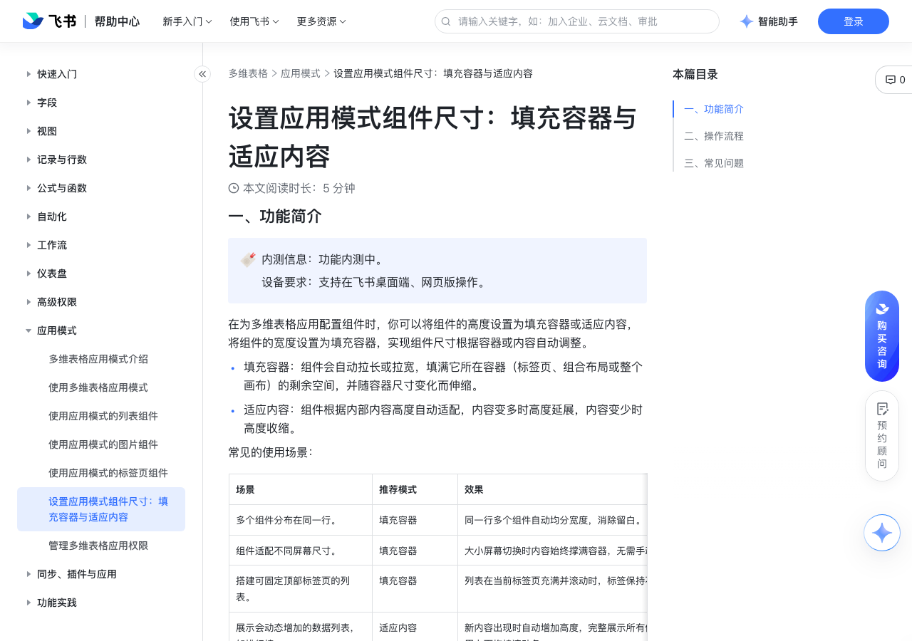

# 设置应用模式组件尺寸：填充容器与适应内容

> 来源：[飞书帮助中心](https://www.feishu.cn/hc/zh-CN/articles/422292664911)  
> 分类：多维表格 / 应用模式  
> 抓取时间：2026-09-22T01:26:33.514Z

## 界面截图

### 文档内配图

1. 配图：https://p1-hera.feishucdn.com/tos-cn-i-jbbdkfciu3/8ed4e9df136e4806a386491330a04801~tplv-jbbdkfciu3-image:0:0.image

## 功能定位

本页对应飞书帮助中心「多维表格 / 应用模式」下的「设置应用模式组件尺寸：填充容器与适应内容」。以下需求描述依据官方说明文档提炼，用于指导 DuoWei 对标实现。

## 功能目标

一、功能简介

## 文档结构（官方章节）

- 一、功能简介​
- 二、操作流程​
- 三、常见问题​

## 详细功能说明

一、功能简介

填充容器：组件会自动拉长或拉宽，填满它所在容器（标签页、组合布局或整个画布）的剩余空间，并随容器尺寸变化而伸缩。

适应内容：组件根据内部内容高度自动适配，内容变多时高度延展，内容变少时高度收缩。

推荐模式

多个组件分布在同一行。

填充容器

同一行多个组件自动均分宽度，消除留白。

组件适配不同屏幕尺寸。

大小屏幕切换时内容始终撑满容器，无需手动调整。

搭建可固定顶部标签页的列表。

列表在当前标签页充满并滚动时，标签保持不动。

展示会动态增加的数据列表，如排行榜。

适应内容

新内容出现时自动增加高度，完整展示所有信息，不用上下拖拽滚动条。

防止内容被裁切，如文本组件中的长文本内容展示不全。

组件高度随内容自动伸缩。

二、操作流程

打开多维表格应用，点击左上角应用名称旁的 编辑应用 图标进入编辑模式。

选择目标组件，点击右上角 图标 > 配置，打开 自定义配置 面板。

注：如需为文本组件设置尺寸，点击组件右上角 图标 > 尺寸；如需为组合布局组件设置尺寸，将鼠标悬停在组件上方，点击浮动工具栏上的 尺寸 图标。

在尺寸设置区域，为组件的宽度和高度选择不同的模式。

不同尺寸设置的适用范围和使用规则见下表：

尺寸适用范围使用规则默认宽度或高度支持设置为所有组件的宽度和高度。组件宽度、高度不会跟随组件内容或所在容器变化而变化。填充容器除插件组件外，支持设置为所有组件的宽度和高度。组件在组合布局或标签页内：高度设为填充容器时，单个组件将占满组合布局或标签页内的纵向剩余空间，多个组件则均分纵向空间。宽度设为填充容器时，单个组件将占满组合布局或标签页内的横向剩余空间，多个组件则均分横向空间。组件在画布中：高度设为填充容器时，单个组件将占满画布首屏（无需滚动，当前画布可以看到的高度范围）的纵向剩余空间，多个组件则均分纵向空间。注：如果组件不在画布首屏范围，高度不支持设置为填充容器。宽度设为填充容器时，单个组件将占满画布横向剩余空间，多个组件则均分横向空间。适应内容仅支持设置为以下组件的高度模式：列表：普通列表、详情列表、卡片列表、聚合列表、折叠列表其他：透视表、文本、按钮、排行榜组件、切片器、组合布局、标签页组件高度根据内容高度自动适配。内容增多时高度随之增大，内容减少时高度自动缩小。如果横向空间不足，内容会自动换行。

适用范围

使用规则

默认宽度或高度

支持设置为所有组件的宽度和高度。

组件宽度、高度不会跟随组件内容或所在容器变化而变化。

除插件组件外，支持设置为所有组件的宽度和高度。

组件在组合布局或标签页内：高度设为填充容器时，单个组件将占满组合布局或标签页内的纵向剩余空间，多个组件则均分纵向空间。宽度设为填充容器时，单个组件将占满组合布局或标签页内的横向剩余空间，多个组件则均分横向空间。组件在画布中：高度设为填充容器时，单个组件将占满画布首屏（无需滚动，当前画布可以看到的高度范围）的纵向剩余空间，多个组件则均分纵向空间。注：如果组件不在画布首屏范围，高度不支持设置为填充容器。宽度设为填充容器时，单个组件将占满画布横向剩余空间，多个组件则均分横向空间。

高度设为填充容器时，单个组件将占满组合布局或标签页内的纵向剩余空间，多个组件则均分纵向空间。

宽度设为填充容器时，单个组件将占满组合布局或标签页内的横向剩余空间，多个组件则均分横向空间。

高度设为填充容器时，单个组件将占满画布首屏（无需滚动，当前画布可以看到的高度范围）的纵向剩余空间，多个组件则均分纵向空间。

宽度设为填充容器时，单个组件将占满画布横向剩余空间，多个组件则均分横向空间。

仅支持设置为以下组件的高度模式：列表：普通列表、详情列表、卡片列表、聚合列表、折叠列表其他：透视表、文本、按钮、排行榜组件、切片器、组合布局、标签页

列表：普通列表、详情列表、卡片列表、聚合列表、折叠列表

其他：透视表、文本、按钮、排行榜组件、切片器、组合布局、标签页

组件高度根据内容高度自动适配。内容增多时高度随之增大，内容减少时高度自动缩小。如果横向空间不足，内容会自动换行。

点击右上角 完成编辑，即可保存尺寸设置。

三、常见问题

场景 | 推荐模式 | 效果

多个组件分布在同一行。 | 填充容器 | 同一行多个组件自动均分宽度，消除留白。

组件适配不同屏幕尺寸。 | 填充容器 | 大小屏幕切换时内容始终撑满容器，无需手动调整。

搭建可固定顶部标签页的列表。 | 填充容器 | 列表在当前标签页充满并滚动时，标签保持不动。

展示会动态增加的数据列表，如排行榜。 | 适应内容 | 新内容出现时自动增加高度，完整展示所有信息，不用上下拖拽滚动条。

防止内容被裁切，如文本组件中的长文本内容展示不全。 | 适应内容 | 组件高度随内容自动伸缩。

尺寸 | 适用范围 | 使用规则

默认宽度或高度 | 支持设置为所有组件的宽度和高度。 | 组件宽度、高度不会跟随组件内容或所在容器变化而变化。

填充容器 | 除插件组件外，支持设置为所有组件的宽度和高度。 | 组件在组合布局或标签页内：高度设为填充容器时，单个组件将占满组合布局或标签页内的纵向剩余空间，多个组件则均分纵向空间。宽度设为填充容器时，单个组件将占满组合布局或标签页内的横向剩余空间，多个组件则均分横向空间。组件在画布中：高度设为填充容器时，单个组件将占满画布首屏（无需滚动，当前画布可以看到的高度范围）的纵向剩余空间，多个组件则均分纵向空间。注：如果组件不在画布首屏范围，高度不支持设置为填充容器。宽度设为填充容器时，单个组件将占满画布横向剩余空间，多个组件则均分横向空间。

适应内容 | 仅支持设置为以下组件的高度模式：列表：普通列表、详情列表、卡片列表、聚合列表、折叠列表其他：透视表、文本、按钮、排行榜组件、切片器、组合布局、标签页 | 组件高度根据内容高度自动适配。内容增多时高度随之增大，内容减少时高度自动缩小。如果横向空间不足，内容会自动换行。

## 实现要点（对标 DuoWei）

1. **入口与信息架构**：在产品中明确该能力所属模块（应用模式），并保证用户可从对应导航触达。
2. **核心交互**：按上文「详细功能说明」还原主要操作路径；截图中出现的按钮、字段、面板命名尽量与飞书语义一致或可映射。
3. **数据与权限**：若文档涉及可见范围、可编辑范围、分享或高级权限，实现时需落到角色/成员模型，并保证 API/MCP 与 UI 权限一致。
4. **边界与上限**：若文档提到数量上限、格式限制、导入导出约束，需在实现与错误提示中体现。
5. **验收**：以本页截图场景为用例，完成「能打开 / 能配置 / 能保存 / 能被 Agent 读写（如适用）」四项检查。

## 原始摘录摘要

> 一、功能简介 填充容器：组件会自动拉长或拉宽，填满它所在容器（标签页、组合布局或整个画布）的剩余空间，并随容器尺寸变化而伸缩。 适应内容：组件根据内部内容高度自动适配，内容变多时高度延展，内容变少时高度收缩。 推荐模式 多个组件分布在同一行。 填充容器 同一行多个组件自动均分宽度，消除留白。 组件适配不同屏幕尺寸。 大小屏幕切换时内容始终撑满容器，无需手动调整。 搭建可固定顶部标签页的列表。 列表在当前标签页充满并滚动时，标签保持不动。 展示会动态增加的数据列表，如排行榜。 适应内容 新内容出现时自动增加高度，完整展示所有信息，不用上下拖拽滚动条。 防止内容被裁切，如文本组件中的长文本内容展示不全。 组件高度随内容自动伸缩。 二、操作流程 打开多维表格应用，点击左上角应用名称旁的 编辑应用 图标进入编辑模式。 选择目标组件，点击右上角 图标 > 配置，打开 自定义配置 面板。 注：如需为文本组件设置尺寸，点击组件右上角 图标 > 尺寸；如需为组合布局组件设置尺寸，将鼠标悬停在组件上方，点击浮动工具栏上的 尺寸 图标。 在尺寸设置区域，为组件的宽度和高度选择不同的模式。 不同尺寸设置的适用范围和使用规则见下表： 尺寸适用范围使用规则默认宽度或高度支持设置为所有组件的宽度和高度。组件宽度、高度不会跟随组件内容或所在容器变化而变化。填充容器除插件组件外，支持设置为所有组件的宽度和高度。组件在组合布局或标签页内：高度设为填充容器时，单个组件将占满组合布局或标签页内的纵向剩余空间，多个组件则均分纵向空间。宽度设为填充容器时，单个组件将占满组合布局或标签页内的横向剩余空间，多个组件则均分横向空间。组件在画布中：高度设为填充容器时，单个组件将占满画布首屏（无需滚动，当前画布可以看到的高度范围）的纵向剩余空间，多个组件则均分纵向空间。注：如果组件不在画布首屏范围，高度不支持设置为填充容器。…

## 元数据

- article_id: `7623733138946067666`
- category_id: `7550306356478574620`
- path: `/hc/zh-CN/articles/422292664911`
- extracted_text_length: 2457
