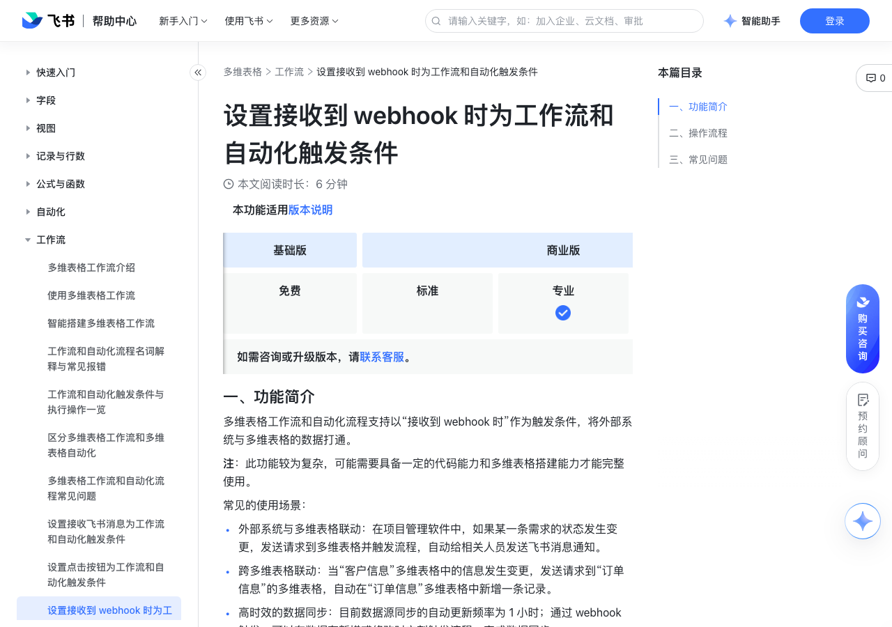

# 设置接收到 webhook 时为工作流和自动化触发条件

> 来源：[飞书帮助中心](https://www.feishu.cn/hc/zh-CN/articles/612376356355)  
> 分类：多维表格 / 工作流  
> 抓取时间：2026-09-22T01:24:08.594Z

## 界面截图

### 文档内配图

1. 配图：https://p1-hera.feishucdn.com/tos-cn-i-jbbdkfciu3/d3fbe54c66ac4a8aa87741b93122da36~tplv-jbbdkfciu3-image:0:0.image
2. 配图：https://p1-hera.feishucdn.com/tos-cn-i-jbbdkfciu3/01c1c97eb25c4c848b067319956aca8e~tplv-jbbdkfciu3-image:0:0.image
3. 配图：https://p1-hera.feishucdn.com/tos-cn-i-jbbdkfciu3/569a940e7be74ee38001c95b415274fe~tplv-jbbdkfciu3-image:0:0.image
4. 配图：https://p1-hera.feishucdn.com/tos-cn-i-jbbdkfciu3/668f98050ec540c09fd9432c7a5f077f~tplv-jbbdkfciu3-image:0:0.image
5. 配图：https://p1-hera.feishucdn.com/tos-cn-i-jbbdkfciu3/dd20c88af55d4efcb7dfd00ccc5e3edb~tplv-jbbdkfciu3-image:0:0.image

## 功能定位

本页对应飞书帮助中心「多维表格 / 工作流」下的「设置接收到 webhook 时为工作流和自动化触发条件」。以下需求描述依据官方说明文档提炼，用于指导 DuoWei 对标实现。

## 功能目标

一、功能简介

## 文档结构（官方章节）

- 一、功能简介​
- 二、操作流程​
- 三、常见问题​

## 详细功能说明

一、功能简介

外部系统与多维表格联动：在项目管理软件中，如果某一条需求的状态发生变更，发送请求到多维表格并触发流程，自动给相关人员发送飞书消息通知。

跨多维表格联动：当“客户信息”多维表格中的信息发生变更，发送请求到“订单信息”的多维表格，自动在“订单信息”多维表格中新增一条记录。

高时效的数据同步：目前数据源同步的自动更新频率为 1 小时；通过 webhook 触发，可以在数据有新增或修改时立刻触发流程、完成数据同步。

二、操作流程

打开目标多维表格，点击左下角的 + 新建 > 工作流。点击 + 从空白开始，打开工作流配置画布。

点击 当发生指定情况 节点，选择 接收到 webhook 时，可以看到该流程对应的唯一的 webhook 地址。

注：每个 webhook 触发的流程都有一个唯一的 webhook 地址。该地址不支持手动刷新、不可编辑。从外部系统发送请求到多维表格流程时，需填写此地址。

（可选）在 安全设置 中，你可以设置 IP 白名单和凭证校验，增强调用的安全性。

IP 白名单：开启后，只有来自白名单内的 IP 地址发送的请求才能触发自动化流程。最多支持输入 10 个 IP 地址。输入完成一个 IP 地址后，请点击回车再输入下一个。

凭证校验（Bearer token）：相当于 webhook 触发的密码。开启后，发送请求时必须携带此凭证，才能触发流程，以确保来源可信。你可以一键复制或重置 token。重置后的 token 会在点击流程的 保存并启用 后生效。关于 Bearer token 的参数及详情，请参考自动化 webhook 参数的详细说明。

（可选）如果需要在后续的流程引用请求发送的信息，需要在 输出设置 中，对 webhook 的输出进行定义和 schema 构造，生成请求体的输出示例。如果不需要引用请求发来的信息，则可以选择 无需输出 图标。

你可以通过以下两种方式生成输出示例：

选择 通过发送请求设置，向该流程对应的 webhook 地址发送示例请求。发送请求后点击 生成，该按钮会显示为加载状态。

系统会监听最近 3 分钟内发送到该 webhook 地址的请求，直至加载结束（最多 5 秒）。如果 5 秒内未获取到请求，则会停止加载，需重新发送请求；如果 5 秒内接收到了请求，则会展示请求体（body）的完整示例结构，不可修改。若 5 秒钟内获取到多个请求，会以最新请求为准。

如果想要发送新的请求体并生成设置，点击 重新生成 即可。

250px|700px|reset250px|700px|reset

手动设置：手动在“示例请求体”中输入请求的输出示例。

完成触发器配置后，点击带有 就执行操作 字样的按钮，添加操作节点。

（可选）如果你想在字段中引用触发器中 webhook 的信息，点击字段右侧的 ⊕ 图标，将鼠标悬停在 第 1 步发送请求的返回值 上，然后点击 选择 完成引用，也可以点击 继续 选择 config、elements 或 header，引用更详细的信息。

注：如果你引用了 webhook 信息后，又修改了输出设置中的输出示例，引用会失效。

保存并启用工作流。

三、常见问题

问：多维表格 webhook 触发是否支持接收图片信息？

答：不支持。Webhook 触发仅能接收文本类字段数据，无法解析或传递图片、附件等内容。

问：多维表格接收到的 HTTP 请求是否有大小限制？

答：有，接收的请求体大小不得超过 4 MB。

问：多维表格 webhook 触发的频率限制是？

答：整个多维表格的 webhook 触发频率上限为 50 次/秒。单个流程的 webhook 触发频率上限为 5 次/秒。针对不开启凭证校验（Bearer token）的流程，每个流程的频率上限为 1 次/秒。关于 webhook 触发报错的更多信息，请参考自动化 webhook 参数的详细说明。

问：在复制 webhook 触发的多维表格流程时（包括从模板创建、导入导出等场景下的复制），其中的配置会如何保留或更新？

答：webhook 地址会重新生成。若勾选了“凭证校验”，token 会重新生成。IP 白名单、输出设置等保持不变。

问：可以使用多维表格 webhook 新增人员字段吗？

答：不可以，webhook 接收到的人员信息无法直接添加为人员字段。

## 实现要点（对标 DuoWei）

1. **入口与信息架构**：在产品中明确该能力所属模块（工作流），并保证用户可从对应导航触达。
2. **核心交互**：按上文「详细功能说明」还原主要操作路径；截图中出现的按钮、字段、面板命名尽量与飞书语义一致或可映射。
3. **数据与权限**：若文档涉及可见范围、可编辑范围、分享或高级权限，实现时需落到角色/成员模型，并保证 API/MCP 与 UI 权限一致。
4. **边界与上限**：若文档提到数量上限、格式限制、导入导出约束，需在实现与错误提示中体现。
5. **验收**：以本页截图场景为用例，完成「能打开 / 能配置 / 能保存 / 能被 Agent 读写（如适用）」四项检查。

## 原始摘录摘要

> 一、功能简介 外部系统与多维表格联动：在项目管理软件中，如果某一条需求的状态发生变更，发送请求到多维表格并触发流程，自动给相关人员发送飞书消息通知。 跨多维表格联动：当“客户信息”多维表格中的信息发生变更，发送请求到“订单信息”的多维表格，自动在“订单信息”多维表格中新增一条记录。 高时效的数据同步：目前数据源同步的自动更新频率为 1 小时；通过 webhook 触发，可以在数据有新增或修改时立刻触发流程、完成数据同步。 二、操作流程 打开目标多维表格，点击左下角的 + 新建 > 工作流。点击 + 从空白开始，打开工作流配置画布。 点击 当发生指定情况 节点，选择 接收到 webhook 时，可以看到该流程对应的唯一的 webhook 地址。 注：每个 webhook 触发的流程都有一个唯一的 webhook 地址。该地址不支持手动刷新、不可编辑。从外部系统发送请求到多维表格流程时，需填写此地址。 （可选）在 安全设置 中，你可以设置 IP 白名单和凭证校验，增强调用的安全性。 IP 白名单：开启后，只有来自白名单内的 IP 地址发送的请求才能触发自动化流程。最多支持输入 10 个 IP 地址。输入完成一个 IP 地址后，请点击回车再输入下一个。 凭证校验（Bearer token）：相当于 webhook 触发的密码。开启后，发送请求时必须携带此凭证，才能触发流程，以确保来源可信。你可以一键复制或重置 token。重置后的 token 会在点击流程的 保存并启用 后生效。关于 Bearer token 的参数及详情，请参考自动化 webhook 参数的详细说明。 （可选）如果需要在后续的流程引用请求发送的信息，需要在 输出设置 中，对 webhook 的输出进行定义和 schema 构造，生成请求体的输出示例。如果不需要引用请求发来的信息，则可以选择 无需输出 图标。 你…

## 元数据

- article_id: `7376177392089907228`
- category_id: `7415964452380049412`
- path: `/hc/zh-CN/articles/612376356355`
- extracted_text_length: 1813
