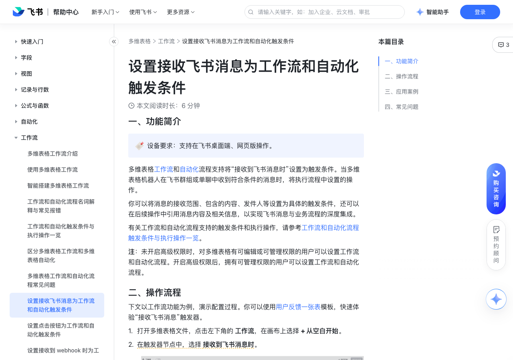

# 设置接收飞书消息为工作流和自动化触发条件

> 来源：[飞书帮助中心](https://www.feishu.cn/hc/zh-CN/articles/644123526076)  
> 分类：多维表格 / 工作流  
> 抓取时间：2026-09-22T01:24:08.717Z

## 界面截图

### 文档内配图

1. 配图：https://p1-hera.feishucdn.com/tos-cn-i-jbbdkfciu3/4011ecdad5b44c01806b9b7c376f23d5~tplv-jbbdkfciu3-image:0:0.image
2. 配图：https://p1-hera.feishucdn.com/tos-cn-i-jbbdkfciu3/361b13f7b7bb41b384705abda9b2ffd6~tplv-jbbdkfciu3-image:0:0.image
3. 配图：https://p1-hera.feishucdn.com/tos-cn-i-jbbdkfciu3/0adf4607c1d148888d6b1397a12aa916~tplv-jbbdkfciu3-image:0:0.image

## 功能定位

本页对应飞书帮助中心「多维表格 / 工作流」下的「设置接收飞书消息为工作流和自动化触发条件」。以下需求描述依据官方说明文档提炼，用于指导 DuoWei 对标实现。

## 功能目标

一、功能简介

## 文档结构（官方章节）

- 一、功能简介​
- 二、操作流程 ​
- 三、应用案例​
- 自动将用户反馈添加至问题收录表​
- 四、常见问题​

## 详细功能说明

一、功能简介

二、操作流程

打开多维表格文件，点击左下角的 工作流，在画布上选择 + 从空白开始。

在触发器节点中，选择 接收到飞书消息时。

在右侧弹窗中配置触发器的接收场景、接收对象、触发条件等信息。

配置项群组场景单聊场景消息接收场景群组单聊接收消息的机器人仅支持选择当前多维表格应用机器人。接收消息的群组（群组场景）或可以和机器人单聊的用户（单聊场景）可选择流程启用者所在的外部群组或内部群组。流程启用后，将以启用者身份将机器人添加至所选群组中。可选择个人用户、部门、用户组或群组。注：启用流程后，如果群成员发生变动，需要重新保存并启用工作流。接收消息范围可选择群组中的所有消息或提及机器人的消息。单聊场景无需配置此选项。消息需要满足的条件注：可选择需满足全部条件或任意条件。可设置条件：消息包含指定关键词消息由指定用户发送新话题消息消息中包含图片或文件可设置条件：消息包含指定关键词消息中包含图片或文件

群组场景

单聊场景

消息接收场景

接收消息的机器人

仅支持选择当前多维表格应用机器人。

接收消息的群组（群组场景）或可以和机器人单聊的用户（单聊场景）

可选择流程启用者所在的外部群组或内部群组。流程启用后，将以启用者身份将机器人添加至所选群组中。

可选择个人用户、部门、用户组或群组。注：启用流程后，如果群成员发生变动，需要重新保存并启用工作流。

接收消息范围

可选择群组中的所有消息或提及机器人的消息。

单聊场景无需配置此选项。

消息需要满足的条件注：可选择需满足全部条件或任意条件。

可设置条件：消息包含指定关键词消息由指定用户发送新话题消息消息中包含图片或文件

消息包含指定关键词

消息由指定用户发送

新话题消息

消息中包含图片或文件

可设置条件：消息包含指定关键词消息中包含图片或文件

注：如果选择外部群组或全部群消息，会对当前多维表格进行一次权限检查。如果未通过检查，将会出现提示，此时需要联系企业管理员为当前多维表格应用机器人开启对应的权限。

250px|700px|reset

添加操作节点后，保存并启用工作流。操作节点可以引用触发器节点中的如下信息：

触发流程的消息 ID 及其所回复的消息 ID

消息类型、消息内容、消息中包含的附件（图片、文件、音视频）

发送人、发送时间、提及的成员

（仅群聊场景）所在群组和消息链接

三、应用案例

自动将用户反馈添加至问题收录表

在自动化流程中设置“接收到飞书消息时”触发条件。在 接收消息的群组 中，添加用户群。

注：你可以选择接收群内的所有消息或是仅接收提及机器人的消息。

在 就执行以下操作： 中，选择 新增记录，并选择 问题收录表 作为要添加记录的数据表。

在 设置记录内容 中，将消息内容及其相关信息引用为数据表对应字段的值。按照以下方式进行设置：

点击 + 设置字段值，选择要引用内容的字段。

点击输入栏右侧的 ⊕ 图标，选择要引用的值。

重复以上步骤，完成以下字段的设置：

收录表字段引用值问题内容消息内容消息链接消息链接问题编号消息 ID

收录表字段

问题内容

消息内容

消息链接

问题编号

消息 ID

保存并启用自动化流程。

四、常见问题

问：为什么无法在工作流或自动化流程中回复机器人接收到的飞书消息？

答：机器人无权限在外部群发送消息。请检查机器人接收到的消息是否来自外部群。

问：为什么机器人发出的消息无法触发工作流或自动化流程？

答：为了避免造成循环触发和资源浪费，以下消息均不会触发以“接收飞书消息”为触发条件的工作流或自动化流程：机器人自动发送的消息以个人身份发送的多维表格自动化消息特定类型的消息，如卡片消息、红包、表情包等

配置项 | 群组场景 | 单聊场景

消息接收场景 | 群组 | 单聊

接收消息的机器人 | 仅支持选择当前多维表格应用机器人。 |

接收消息的群组（群组场景）或可以和机器人单聊的用户（单聊场景） | 可选择流程启用者所在的外部群组或内部群组。流程启用后，将以启用者身份将机器人添加至所选群组中。 | 可选择个人用户、部门、用户组或群组。注：启用流程后，如果群成员发生变动，需要重新保存并启用工作流。

接收消息范围 | 可选择群组中的所有消息或提及机器人的消息。 | 单聊场景无需配置此选项。

消息需要满足的条件注：可选择需满足全部条件或任意条件。 | 可设置条件：消息包含指定关键词消息由指定用户发送新话题消息消息中包含图片或文件 | 可设置条件：消息包含指定关键词消息中包含图片或文件

收录表字段 | 引用值

问题内容 | 消息内容

消息链接 | 消息链接

问题编号 | 消息 ID

## 实现要点（对标 DuoWei）

1. **入口与信息架构**：在产品中明确该能力所属模块（工作流），并保证用户可从对应导航触达。
2. **核心交互**：按上文「详细功能说明」还原主要操作路径；截图中出现的按钮、字段、面板命名尽量与飞书语义一致或可映射。
3. **数据与权限**：若文档涉及可见范围、可编辑范围、分享或高级权限，实现时需落到角色/成员模型，并保证 API/MCP 与 UI 权限一致。
4. **边界与上限**：若文档提到数量上限、格式限制、导入导出约束，需在实现与错误提示中体现。
5. **验收**：以本页截图场景为用例，完成「能打开 / 能配置 / 能保存 / 能被 Agent 读写（如适用）」四项检查。

## 原始摘录摘要

> 一、功能简介 二、操作流程 打开多维表格文件，点击左下角的 工作流，在画布上选择 + 从空白开始。 在触发器节点中，选择 接收到飞书消息时。 在右侧弹窗中配置触发器的接收场景、接收对象、触发条件等信息。 配置项群组场景单聊场景消息接收场景群组单聊接收消息的机器人仅支持选择当前多维表格应用机器人。接收消息的群组（群组场景）或可以和机器人单聊的用户（单聊场景）可选择流程启用者所在的外部群组或内部群组。流程启用后，将以启用者身份将机器人添加至所选群组中。可选择个人用户、部门、用户组或群组。注：启用流程后，如果群成员发生变动，需要重新保存并启用工作流。接收消息范围可选择群组中的所有消息或提及机器人的消息。单聊场景无需配置此选项。消息需要满足的条件注：可选择需满足全部条件或任意条件。可设置条件：消息包含指定关键词消息由指定用户发送新话题消息消息中包含图片或文件可设置条件：消息包含指定关键词消息中包含图片或文件 群组场景 单聊场景 消息接收场景 接收消息的机器人 仅支持选择当前多维表格应用机器人。 接收消息的群组（群组场景）或可以和机器人单聊的用户（单聊场景） 可选择流程启用者所在的外部群组或内部群组。流程启用后，将以启用者身份将机器人添加至所选群组中。 可选择个人用户、部门、用户组或群组。注：启用流程后，如果群成员发生变动，需要重新保存并启用工作流。 接收消息范围 可选择群组中的所有消息或提及机器人的消息。 单聊场景无需配置此选项。 消息需要满足的条件注：可选择需满足全部条件或任意条件。 可设置条件：消息包含指定关键词消息由指定用户发送新话题消息消息中包含图片或文件 消息包含指定关键词 消息由指定用户发送 新话题消息 消息中包含图片或文件 可设置条件：消息包含指定关键词消息中包含图片或文件 注：如果选择外部群组或全部群消息，会对当前多维表格进行一次权限检查。如果未通过检查，将会出现提…

## 元数据

- article_id: `7525296491783536641`
- category_id: `7415964452380049412`
- path: `/hc/zh-CN/articles/644123526076`
- extracted_text_length: 1904
