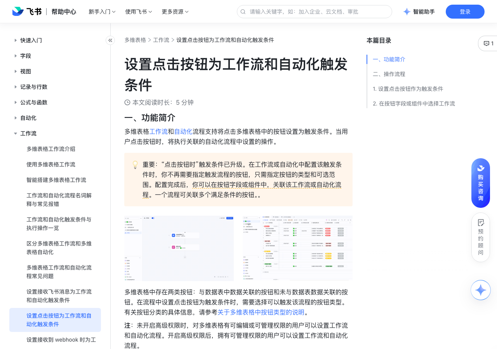

# 设置点击按钮为工作流和自动化触发条件

> 来源：[飞书帮助中心](https://www.feishu.cn/hc/zh-CN/articles/804644015036)  
> 分类：多维表格 / 工作流  
> 抓取时间：2026-09-22T01:24:08.634Z

## 界面截图

### 文档内配图

1. 配图：https://p1-hera.feishucdn.com/tos-cn-i-jbbdkfciu3/9132f83d43a5451dad24e2052643b0e8~tplv-jbbdkfciu3-image:0:0.image
2. 配图：https://p1-hera.feishucdn.com/tos-cn-i-jbbdkfciu3/732ca74e6c1b40b681bfc79cbe63f80b~tplv-jbbdkfciu3-image:0:0.image
3. 配图：https://p1-hera.feishucdn.com/tos-cn-i-jbbdkfciu3/77c717d1be344a059295da2473c73ce4~tplv-jbbdkfciu3-image:0:0.image
4. 配图：https://p1-hera.feishucdn.com/tos-cn-i-jbbdkfciu3/f67bb1404c3747e29d0e8070906e0b1f~tplv-jbbdkfciu3-image:0:0.image
5. 配图：https://p1-hera.feishucdn.com/tos-cn-i-jbbdkfciu3/a5b3184d1609479eaba5d28b80a3de63~tplv-jbbdkfciu3-image:0:0.image

## 功能定位

本页对应飞书帮助中心「多维表格 / 工作流」下的「设置点击按钮为工作流和自动化触发条件」。以下需求描述依据官方说明文档提炼，用于指导 DuoWei 对标实现。

## 功能目标

一、功能简介

## 文档结构（官方章节）

- 一、功能简介​
- 二、操作流程 ​
- 设置点击按钮作为触发条件​
- 在按钮字段或组件中选择工作流​

## 详细功能说明

一、功能简介

二、操作流程

在工作流或自动化中，将触发条件设置为“点击按钮时”，并选择可触发该流程的按钮的类型。

在对应的按钮字段或组件的配置面板中，选择要触发的工作流或自动化。

设置点击按钮作为触发条件

打开多维表格文件，点击左下角的 工作流，在画布上选择 + 从空白开始。

在触发器节点中，选择 点击按钮时。

选择可配置的按钮类型和范围：可选 按钮字段 或 按钮组件。

按钮字段：如果流程需要引用按钮字段所在数据表中的具体数据，需要选择此选项。流程可以被数据表中的按钮字段所触发，如选择此选项，需要进一步选择数据表。还可以设置可以触发流程的记录范围。

按钮组件：流程可以被多维表格中的任意按钮字段或组件触发，还可以被引用了当前多维表格数据的多维表格应用中的按钮所触发。后续流程仅可获取按钮点击人和点击时间。

在按钮字段或组件中选择工作流

按钮字段可以关联：

在“点击按钮时”节点配置中选择类型为 按钮字段，且关联数据表为当前数据表的流程。

所有在“点击按钮时”节点配置中选择类型为 按钮组件 的流程。

按钮组件可以关联所有在“点击按钮时”节点配置中选择类型为 按钮组件 的流程。

以按钮字段为触发条件的流程：单个按钮每分钟最多可触发 10 次。

以按钮组件为触发条件的流程：整个多维表格内的所有此类流程，每分钟累计最多可触发 10 次。

## 实现要点（对标 DuoWei）

1. **入口与信息架构**：在产品中明确该能力所属模块（工作流），并保证用户可从对应导航触达。
2. **核心交互**：按上文「详细功能说明」还原主要操作路径；截图中出现的按钮、字段、面板命名尽量与飞书语义一致或可映射。
3. **数据与权限**：若文档涉及可见范围、可编辑范围、分享或高级权限，实现时需落到角色/成员模型，并保证 API/MCP 与 UI 权限一致。
4. **边界与上限**：若文档提到数量上限、格式限制、导入导出约束，需在实现与错误提示中体现。
5. **验收**：以本页截图场景为用例，完成「能打开 / 能配置 / 能保存 / 能被 Agent 读写（如适用）」四项检查。

## 原始摘录摘要

> 一、功能简介 二、操作流程 在工作流或自动化中，将触发条件设置为“点击按钮时”，并选择可触发该流程的按钮的类型。 在对应的按钮字段或组件的配置面板中，选择要触发的工作流或自动化。 设置点击按钮作为触发条件 打开多维表格文件，点击左下角的 工作流，在画布上选择 + 从空白开始。 在触发器节点中，选择 点击按钮时。 选择可配置的按钮类型和范围：可选 按钮字段 或 按钮组件。 按钮字段：如果流程需要引用按钮字段所在数据表中的具体数据，需要选择此选项。流程可以被数据表中的按钮字段所触发，如选择此选项，需要进一步选择数据表。还可以设置可以触发流程的记录范围。 按钮组件：流程可以被多维表格中的任意按钮字段或组件触发，还可以被引用了当前多维表格数据的多维表格应用中的按钮所触发。后续流程仅可获取按钮点击人和点击时间。 在按钮字段或组件中选择工作流 按钮字段可以关联： 在“点击按钮时”节点配置中选择类型为 按钮字段，且关联数据表为当前数据表的流程。 所有在“点击按钮时”节点配置中选择类型为 按钮组件 的流程。 按钮组件可以关联所有在“点击按钮时”节点配置中选择类型为 按钮组件 的流程。 以按钮字段为触发条件的流程：单个按钮每分钟最多可触发 10 次。 以按钮组件为触发条件的流程：整个多维表格内的所有此类流程，每分钟累计最多可触发 10 次。

## 元数据

- article_id: `7555398513734320129`
- category_id: `7415964452380049412`
- path: `/hc/zh-CN/articles/804644015036`
- extracted_text_length: 570
