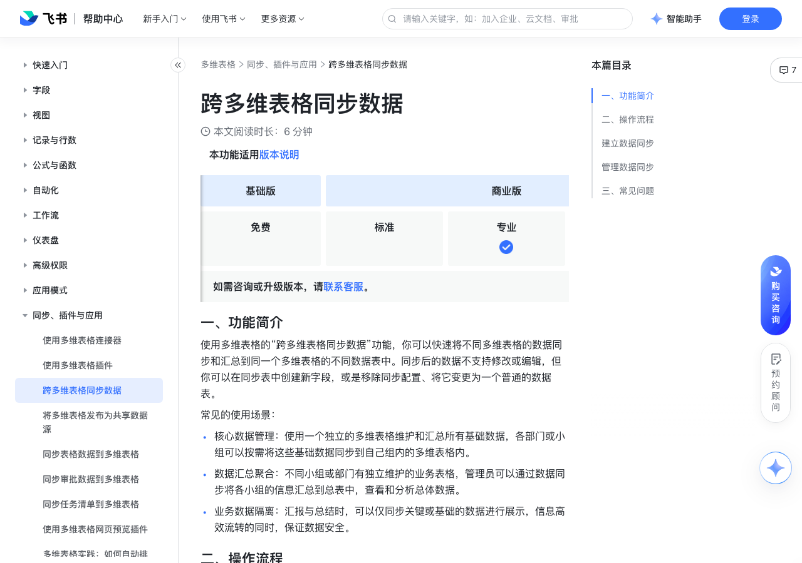

# 跨多维表格同步数据

> 来源：[飞书帮助中心](https://www.feishu.cn/hc/zh-CN/articles/128401098783)  
> 分类：多维表格 / 同步、插件与应用  
> 抓取时间：2026-09-22T01:26:34.738Z

## 界面截图

### 文档内配图

1. 配图：https://p1-hera.feishucdn.com/tos-cn-i-jbbdkfciu3/1d482212ce864fcb895bd3dd7caf799a~tplv-jbbdkfciu3-image:0:0.image
2. 配图：https://p1-hera.feishucdn.com/tos-cn-i-jbbdkfciu3/33a6980f7673457ab61ab4657cda8a74~tplv-jbbdkfciu3-image:0:0.image
3. 配图：https://p1-hera.feishucdn.com/tos-cn-i-jbbdkfciu3/a1bc9ebc6abe461184748868dad31029~tplv-jbbdkfciu3-image:0:0.image
4. 配图：https://p1-hera.feishucdn.com/tos-cn-i-jbbdkfciu3/12f9e1f3a3634336b9230f23cd4fedae~tplv-jbbdkfciu3-image:0:0.image
5. 配图：https://p1-hera.feishucdn.com/tos-cn-i-jbbdkfciu3/aa3edaf3e22c49c7b23dbdb05971fd49~tplv-jbbdkfciu3-image:0:0.image

## 功能定位

本页对应飞书帮助中心「多维表格 / 同步、插件与应用」下的「跨多维表格同步数据」。以下需求描述依据官方说明文档提炼，用于指导 DuoWei 对标实现。

## 功能目标

一、功能简介

## 文档结构（官方章节）

- 一、功能简介​
- 二、操作流程​
- 建立数据同步​
- 管理数据同步​
- 三、常见问题​

## 详细功能说明

一、功能简介

核心数据管理：使用一个独立的多维表格维护和汇总所有基础数据，各部门或小组可以按需将这些基础数据同步到自己组内的多维表格内。

数据汇总聚合：不同小组或部门有独立维护的业务表格，管理员可以通过数据同步将各小组的信息汇总到总表中，查看和分析总体数据。

业务数据隔离：汇报与总结时，可以仅同步关键或基础的数据进行展示，信息高效流转的同时，保证数据安全。

二、操作流程

建立数据同步

打开目标多维表格，点击左下角的 新建 > 导入/同步数据 > 连接器中心，在弹窗中找到 多维表格，将鼠标悬停其上并点击 使用。

注：你需要对当前多维表格有可管理权限才能看到此功能入口。

在配置界面完成 参数设置，依次选择需要同步的 多维表格文件、数据表 和 视图，支持输入关键词进行搜索。

如果你只想同步源数据表中的部分数据，可以在待同步的源数据表视图中筛选出需要的数据并保存好视图配置，然后再建立数据同步。通过这种方式，你可以仅同步筛选后的数据。

若数据源多维表格未开启高级权限，你需要拥有数据源多维表格的复制内容的权限，才可以选择并同步。

若数据源多维表格开启了高级权限，你需要拥有数据源多维表格的可管理权限，才可以选择并同步。

选择视图时，不支持选择个人视图。

填写 字段设置 和 同步设置。

字段范围：全选或按需逐一勾选需要从源数据表中同步的字段。

未来新增字段：如需让源数据表中后续新增的字段也自动同步到当前数据表，则勾选 包含，否则勾选 不包含。

同步设置：启用同步设置后，数据源的更新将每小时自动同步到当前数据表。如不启用，后续可按需手动同步数据源的更新，具体信息请参考本文“管理数据同步”。

配置完成后，点击 创建。

管理数据同步

同步而来的数据表会带有闪电标识，名称默认与源数据表一致，可自行重命名。你还可以对该数据表进行复制、删除等操作，也可以在数据表中新增字段来进行数据管理。该数据表中同步而来的字段也都会带有闪电标识，不支持在多维表格中编辑内容或修改字段类型，也不支持删除。

注：如果对同步的数据表进行复制，复制后的副本数据表只是一个普通的数据表，其中的内容可以被修改和编辑，与数据源没有同步关系。

手动同步数据：点击同步而来的数据表，再点击数据表名称右侧的 ⋮ 更多操作 图标 > 同步数据，即可手动同步数据。

注：若同步后的多维表格未开启高级权限，有可管理或可编辑权限的用户可以进行手动同步。若同步后的多维表格开启了高级权限，对同步后的多维表格有可管理权限的用户可以进行手动同步。

调整数据同步的配置：点击同步而来的数据表，再点击数据表名称右侧的 ⋮ 更多操作 图标 > 同步配置。在弹窗中，点击 配置 按钮即可调整要同步的字段，你还可以设置开启或关闭自动同步。调整完成后，点击 保存并同步 即可。

注：只有对同步后的多维表格有可管理权限的用户才可以调整同步配置。此处不支持修改数据源，即不能更换要同步的多维表格、数据表和视图。如需修改，需要建立新的同步关系。

移除同步配置：如果你需要停止同步，点击同步而来的数据表，再点击数据表名称右侧的 ⋮ 更多操作 图标 > 移除配置，即可解除同步。移除后，当前数据表将变为普通数据表，无法再继续同步数据源中的数据，已同步的数据将会保留。同时，移除配置的操作不可撤销。

注：只有对同步后的多维表格有可管理权限的用户才可以移除同步配置。

三、常见问题

问：支持同步哪些多维表格的数据？

答：若多维表格数据源未开启高级权限，支持同步有复制内容的权限的多维表格中的数据。若多维表格数据源开启了高级权限，支持同步有可管理权限的多维表格中的数据。

问：建立多维表格数据同步后，谁可以进行手动同步数据的操作？

答： 若同步后的多维表格未开启高级权限，有可管理或可编辑权限的用户可以进行手动同步。若同步后的多维表格开启了高级权限，有可管理权限的用户可以进行手动同步。

问：跨多维表格数据同步是否有行数限制？

答：跨多维表格数据可同步的最大行数取决于数据表中的行数上限。

问：多维表格数据同步时，不同类型字段的同步限制有哪些？

答：源多维表格的索引列默认同步，不可移除。不支持同步流程字段和按钮字段。自动编号字段、查找引用字段、单向关联字段、双向关联字段同步后会变成文本字段。公式字段会根据计算后的内容格式自适应调整同步表对应的字段类型，若无法自适应到对应格式，将会采用文本来承载。

问：跨多维表格同步后的数据是否支持编辑？

答：不支持，同步后的数据表仅支持阅读，不支持编辑、修改和删除字段中的数据，不支持新增记录和删除记录，同时不支持创建表单视图。

问：删除多维表格数据源后会影响数据同步吗？

答：删除多维表格数据源后，已同步的数据记录将会保留，但后续无法再进行同步。

问：同步后的数据表可以作为源数据吗？

答：可以。

问：如何将多张多维表格数据表数据同步到同一个数据表？

答：不支持将多张数据表数据同步到同一个数据表。

问：多维表格数据同步完成后，什么情况下自动同步会降频或关闭？

答：数据同步完成后，若超过 10 天未浏览从数据源同步数据的多维表格，自动同步的频率会由每 1 小时同步一次降低为每 24 小时同步一次；若超过 30 天未浏览多维表格，自动同步将会被关闭。如需再次启动自动同步，可点击同步后的数据表右侧 ⋮ 更多操作 图标，选择 同步配置，在 自动同步（每小时）处点击开启按钮。

问：多维表格数据同步完成后，是否支持撤回？

答：不支持。

问：跨多维表格同步数据后，自动编号字段如何转为其他格式？

答：自动编号字段同步后会转换成文本格式，如需转为其他格式，可使用 TEXT 函数。

问：是否支持同一个多维表格内的数据表相互同步？

问：是否支持同步组织外的多维表格？

答：支持，但是你需要拥有对应的权限：若数据源多维表格未开启高级权限，你需要拥有数据源多维表格的复制内容的权限，才可以选择并同步。若数据源多维表格开启了高级权限，你需要拥有数据源多维表格的可管理权限，才可以选择并同步。

问：使用多维表格同步数据时，为什么会出现记录被“多维表格助手”删除的情况？

答：如果你在同步表的历史记录中看到“多维表格助手删除了 [数字] 条记录”的提示，可能有以下两种原因：同步的源数据表中的记录被删除了，导致同步表中的数据也被删除。同步的源数据表的视图中设置了筛选条件，使得源视图中展示的记录减少了，同步表中的数据就会被删除。

问：可以同步 Google Sheet 至多维表格吗

答：不支持直接从 Google Sheet 同步数据至多维表格。

## 实现要点（对标 DuoWei）

1. **入口与信息架构**：在产品中明确该能力所属模块（同步、插件与应用），并保证用户可从对应导航触达。
2. **核心交互**：按上文「详细功能说明」还原主要操作路径；截图中出现的按钮、字段、面板命名尽量与飞书语义一致或可映射。
3. **数据与权限**：若文档涉及可见范围、可编辑范围、分享或高级权限，实现时需落到角色/成员模型，并保证 API/MCP 与 UI 权限一致。
4. **边界与上限**：若文档提到数量上限、格式限制、导入导出约束，需在实现与错误提示中体现。
5. **验收**：以本页截图场景为用例，完成「能打开 / 能配置 / 能保存 / 能被 Agent 读写（如适用）」四项检查。

## 原始摘录摘要

> 一、功能简介 核心数据管理：使用一个独立的多维表格维护和汇总所有基础数据，各部门或小组可以按需将这些基础数据同步到自己组内的多维表格内。 数据汇总聚合：不同小组或部门有独立维护的业务表格，管理员可以通过数据同步将各小组的信息汇总到总表中，查看和分析总体数据。 业务数据隔离：汇报与总结时，可以仅同步关键或基础的数据进行展示，信息高效流转的同时，保证数据安全。 二、操作流程 建立数据同步 打开目标多维表格，点击左下角的 新建 > 导入/同步数据 > 连接器中心，在弹窗中找到 多维表格，将鼠标悬停其上并点击 使用。 注：你需要对当前多维表格有可管理权限才能看到此功能入口。 在配置界面完成 参数设置，依次选择需要同步的 多维表格文件、数据表 和 视图，支持输入关键词进行搜索。 如果你只想同步源数据表中的部分数据，可以在待同步的源数据表视图中筛选出需要的数据并保存好视图配置，然后再建立数据同步。通过这种方式，你可以仅同步筛选后的数据。 若数据源多维表格未开启高级权限，你需要拥有数据源多维表格的复制内容的权限，才可以选择并同步。 若数据源多维表格开启了高级权限，你需要拥有数据源多维表格的可管理权限，才可以选择并同步。 选择视图时，不支持选择个人视图。 填写 字段设置 和 同步设置。 字段范围：全选或按需逐一勾选需要从源数据表中同步的字段。 未来新增字段：如需让源数据表中后续新增的字段也自动同步到当前数据表，则勾选 包含，否则勾选 不包含。 同步设置：启用同步设置后，数据源的更新将每小时自动同步到当前数据表。如不启用，后续可按需手动同步数据源的更新，具体信息请参考本文“管理数据同步”。 配置完成后，点击 创建。 管理数据同步 同步而来的数据表会带有闪电标识，名称默认与源数据表一致，可自行重命名。你还可以对该数据表进行复制、删除等操作，也可以在数据表中新增字段来进行数据管理。该数据表中同步…

## 元数据

- article_id: `7186950453174059010`
- category_id: `7225134052943200257`
- path: `/hc/zh-CN/articles/128401098783`
- extracted_text_length: 2697
