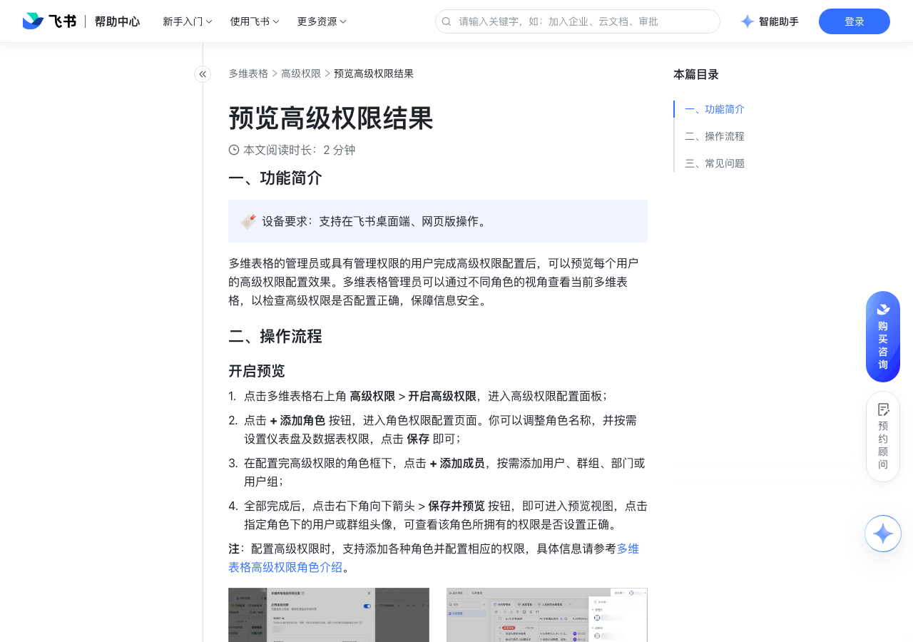

# 预览高级权限结果

> 来源：[飞书帮助中心](https://www.feishu.cn/hc/zh-CN/articles/733211518261)  
> 分类：多维表格 / 高级权限  
> 抓取时间：2026-09-22T01:25:23.122Z

## 界面截图

### 文档内配图

1. image.png：https://p1-hera.feishucdn.com/tos-cn-i-jbbdkfciu3/a7f152ec3e6c4e28a6fe3195c06d9f10~tplv-jbbdkfciu3-png:0:0.png
2. image.png：https://p1-hera.feishucdn.com/tos-cn-i-jbbdkfciu3/e39e7b62b280485b822671f7f81aa28f~tplv-jbbdkfciu3-png:0:0.png
3. 配图：https://p1-hera.feishucdn.com/tos-cn-i-jbbdkfciu3/2575aedc7e744c8f996225fece0e312d~tplv-jbbdkfciu3-image:0:0.image

## 功能定位

本页对应飞书帮助中心「多维表格 / 高级权限」下的「预览高级权限结果」。以下需求描述依据官方说明文档提炼，用于指导 DuoWei 对标实现。

## 功能目标

一、功能简介

## 文档结构（官方章节）

- 一、功能简介​
- 二、操作流程​
- 开启预览​
- 退出预览​
- 三、常见问题​

## 详细功能说明

一、功能简介

二、操作流程

开启预览

点击多维表格右上角 高级权限 > 开启高级权限，进入高级权限配置面板；

点击 + 添加角色 按钮，进入角色权限配置页面。你可以调整角色名称，并按需设置仪表盘及数据表权限，点击 保存 即可；

在配置完高级权限的角色框下，点击 + 添加成员，按需添加用户、群组、部门或用户组；

全部完成后，点击右下角向下箭头 > 保存并预览 按钮，即可进入预览视图，点击指定角色下的用户或群组头像，可查看该角色所拥有的权限是否设置正确。

退出预览

三、常见问题

问：预览状态下，其他人对高级权限进行修改，是否会实时同步？

答：不会，需要退出预览，然后对权限进行修改，才能生效。

问：预览状态下，修改多维表格内容，是否生效？

答：不会，预览状态下，所有的操作结果均为临时示意，退出预览状态后，所有相关操作及结果会被清空。

## 实现要点（对标 DuoWei）

1. **入口与信息架构**：在产品中明确该能力所属模块（高级权限），并保证用户可从对应导航触达。
2. **核心交互**：按上文「详细功能说明」还原主要操作路径；截图中出现的按钮、字段、面板命名尽量与飞书语义一致或可映射。
3. **数据与权限**：若文档涉及可见范围、可编辑范围、分享或高级权限，实现时需落到角色/成员模型，并保证 API/MCP 与 UI 权限一致。
4. **边界与上限**：若文档提到数量上限、格式限制、导入导出约束，需在实现与错误提示中体现。
5. **验收**：以本页截图场景为用例，完成「能打开 / 能配置 / 能保存 / 能被 Agent 读写（如适用）」四项检查。

## 原始摘录摘要

> 一、功能简介 二、操作流程 开启预览 点击多维表格右上角 高级权限 > 开启高级权限，进入高级权限配置面板； 点击 + 添加角色 按钮，进入角色权限配置页面。你可以调整角色名称，并按需设置仪表盘及数据表权限，点击 保存 即可； 在配置完高级权限的角色框下，点击 + 添加成员，按需添加用户、群组、部门或用户组； 全部完成后，点击右下角向下箭头 > 保存并预览 按钮，即可进入预览视图，点击指定角色下的用户或群组头像，可查看该角色所拥有的权限是否设置正确。 退出预览 三、常见问题 问：预览状态下，其他人对高级权限进行修改，是否会实时同步？ 答：不会，需要退出预览，然后对权限进行修改，才能生效。 问：预览状态下，修改多维表格内容，是否生效？ 答：不会，预览状态下，所有的操作结果均为临时示意，退出预览状态后，所有相关操作及结果会被清空。

## 元数据

- article_id: `7332411159717609500`
- category_id: `7165750460006055938`
- path: `/hc/zh-CN/articles/733211518261`
- extracted_text_length: 368
