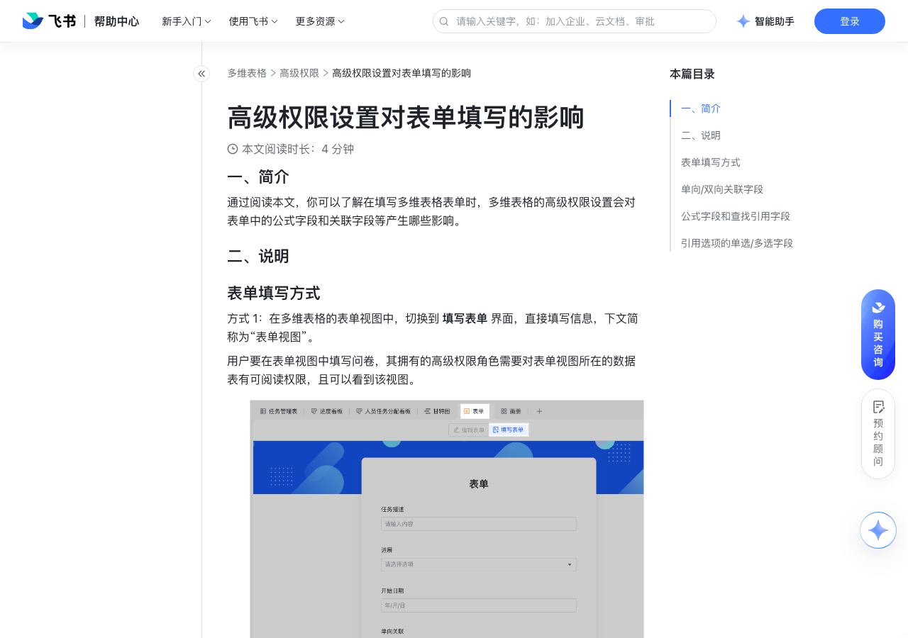

# 高级权限设置对表单填写的影响

> 来源：[飞书帮助中心](https://www.feishu.cn/hc/zh-CN/articles/183307421587)  
> 分类：多维表格 / 高级权限  
> 抓取时间：2026-09-22T01:25:24.182Z

## 界面截图

### 文档内配图

1. 配图：https://p1-hera.feishucdn.com/tos-cn-i-jbbdkfciu3/e4c6018d21284db093db7b0fd347c4ab~tplv-jbbdkfciu3-image:0:0.image
2. 配图：https://p1-hera.feishucdn.com/tos-cn-i-jbbdkfciu3/637febd5c34b459083a7438fd619e380~tplv-jbbdkfciu3-image:0:0.image
3. 配图：https://p1-hera.feishucdn.com/tos-cn-i-jbbdkfciu3/a7caeacc26964749bbed98380af2f87b~tplv-jbbdkfciu3-image:0:0.image
4. 配图：https://p1-hera.feishucdn.com/tos-cn-i-jbbdkfciu3/b58abb4c87d54ab386412993216f5187~tplv-jbbdkfciu3-image:0:0.image

## 功能定位

本页对应飞书帮助中心「多维表格 / 高级权限」下的「高级权限设置对表单填写的影响」。以下需求描述依据官方说明文档提炼，用于指导 DuoWei 对标实现。

## 功能目标

一、简介

## 文档结构（官方章节）

- 一、简介​
- 二、说明​
- 表单填写方式​
- 单向/双向关联字段​
- 公式字段和查找引用字段​
- 引用选项的单选/多选字段​

## 详细功能说明

一、简介

二、说明

表单填写方式

方式 2：通过表单的分享链接打开表单并进行填写，下文简称为“通过链接分享的表单”。

通过表单的分享链接填写问卷的用户不需要拥有可阅读表单视图数据表的权限，问卷管理者可在分享设置面板设置可分享的范围。

单向/双向关联字段

表单视图：

权限说明：用户在多维表格的表单视图内填写时，只能选择关联的数据表中自己有权限查看的记录。

用户只能看到自己有阅读权限的记录。

用户不仅能看到索引列的数据，还会看到关联的数据表中其他有阅读权限的字段。

使用场景示例：销售人员录入订单时需要关联客户，仅能看到和选择自己负责的客户。

通过链接分享的表单：

权限说明：用户通过表单的分享链接填写时，能看到和选择关联数据表内的所有索引列内容。

用户只能看到索引列的数据，无法看到其他字段。

即使用户没有部分记录的阅读权限，也仍然可以看到数据表内的所有记录的索引列。

使用场景示例：员工在进行办公物品领用时，仅能看到物品名称。办公物品的库存等基本信息不对外部开放。

公式字段和查找引用字段

权限说明：若表单中有公式字段或查找引用字段，无论对引用的源数据是否有查看权限，在“表单视图”和“通过链接分享的表单”中，用户都可以正常看到完整的计算或引用结果。

使用场景示例：填写订单信息时，即使对商品表的单价、数量等字段无权限，也能通过公式字段看到需要下单商品的总报价。

引用选项的单选/多选字段

## 实现要点（对标 DuoWei）

1. **入口与信息架构**：在产品中明确该能力所属模块（高级权限），并保证用户可从对应导航触达。
2. **核心交互**：按上文「详细功能说明」还原主要操作路径；截图中出现的按钮、字段、面板命名尽量与飞书语义一致或可映射。
3. **数据与权限**：若文档涉及可见范围、可编辑范围、分享或高级权限，实现时需落到角色/成员模型，并保证 API/MCP 与 UI 权限一致。
4. **边界与上限**：若文档提到数量上限、格式限制、导入导出约束，需在实现与错误提示中体现。
5. **验收**：以本页截图场景为用例，完成「能打开 / 能配置 / 能保存 / 能被 Agent 读写（如适用）」四项检查。

## 原始摘录摘要

> 一、简介 二、说明 表单填写方式 方式 2：通过表单的分享链接打开表单并进行填写，下文简称为“通过链接分享的表单”。 通过表单的分享链接填写问卷的用户不需要拥有可阅读表单视图数据表的权限，问卷管理者可在分享设置面板设置可分享的范围。 单向/双向关联字段 表单视图： 权限说明：用户在多维表格的表单视图内填写时，只能选择关联的数据表中自己有权限查看的记录。 用户只能看到自己有阅读权限的记录。 用户不仅能看到索引列的数据，还会看到关联的数据表中其他有阅读权限的字段。 使用场景示例：销售人员录入订单时需要关联客户，仅能看到和选择自己负责的客户。 通过链接分享的表单： 权限说明：用户通过表单的分享链接填写时，能看到和选择关联数据表内的所有索引列内容。 用户只能看到索引列的数据，无法看到其他字段。 即使用户没有部分记录的阅读权限，也仍然可以看到数据表内的所有记录的索引列。 使用场景示例：员工在进行办公物品领用时，仅能看到物品名称。办公物品的库存等基本信息不对外部开放。 公式字段和查找引用字段 权限说明：若表单中有公式字段或查找引用字段，无论对引用的源数据是否有查看权限，在“表单视图”和“通过链接分享的表单”中，用户都可以正常看到完整的计算或引用结果。 使用场景示例：填写订单信息时，即使对商品表的单价、数量等字段无权限，也能通过公式字段看到需要下单商品的总报价。 引用选项的单选/多选字段

## 元数据

- article_id: `7182507287339368450`
- category_id: `7165750460006055938`
- path: `/hc/zh-CN/articles/183307421587`
- extracted_text_length: 596
